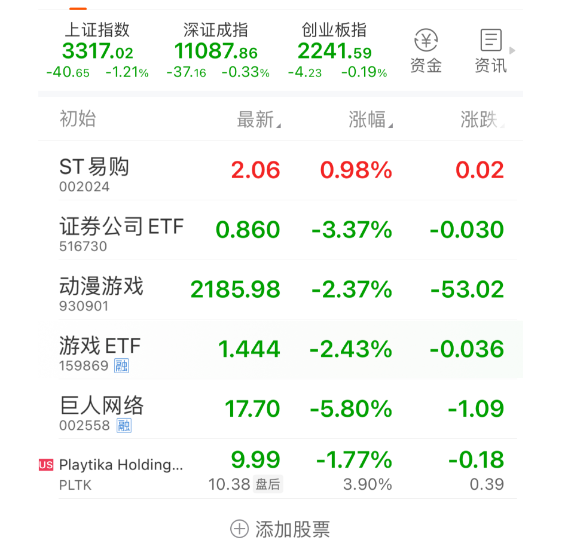
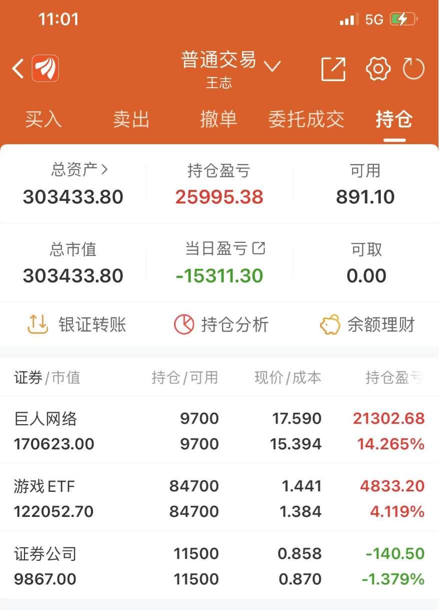

# 2023年05月10

| 真实  | 实战  |
|---|---|
|   |   |

## 情绪

### ST 易购 (002024)

开始进入观察序列, 目前 200 亿估值还是有点高. 关注点 1. 电商 2. ST 摘牌 3. 壳子价值

### 证券 ETF (516730)

今天开始回本, 早上看了眼曲线, 大概率亏本概率不大. 外加上操作不及时. 继续留着吧. 当牛市🐂市场风向标观察.

### 巨人网络 (002558) | 游戏 ETF (159869)

游戏 ETF 和 巨人网络 走势目前轻微有些不再趋同. 最近回撤严重. 特别是 游戏 ETF 目前比较放心, 整体利润只有 1 W 左右尝试退出. 目前观望. 未来后续逐步降低 游戏 ETF 仓位. 

## 后续

整体操作比较原始, 这东西没有特别技巧. 玩的就是耐心而已. 其他股票也不熟悉. 