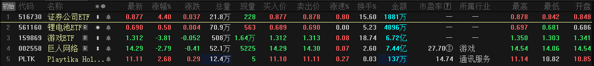
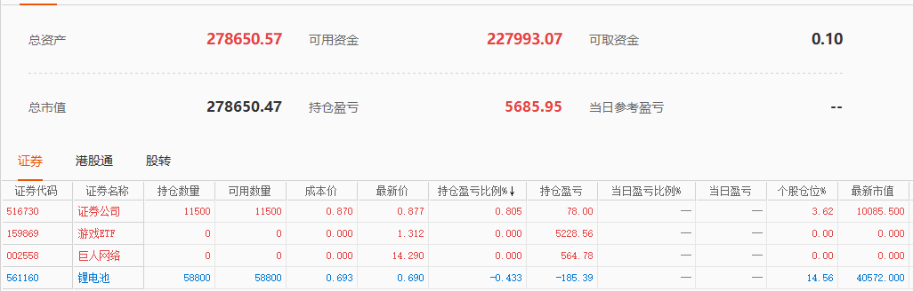
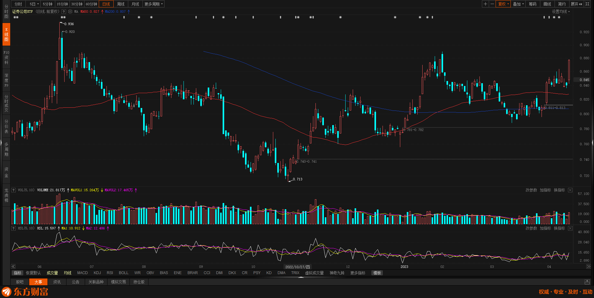
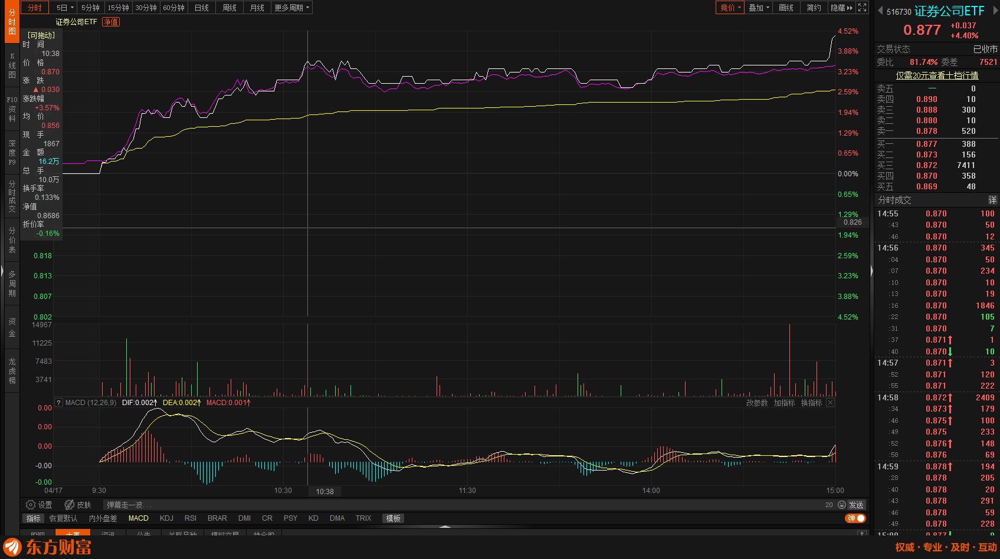
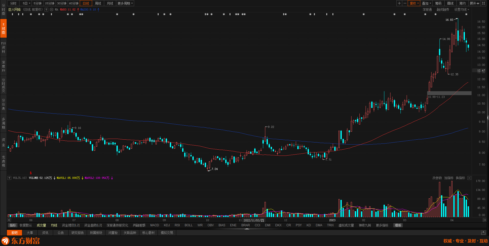
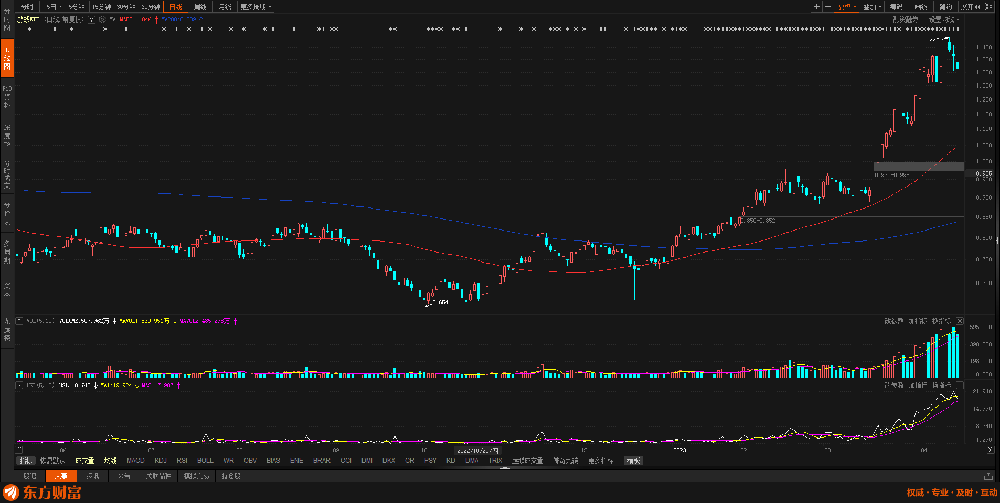
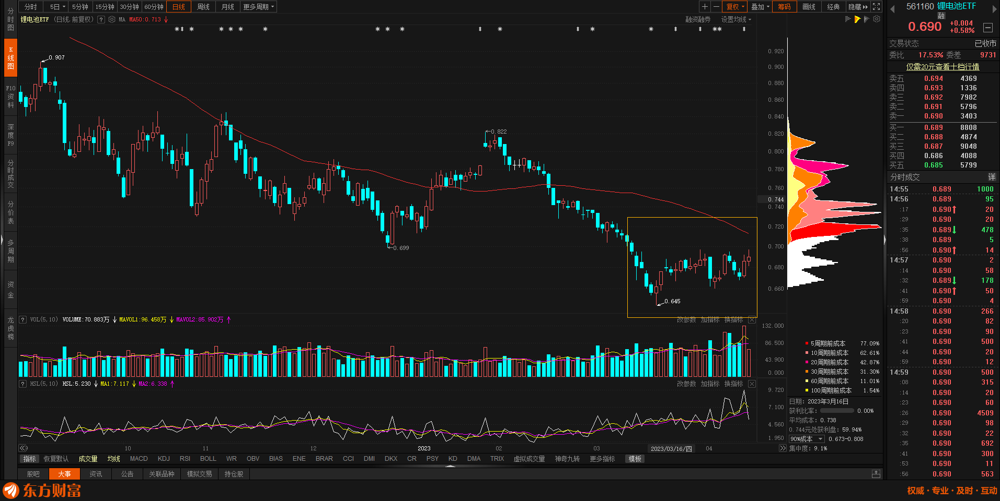
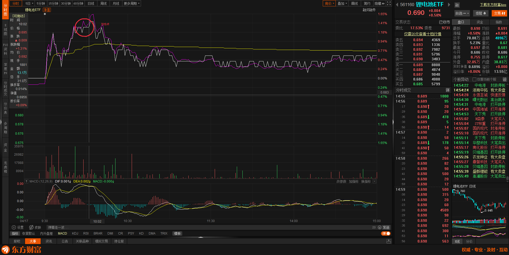

# 2023年4月17日

## 真实 · 实战

### 关注

### 持有

## 情绪

### 516730 证券公司 ETF

操作 : 0.870 入了 ￥ 1W 头部仓位

入场后止损位置 : 0.848

今天看最热板块, 恰好关注到的. 

看日线图整体向上, 没有到前高, 没有太强阻力, 赚钱概率大. 我是今天关注到 涨了 3 个点入场的. 后续涨轻微加仓, 预计在 2 - 3 万之间. 因为这次赚钱了. 止损位位置在 0.848 和 0.870 之前. 其中 0.848 是死亡线. 突破前阻力下 0.878 -> 0.890 尝试加仓, 但这里可能存在风险是诱多, 少量加仓为主.

### **159869 游戏 ETF** 和 **002550 巨人网络**

操作 : 已经清仓

二者同属于一个版块, 图形趋同, 特别是巨人网络这块快面临亏损. **这部分三根下杀和赚的钱要亏了, 选择清仓**. 后面会单独分析这个板块和个股. 这些股后续我会高度关注.

总结 : **赚钱的时候什么时间走都不亏**

### ** 002558 锂电池 ETF **

日线走势还是非常漂亮, 买的比较心安. 

在画线地方加仓 2W 整体赌成分有点高. 止损位置是 0.645 . 后面不赚钱不会再加仓. 

## 总结 & 复盘

关注这么多股票感觉非常累, PC 上软件用的不好. 熟悉中. 现在市场是捡钱环境, 未来会越来越热. 保持热度去投入. 

