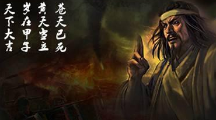
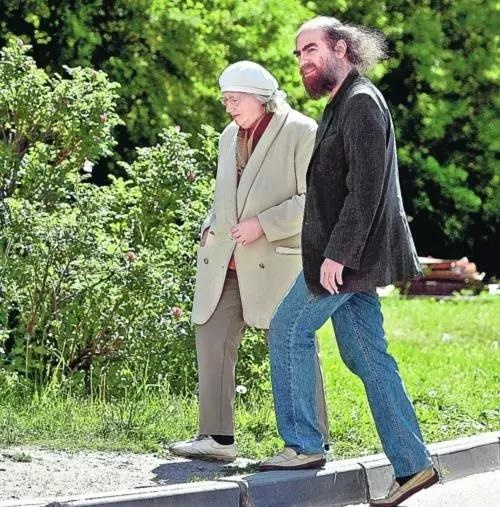
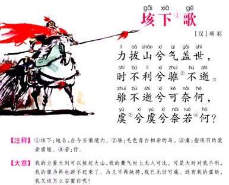
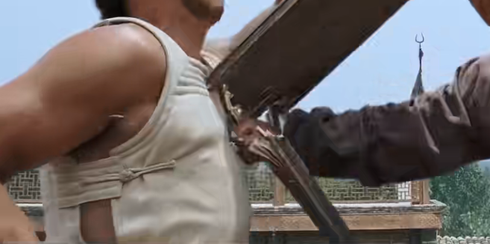

# ChinA 股 · 凡人修习录

```
WWWWWWWWWWWWWWWWWWWWWWWWWWWWWWWWWWWWWWWWWWWWWWWWWWWWWWWWWWWWWWWWWWWWWWWWWWWWWWWWWWWWWWWWWWWWWWWWWWWW
WWWWWWWWWWWWWWWWWWWWWWWWWWWWWWWWWWWWWWWWWWWWWWWWWWWWWWWWWWWWWWWWWWWWWWWWWWWWWWWWWWWWWWWWWWWWWWWWWWWW
WWWWWWWWWWWWWWWWWWWWWWWWWWWWWWWWWWWWWWWWWWWWWWWWWWWWWWWWWWWWWWWWWWWWWWWWWWWWWWWWWWWWWWWWWWWWWWWWWWWW
WWWWWWWWWWWWWWWWWWWWWWWWWWWWWWWWWWWWWWWWWWWWWWWWWWWWWWWWWWWWWWWWWWWWWWWWWWWWWWWWWWWWWWWWWWWWWWWWWWWW
WWWWWWWWWWWWWWWWWWWWWWWWWWWWWWWWWWWWWWWWWWWWWWWWWWWWWWWWWWWWWWWWWWWWWWWWWWWWWWWWWWWWWWWWWWWWWWWWWWWW
WWWWWWWWWWWWWWWWWWWWWWWWWWWWWWWWWWWWWWWWWWWWWWWWWWWWWWWWWWWWWWWWWWWWWWWWWWWWWWWWWWWWWWWWWWWWWWWWWWWW
WWWWWWWWWWWWWWWWWWWWWWWWWWWWWWWWWWWWWWWWWWWWWWWWWWWWWWWWWWWWWWWWWWWWWWWWWWWWWWWWWWWWWWWWWWWWWWWWWWWW
WWWWWWWWWWWWWWWWWWWWWWWWWWWWWWWWWWWWWWWWWWWWWWWWWWWWWWWWWWWWWWWWWWWWWWWWWWWWWWWWWWWWWWWWWWWWWWWWWWWW
WWWWWWWWWWWWWWWWWWWWWWWWWWWWWWWWWWWWWWWWWWWWWWWWWWWWWWWWWWWWWWWWWWWWWWWWWWWWWWWWWWWWWWWWWWWWWWWWWWWW
WWWWWWWWWWWWWWWWWWWWWW #WWWWWWWWWWWWWWWWWWWWWWWWWWWWWWWWWWWWWWWWWWWWWWWWWWWWWWWWWWWWWW,#WWWWWWWWWWWW
WWWWWWWWWWWWWWW# .WWWW  WWWWWWWWWWWWWWWWWWWWWWWWWWWWWWWWWW #WWWWWWWWWWWWWWWWWWWWWWWWW#  WWWWWWWWWWWW
WWWWWWWWWWWWWWWWK WWWW  WWWWWWWWWWWWWWW##    #WWWWWWWWWWWW  WWWWWWWWWWWWWWWWWWWWW  WW ;WWWWWWWWWWWWW
WWWWWWWWWWWWWWWWW WWWW   :WWWWWWWWW#       WWWWWWWWWWWWWW. WWWWWW   WWWWWWW  .WWWW WtWWWWWWWWWWWWWWW
WWWWWWWWWWWWWW#.   EWW WWWWWWWWWWWWWWWW #WWWWWWWWWWWWWWW  WWWW   jWWWWWWWWW#  WWWWWW#    fWWWWWWWWWW
WWWWWWWWWWWWWWWWKWWWWW #i   WWWWWWWWWWW WWWWWWWWWWWWWWW  WWWWWWWWWWWWWWWWWWWWWWK    WWWWWWWWWWWWWWWW
WWWWWWWWWWWWWWWW.K f   LWWWWWWWWWWWWWWW WWWWWWWWWWWWWW.EWK WWWWWWWWWD,WWWWWWWWWWWWW WWWWWWWWWWWWWWWW
WWWWWWWWWWWWL    W#WWW  WWWWWWWWWWWWWWW WW    WWWWWWWWWWW  WWWWWE      WWWWWWWWWWW;W:  #WWWWWWWWWWWW
WWWWWWWWWWWW WWW WWWW WW #WWWWWWWWWWt    LWWWWWWWWWWWWWW; WE   f #WWWWWWWWG   WWW #WWW #WWWWWWWWWWWW
WWWWWWWWWWWWWWW W  WW.WWj jW#WWWWWW.E#W #WWWWWWWWWWWWWWW WWWWWWW# WWWWWWWWWW DWWW W  # WWWWWWWWWWWWW
WWWWWWWWWWWWWWK WW # WWWW.   :WWWWWWWW.  WWWWWWWWWWWWWW W WWWWWWW WWWWWWWWWW WWWW WWWW WWWWWWWWWWWWW
WWWWWWWWWWWWW# WWWWW#  LWWWWWWWWWWWWWW WjWWWWWWWWWWWW# WW WWWWWW# WWWWWWWWW# WWWW W  W WWWWWWWWWWWWW
WWWWWWWWWWWWWKWW  ,##W  WWWWWWWWWWWWWK WW WWWWWWWWWWW WWW WWWWWWW WWWWWWWWW# WWWW WWW# WWWWWWWWWWWWW
WWWWWWWWWWWWWWWW WKWWW  WWWWWWWWWWWWW WWWW WWWWWWWWWWWWWW WWWWWWW WWWWWWWWWWfWWWW WWjW WWWWWWWWWWWWW
WWWWWWWWWWWWWWWW .   W  WWWWWWWWWWWW .WWWW# #WWWWWWWWWWWW WWWWWWW WWWWWWWW  .W#WW WWWW WWWWWWWWWWWWW
WWWWWWWWWWWWWWWW WWWWW  WWWWWWWWWW  ##WWWWW   WWWWWWWWWW  WWWWWWW WWWWWWW# #WW  t##WWW WWWWWWWWWWWWW
WWWWWWWWWWWWWWWW WW#    WWWWWWWW: #WWWWWWWW#    KWWWWWWW  WWWWi t WWWWWWWWWWWWWW    LW#WWWWWWWWWWWWW
WWWWWWWWWWWWWWWW WWWWW .WWWWWWWWWWWWWWWWWWWWWK   .WWWWWWWKWWWWWW  WWWWWWWWWWWWWWWW.       :WWWWWWWWW
WWWWWWWWWWWWWWWWjWWWWW DWWWWWWWWWWWWWWWWWWWWWWWWWWWWWWWWWWWWWWWW DWWWWWWWWWWWWWWWWWWWi fWWWWWWWWWWWW
WWWWWWWWWWWWWWWWWWWWWW.WWWWWWWWWWWWWWWWWWWWWWWWWWWWWWWWWWWWWWWWWWWWWWWWWWWWWWWWWWWWWWWWWWWWWWWWWWWWW
WWWWWWWWWWWWWWWWWWWWWWWWWWWWWWWWWWWWWWWWWWWWWWWWWWWWWWWWWWWWWWWWWWWWWWWWWWWWWWWWWWWWWWWWWWWWWWWWWWWW
WWWWWWWWWWWWWWWWWWWWWWWWWWWWWWWWWWWWWWWWWWWWWWWWWWWWWWWWWWWWWWWWWWWWWWWWWWWWWWWWWWWWWWWWWWWWWWWWWWWW
WWWWWWWWWWWWWWWWWWWWWWWWWWWWWWWWWWWWWWWWWWWWWWWWWWWWWWWWWWWWWWWWWWWWWWWWWWWWWWWWWWWWWWWWWWWWWWWWWWWW
WWWWWWWWWWWWWWWWWWWWWWWWWWWWWWWWWWWWWWWWWWWWWWWWWWWWWWWWWWWWWWWWWWWWWWWWWWWWWWWWWWWWWWWWWWWWWWWWWWWW
WWWWWWWWWWWWWWWWWWWWWWWWWWWWWWWWWWWWWWWWWWWWWWWWWWWWWWWWWWWWWWWWWWWWWWWWWWWWWWWWWWWWWWWWWWWWWWWWWWWW
WWWWWWWWWWWWWWWWWWWWWWWWWWWWWWWWWWWWWWWWWWWWWWWWWWWWWWWWWWWWWWWWWWWWWWWWWWWWWWWWWWWWWWWWWWWWWWWWWWWW
WWWWWWWWWWWWWWWWWWWWWWWWWWWWWWWWWWWWWWWWWWWWWWWWWWWWWWWWWWWWWWWWWWWWWWWWWWWWWWWWWWWWWWWWWWWWWWWWWWWW
WWWWWWWWWWWWWWWWWWWWWWWWWWWWWWWWWWWWWWWWWWWWWWWWWWWWWWWWWWWWWWWWWWWWWWWWWWWWWWWWWWWWWWWWWWWWWWWWWWWW
```

## 第一版 - 序言

```
苦海 🗡 翻起愛恨

在世間  難逃避命運
```

有天吃饱了撑着, 想起自己在 A 股市场吃过的数不尽的亏, 涌现太多次绝望和彷徨, 想给予这个市场同自己一样的凡人写一本真实的书. 在这个市场上各式各样光鲜亮丽的 b 太多太多了, 凡人常见修行进阶路线有骗子和老狐狸两种. 骗子呢五花八门多数是吃贪婪, 老狐狸呢在骗局中推波助澜看破不说破一拨人, 吃些剩下残羹剩饭, 孔乙己式小偷更贴切些. 除了凡人, 这世上人有人出生自带镰刀, 有人出生后开始和驴羊比吃苦, 凡人在大 A 股市场玩, 一定一定要有自知之明, 对这个市场要有足够得尊重, 然后把自己的自尊和预期打到细碎. 因为这个市场包括它得外围, 能让你看见几乎所有信息和所有的数据就是为搞个锅子鲜活的吃驴羊三鲜. 在玩得时候, 必要时候唤醒和**修炼**自身恶意和怀疑, 这个世界暗能量和谣言很多是没法证伪, 但对于其运转至关重要, 阴阳明暗生生不息. 

在全球有很多很多流动性得交易市场, 例如货币, 期货, 股票, 虚拟币, 游戏装备, 又可以按照国家或者区域分, 美股, A股, 港股 等等, 很多很多种. 很多人自负没吃过亏觉得一通百通, 或者用期货理论, 用美股理论来搞 A 股. 这个有点像, 足球运动员跨界去打乒乓球比赛, 身体好有相关性, 也能玩但感觉难受外行. 最主要区别在于不同区域人群内在传承的特性不一样, 顶层的相关制度不一样, 比赛得玩法细节不一样, 老爷们吃驴羊鲜力度不一样, 很多不一样, 有些骗子通过嫁接指点江山来吃这个饭也吃的很不错. 现代社会非常细化, 隔行如隔山, 特别当你真的当一个竞技选手去玩真的去打比赛, 那细节大局观差异巨大, 希望修炼到老狐狸阶段选手互相尊重, 双修是小说里人物, 本书面向的是凡人, 什么是凡人呢, 平凡困苦中透露着些许可恨可怜, 默认成长的路上没有奇遇只有大坑. 

很多可怜人带着赚钱想法来到 A 股, 为什么是 A 股, 而不是官老爷和骗子心善一点美股呢, 这里面就有一点命理味道. 万般皆是命，半点不由人.自己之前一直在挣扎, 同朋友商量创业, 开水果店, 开超市 等等, 不想也可能没法这么一直当太监打螺丝然后屎上雕花, 思来想去, 骗子或者老狐狸们都说炒股这门手艺好, 完全可以做到不求人, 加上前面尝试很多路感到都不太靠谱, 最后调研要不就学学炒股手艺吧. 至此才算看见了深渊, 身体在无尽的下沉. 这个几百年赌博行当真 nmlb 厉害, 这里形形色色门道真的开了眼界, 大写的服. 赌博行为是阶层下降最快的方式, 别的也就 0.1 阶层下降到 0 阶层, 这个可以到负阶层. 特别是那些怀揣着赚钱想法进来的人, 从一开始就决定是个你的命, 你的地狱他人的甘甜. 一个人去一个陌生并且存在几百年的行业自身毫无优势, 有些是老天爷捉弄, 很照顾, 可是被照顾得人也没烧香拜佛, 总觉得自己很能, 自然玄学照顾逐渐消散了. **最终被自己, 被局, 被大数定律**数学期望为负收益缓慢生吃. A 股这个市场特别有意思, 你想着赚钱, 超大概率赚不到钱, 那些介绍带你赚钱 A 股书籍, 擦屁股都嫌弃硬, 那些大 b 光鲜亮丽或者仙风道骨说传你秘籍银弹让你赚钱的, 估计能把你渣消耗干净, 因为这个行业感觉是行业选人, 而不是任何凡人可以进去这个市场, 9 成人不适合进入 A 股, 但他不会告诉你. 传统文化可能认为, 人没本事时候最多窝囊, 但你自认为涨了本事, 去大干一场, 那是找死. **凡事也有意外, 当你和丁蟹一样气运挡不住时候, 接下来要做的是感谢老天爷, 去还愿去行善积德, 让玄学慢一点, 平安金盆洗手.** 



凡人不适合玩 A 股, 这是命 (数学期望为负), 然后你却不信命, 自然难度就起来了, 特别是对于那些充满自信, 其他行业小有成就那批人, 地狱的门早等着呢. 这本书没法带你在 A 股赚钱, 因为带你在 A 股市场赚钱的书是不存在的(可用反证法证明). 只是把自己作为凡人看见的局部血肉展现出来, 共性部分抽离出来. 传统文化或者当下群体里主流还是讲态度, 道理, 因果, 很少讲舶来品逻辑, 世界那么大各有各运转规律吧, 本书也会讲很少点道理, 更多是艺术, 那种不受拘束的随波追求, 那种放荡不羁需要各自去感受感悟. 文明发展长河里可能也应该是先有艺术再有逻辑, 而且逻辑更多是后知后觉. 到这里如果感觉不适可以扔掉这本书了. 这本书希望修习如何入门 A 股抄手, 仅此而已, 再提醒下, 这门手艺学会后那天入门了, 你的性格发生很大变化(性格变了也不见得是好事), 因为你逐渐认清的羊群与在羊群的自己, 好消息是能在任何赌博行当入门到职业或者半职业人士比率估计很少, 大部分浑浑噩噩玩玩呗. 

最后一次忠告别来 ChinA 缅北, 如果已经深陷其中的话, 能给的三句话, 尊重环境, 尊重对手, 尊重自己. 阿弥陀佛🪷回头是岸. 

## [选修] 第一章 - 入门修习

在 A 股 中国人介绍 A 股书籍, 基本上没有一本适合凡人当教材的, 清一色图像技术系统好一点讲一些人生道理和社会怎么做局, 这些对于玩真的没有什么价值最不值钱, 基本很难入门学这门手艺. 大的金融交易市场是个稳定的战场, 战场是会死人的, 不能戏说. 哪有一本国内书会告诉你快来器官不够了. 

任何行业基础打的好, 可能都会事半功倍吧. 有些人自己一头扎进去这个市场磨练呢, 不搞这基础行不行, 自己直接进去猛干, 也是可以的, 自己磨自己吃个 7 - 8 年 或者 十几年亏 突然有一天脑子一灵光估计也就入门. 如果先经历打基础呢, 可能快的 3 - 5 年 脑子一灵光也就入门. 有些凡人好奇怎么要这么久, 这东西是个古老传统行业, 尊重一些, 毕竟不是写代码各大工程师工种 1 天会 2 天精通 3 天就是架构师, 然后看谁都是 SB. 古老传统行业基本趋同特别强调做人, 在长时间打基础过程中老是碰壁然后逐渐学会做人. 到底是什么是做人呢, 好难用文字说, 一方水土一方人, 自己体会吧没有定数, 学会反思做人可能也就入门了吧. 知行合一估计大成了吧. 在市场里竞技, 你是和一批批无限制格斗好手较量, 比到最后可不是那些不值钱绝招, 和一堆堆为了造而造的数据与信息, 更多是(做)人学怎么样. 题外话, **很多传统行业入门时间非常长的**, 例如围棋棋手在良好环境中起码十几年入行, 搞数学天赋好的少说十多年起步, 传统行业和现代行业区别吧. 

相关教材国内找不到, 找些国外舶来品替代, 互相借鉴带动自身转动起来.  

```
教材 1 : 股票大作手回忆录

教材 2 : 炒股的智慧
```

教材 1 主角 利弗莫尔 （Jesse Lauriston Livermore，1877—1940）是奇中奇的奇人, 西方价值观里中悲情英雄. 任何一个想入门 A 股的人, 这本书不可多得参考书, 不限制在入门 1 - 3 年 或者 3 - 5 年 间, 随时想起来反复借鉴, 打破命运的本身就是命运的一部分. 

教材 2 作者是福建老华人, 1962 年生于福建省福州，养过牛，种过地, 插过队, 1982 年毕业于上海交通大学，1983 年赴美留学, 作者说他毕业后不想一辈子炸鸡膀子, 实在没办法开始职业炒股, 吃了无数的亏提炼出酸甜苦辣咸. 如果把 A 股比作乒乓球的话, 美股相当于篮球, 这本智慧教你如何玩篮球成为专家的书籍, 目前能找到最接近 A 股教材和好书了, 必须练到书中的无招胜有招境界, 才会对 A 股中玩乒乓球会有点用. 快的话 3 - 5 年.  

```
可选读物 1: 赌博默示录

可选读物 2: 海龟交易法则 / 海龟交易核心法则
```

可选读物 1 非常推荐 《赌博默示录》（日语：賭博黙示録カイジ）是福本伸行的日本漫画作品。1996 年开始在讲谈社漫画杂志周刊 Young Magazine 上连载。塑造的主角 伊藤开司 是极其少有的天生赌徒, 从他身上看到赌徒那种浪荡与众生皆苦. 

可选读物 2 系列选看一般推荐, 讲述关于大户怎么系统(量化)玩美股期货市场的故事, 也是不可多得好书. 核心在于心理而不是技术, 西方心理类似于国内做人心智和心态. 有些戏曲化, 开局是万中无一擎天大能, 结尾是二转身心破碎消于尘烟, 这个行业东西方都没有秘密, 看天.   

掐住脖子大王饶命, 放开脖子, 尔等还不束手就擒, 玩真的和混子就是一念之间, 有人觉得 3 - 5 年 这么久啊, 其实对于炒股行当而言, 3 - 5 年 很短, 慢为了后面更顺畅, 回头一看原来这才是快. 大巧若拙, 聪明往往死在作上了. 因为在中国聪明是贬义词, 可能除了各自爹妈没人喜欢你讨人厌的聪明, 聪明下一个阶段是阅历是智慧是抉择.

语言和文字是不值钱的, 轻飘飘打基础快的话 3 - 5 年 没了, 还不见得能入门, 然后又会有无数得凡人没的选没的靠, 总是无可奈何自我洗脑里选择了长期收益最低那条路. 如果现在退出还来得及, 你将领先 99.99% 凡人.🙂 任何**赌博市场最怕你不玩了, 最爱官人还在来**. 



## 第二章 - 认识自己

东西方市场有很大不同, 用健全和不健全囊括不准确的, 我们也是挺健全的, 只是保护群体不一样, 其中国民群体以及体制运转极大不同导致了市场玩法上巨大差异性. 骗子群体的追逐利益内在是趋同的. 我们要对自己的市场足够那种熟悉感觉, 例如市场走势无外乎趋势或者震荡. 高手信条是不去玩震荡市场的(休息), 但 A 股大盘这 7 - 8 年(截至 2023 年末)就在震荡中度过的, 这时候你下场玩震荡那只能全靠自学成才听天由命. 这时候你常见的美股和期货那套策略和认知, 玩 A 股很受伤, 需要自己调整认识这个熟悉起这个市场来, 找到相处的感觉. 然后心里大概有粗粒度策略. 趋势市场喜欢高买更高卖, 震荡市场喜欢低买高卖. 我们用趋势理论, 或者用牛市中随便都能赚钱策略, 用在一个震荡市场骗子成群市场中自然非常效果不好和受伤, 这时候有些人会继续找趋势, 有些人开始思考操蛋的市场, 这时候一批人被筛选了.  认识自己的市场投其所好, 认识这个市场大众人群, 虽然同湖中浮萍唯一能做的就是随波飘荡但一有机会从高处看着他们(可能需要深刻认识自己之后才能做到). 随着市场泄露越来越严重, 你所面对基本都是老狐狸, 做好心里准备尊重对手跟随对手. 认识市场是入门中最简单的, 差不多每年感受几次感觉差不多就够了. 

**认识自己呢? 认识自己也是个奇怪的话. 当我们不认识自己时, 自己还是自己, 而当一个人认识了自己之后, 那还是它自己吗?** 认识自己有很多人说过类似或多或少耳边听过 例如吾日三省吾身, 走出幻觉走向成熟, 好事多磨, 本我自我超我, 等等都算认识自己方法或影响. 在 A 股赌博, 或者所有这种博弈的流动性投资其中大的陷阱(策略)就是根据凡人群体的人性去收割, 认识群体只能让自己知道, 只有认识自己之后, 才有可能深刻体会自己性格和群体的人性, 让自己深刻理解逆向思维做到顺势和逆向本能的切换, 才有点希望做到, 最终踏出知**行**合一那一步. 这里限定在赌博市场, 其他行业或者场景可能趋同需要各自下功夫.


认识市场容易, 可能查查资料几天就搞明白了, 例如这个市场是投资市场, 这个市场是诈骗市场, 这个市场还在走多行情中, 这个市场很有潜力, 等等, 最多吃个几年亏, 没有难度很好理解, 也不需要过多干预, 进入正收益市场, 远离诈骗市场, 在 A 股难点在于明知不可为而为之, 明知道亏钱市场硬要进去赚钱, 自然交的学费和苦难套餐更多些. 难在认识自己, 帮别人算命容易, 帮自己算命很难. 好消息在于人性千年不变, 有很多类似的相关书籍, 这方面可以借鉴学习的. 也是这个市场唯一可以传承的东西. 而不是那些都可以去做局的数据和线图信号什么鬼的. 

炒股这个行业入门非常陡峭, 快一点吃过 3 - 5 年亏, 脑子灵光, 慢一点可能直到销户都在门外转. 但上手玩简单 1天开户 2天入账 3天梦想发大财, 然后给大数定律提供分母. 言之就算入门后专业的, 也不见得比瞎玩的厉害, 因为这个对于凡人升级是长期玄学事情, 能确定是专业玩家在这个市场活得久点. 这里提供一种协助我们认识自己的笨方法, 在自己犯蠢的时候多自己扇自己耳光. 三国时候顶级厚黑王者司马懿, 在自己犯蠢时候也同样羞愧难当, 这个市场当你**吃够足够的亏时候并且没死**一定会迎来质变时刻, 前提是前期你真的在用心扇自己, 用心去体会自己的 SB. 长期以往你是否赚到钱不知道, 但你性格变化很多, 你会很贴合这个市场, 很容易有一种市场感觉, 那些感觉就是你艺术感来源. 当然你认识自己之后, 可能也不一定好事, 谁知道呢. 这时候你可能理解了**众生皆苦, 当人的不易**. 

## 第三章 - 买卖和心态

一开始想单独章节开讲买和卖, 但很多买卖和市场和策略绑定的. 他们是分不开的. 在 A 股这种钟爱震荡的市场, 你用趋势你用系统, 默认 90% 亏钱, 可能有些骗子欺凡人我小亏, 追求大赚顺势而为. 各行各业都喜欢讲顺势而为, 风浪来了猪都能飞梗, 感觉快的没个 3 - 5 年 起步, 都不知道顺势而为在赌博市场到底是什么意思. 然后又要很长时间过去了才能做到顺势而为. 一来一回凡人没多少能熬得住. 吃掉顺势交易这批人策略就是震荡. 而且这个市场各方面都做好做仔细都不一定赚钱, 更不敢考虑赚大钱, 而你一丝不慎很容易给别人送钱. 因为你们和人在 battle 战斗时候, 你没有优势, 结局那自然而然了. 所以在你买卖时候一定一定要挖掘和积累自己优势. 或者说我老爹是市长局长什么的不用问那一定是真股神, 但限定这里是凡人, 经过 5 - 6 年 之后, 遍体鳞伤总要思考自己入局之后优势到底是什么, 我要靠什么核心优势站住脚. 当狗肯定是行不通了, 因为这里收割不管聪明还是莽还是不当人来了直接无情碾压. 所以凡人修行第一步站起来, 买卖之前思考下有什么优势促使我在战场上活下去, 可千万别一开始幻想当五星上将哦, 如果还没有**别着急买卖**. 

此刻如果之前认识市场, 认识自己足够深刻, 你一定会自然而然面对抉择, 我的优势是什么, 凭什么自己可以在屠宰场羊群里活下去. 这时候之前脸上无数隐形的巴掌印可能就起作用了, 让自己脸皮厚了, 能体会到忍无可忍还需再忍成熟之后叹气. 作为凡人能获取优势很少, 比如说你获取很多东西都是让你犯错继而送命的, 这时候可能逐渐干净一点, 你尝试做减法, 让胜率逐渐靠近 50% 白纸, 你相比那些做局或者高频每天都在其中费心的大户或者韭菜要有些不一样了, 你相比大户你的时间没有他们值钱, 你需要更多感觉, 在你伺机而动时候, 更多更多时间去感受他, 从市场感受积累到你钟意股票感受, 找到那种随意所欲艺术感觉, 一直到你那种感觉到了, 守株待兔不动如山. 相比生活和人群一样, 你只会帮助那些你有感觉那人, 你不应该去掺和冷冰冰那些会让你不舒服和付出代价. 但你相比那些散户或者韭菜, 你的时间是宝贵的, 还需要考虑家人, 你还需吃喝玩乐, 你还需要工作, 不可能一直浪费时间在炒股上, 前期看几眼还有点新鲜感, 后面最多不忙的时候扫一眼, 找找自己感觉. 一般而言对于具体自己钟意股票, 找到感觉需要很长时间, 可能几个月, 或者几年. 有些高手是用现有感觉或者方法去找股票, 不推荐和股票建立感情, 让自己时间更高效, 我这里是相反的和自己喜欢的建立感觉, 前者职业的, 后者是他更高层抽象, 偏业余. 千人千面, 当你入门后, 一定会有自己的感觉, 你一定有自己一套简单主观方法. 千万不要忘记老狐狸之间相互尊重. 

技术这个东西, 其实是是最简单, 包括买卖也不需要什么技术, 我们是炒股的可不是为了求技术而去炒股. 陡峭难的在于心态和知行合一. 心态是认识自己之后进阶篇. 你和那些大户, 或者纸牌屋里定江山那些人, 以及其他赌命的凡人, 
到底有什么超过他们或者和他们看齐的优势呢? 资金也没有, 时间也没有, 因为他们后面有一批 996 博士协助他们, 吃喝玩乐也不一定比他们好. 提一下赌这个古老行当, 一定会和吃喝玩乐绑定在一起他们直接长期走下去互相促进的, 没有吃喝玩乐你根本没有深渊里走出去的野望, 没有吃喝玩乐根本无法消除那种过度分泌激素之后身体那种副作用. 吃喝玩乐是大数定律的漏洞, 吃喝玩乐是赌徒海中灯塔. 你能坐在牌局上同那些做局和指点江山得人玩这个游戏, 无能如何都需要把自己心态向他们看齐. 胜不骄败不馁, 任何时候心态一定要稳, 泰山崩了都得绷住. 在诈骗赌博游戏维护一个好的心态也有很多窍门, 这里简单抛砖引玉一些, 例如用自己闲钱去玩, 例如凡事有后手, 例如扇巴掌时候也在锻炼心脏脉动. 无能如何心态一定要好, 心态修炼不到家, 基本很难越过忍无可忍还需再忍门槛. 赌博战场上走下去的可不是一碰就着鞭炮. 唯有心态才是买卖的灵魂.

这里分享个网上的故事, 迁移到炒股上很好不过, 众像丛生, 妙不可言. 凡人, 骗子, 老狐狸 一个都不能少.  

```
秦国变法之后，有两个双胞胎兄弟为了分到田地，娶到老婆，要去秦国当兵，然后就出发了。

而走到半道呢，俩兄弟饿了，看到路边有个面馆，就进去吃面去了，在吃面的时候，店家桌子不够，
就给他俩拼桌，然后他俩兄弟就和一个头戴斗笠背着宝剑的一个大侠拼了一个桌，完事他们也聊了起来。

而他们聊的啥？就是这个大侠听说他俩的目的后，就说，你俩要上阵杀敌，建功立业，
最起码你俩得有点功夫啊，这样的话你俩才能杀敌多，说不定还能混个将军当当，
要不然就你俩这杀作战经验都没有，上去最多就是个炮灰。

而这俩兄弟中的大哥一听呢，立马就支楞起来，觉得这大侠说的太有道理了，然后就问大侠说。

这位大侠，你说的太有道理了，我们到哪里学点功夫呢？然后这个大侠说，本人不才，有自创的五招，
这五招进可攻退可守，如果你俩学会之后啊，可以让你们在战场上杀的七进七入，人仰马翻的。

而大哥这么一听呢，脑子立马也有了那个在战场上杀的七进技术人仰马翻的画面感了，
于是就很激动的又问大侠说，不知道我俩兄弟能否拜大侠为师，向大侠学艺呢？
然后这个大侠听大哥这么一说，脸上表现出来有点犯难的表情，然后说，
这个不是不可以，只是法不经传，道不贱卖，这个有点让我犯难啊。

而大哥听大侠这么一说，也瞬间懂了，然后大哥也是一个挺会来事的人嘛，
于是连忙从行李里面把所有的盘缠都拿了出来，完事，大侠看到桌子上的盘缠呢，
也就说了，嗯，看你俩如此有诚意，我也就勉为其难的把你们给收下了。

于是，接下来的日子，这个大侠也开始教这俩兄弟他那自创的五招绝学了，而说起来呢，
这俩兄弟学习能力很强，就是没过多久就把这五招练的是炉火纯青了，
并且和大侠对招的过程中已经完全不落下风，也就是炉火纯青呢，一有青出于蓝胜于蓝的感觉了。

因此呢，这俩兄弟看他们学业有成，就，三叩九拜之后，行完礼就去投军去了。

而到了秦军招兵处呢，也恰巧当时秦军正在招募先锋军，先锋军也就是冲到最前面的人，
当时这个小弟就给大哥说，我们可是有功夫的人啊，我们就当先锋军，这样的话，我们冲到最前面，
在杀敌杀的七进七出，人仰马翻的时候，那些大将军指定能够看见我俩，他们看我们兄弟如此之神勇，
指不定能封我们个将军当呢，于是大哥一听呢，也正有此意，于是俩兄弟就毫不犹豫当了先锋军。

而接下来这俩大兄弟加入先锋军后，在等了好久之后，终于上上战场，在战场上，
在等大将军一声令下之后，他俩兄弟和先锋军热血沸腾的就冲了上去，
只不过这俩兄弟还没看清楚敌人长啥样呢，弟弟就被乱箭给射死了，而大哥呢，好一点冲了上去，
只是他那五招还没施展呢，又被一个长矛给怼了过来，给插死了。
```



**买卖技巧在吃亏很多年后, 删选下来得人一定会有自己认识.** 这个不难学, 千人千面, 难的还在于心态. 心态是什么, 我亏钱了, 我熬得住, 这不是心态, 这是局就为了收割这些人人性. 并且在小涨之后这些人性又会被收割. 心态是什么, 哪有什么底, 走不出来就没有底, 那不过是投石问路. 很多人修炼买在最低点, 卖在最高点, 这就是金融市场新永动机, 显然不可能实现的, 这种贪婪吃到一丝不苟的人早晚也会老天吃掉. 在股市里买卖和自己做生意买卖或者进货然后销售也有趋同性, 在钱和货之间我们来回去运作产生收益. 而当你做生意当老板时候亏亏赚赚也非常正常, 一回生二回熟, 活得久自然成了老板. 

把心态练起来, 心态是缅北市场成为老狐狸入场券. 买卖技术比较好学, 时间够了还没淘汰, 感觉起来了, 基本大差不差. 买卖高手专业的人各自的技术也是千人千面, 贴合自己贴合市场就可以, 没有太多定式, 也不要迷恋定式, 吃的就是那些不变性.

## 第四章 - 还愿

前面反复絮叨了很多, **如何玩 A 股呢? 学会尊重; 花时间打基础; 认识自己; 买卖方法来自于一次次吃亏 + 多扇自己得脸; 做生意时候心态一定要极其好;**. 感觉说了和没说一样, 很像有些人评价, 需要你懂了之后才能看懂的幼稚科普. 人类发展一开始没有文字的, 文字也没法表达事物全部. 艺术这个东西越是刻板细致越偏离艺术性. 这类数百年赌博行当是个轮回游戏, 经历轮回越多功力越深, 没有太多秘密. 剩下就是慢慢来慢慢感受. 不过每次轮回真要命, 如果可以还是别进来, 这里真不是过家家.

命 ? 能说非常非常多, 当你开始认识市场, 认识自己, 无数次反思, 修炼心态时候, 你的性格逐渐发生变化了, 你的命在不知道好坏中出现些许变化, 也许你以为你改变了命运, 其实那就是命运. 一般在求签问卦时候, 如果灵验了后面需要去烧香还愿, 当你在这个厮杀游戏最后活的很久, 也不妨去还愿, **留一份善缘给这个世界**. 善是什么呢? 也挺有意思, 在民国时候有一种奇葩栽培年轻人方式, 如何让年轻人入世学会善和正能量呢, 先学厚黑学, 知彼知己从容不迫. 赚钱和善一样, 不好学难学, 当你学会了怎么亏, 怎么厚黑后, 可能赚和善也就无师自通了. **世界上一开始没有善, 然后突然有人恶起来了, 恶出来之后, 厚黑自然由运而生, 厚黑多了, 善自然来了, 阴阳相克循环不息**. 

ChinA 股, 全球最大知识付费平台. 学到真本事, 离不开下功夫 & 经历生与死 ~ 感恩 88 ~

```
想练武, 就得下功夫! 

什么是功夫? 什么是功夫? 功夫就是要时间磨练出来的!

这一拳二十年的功夫 你们挡得住吗!
```

(备注 : 希望别理解错了, 凡人修习可成为不了主角更不能一拳把木头桩🌳打折了, 而是蜕变成会转弯的木头🙏 毕竟二者生殖隔离挺明显的)


