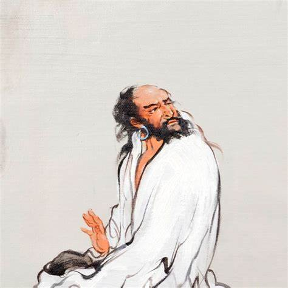
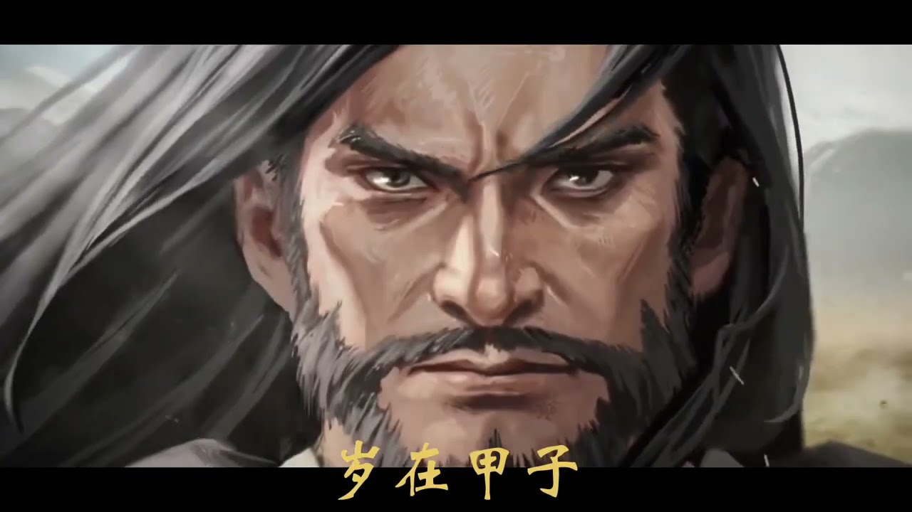

# ChinA 股 · 凡人修习录

**苦海 🗡 翻起愛恨**

**在世間  難逃避命運**

赠给平凡困苦中透露着些许可恨可怜凡人. 玩投机最难练的功夫是什么? 云淡风轻与金盆洗手. 

9.99 成的人不适合进入 A 股市场, 命数中数学期望为负. 🪷 强行玩也不过是给沿途中形形色色得道的骗子和老狐狸, 提供新鲜的器官🫀和血液🩸.

## [选修] 第一章 - 入门修习

**教材 1 : 股票大作手回忆录**

教材 1 主角 利弗莫尔 （Jesse Lauriston Livermore，1877 — 1940）是奇中奇的奇人, 西方价值观里中悲情英雄. 任何一个想入门 A 股的人, 这本书是值得反复查阅的红宝书, 随时想起来都可以反复借鉴, 打破命运的本身就是命运的一部分. 

**教材 2 : 炒股的智慧**

教材 2 老一辈华人, 作者实在没办法情况下开始职业炒股, 吃了无数的亏提炼出酸甜苦辣咸. 如果把 A 股比作乒乓球的话, 美股相当于篮球, 这是本教你如何玩篮球成为专家的智慧小册子, 但愿能练到书中的无招胜有招境界, 会对 A 股中玩乒乓球会有些用. 

**可选读物 1: [赌博默示录](https://www.youtube.com/watch?v=FvpsVgD8BcE)**

可选读物 1 非常推荐 《赌博默示录》（日语：賭博黙示録カイジ）是福本伸行的日本漫画作品。1996 年开始在讲谈社漫画杂志周刊 Young Magazine 上连载。塑造的主角 **伊藤开司** 是极其少有的**天生赌徒**, 从他身上看到赌徒那种浪荡与众生皆苦. 

**可选读物 2: 一個投機者的告白 / 安德烈．科斯托蘭尼**

可选读物 2 异常推荐, 证劵教父.

凡事慢慢来, 别被聪明耽误太久 ~

## 第二章 - 认识自己

你认识你自己吗?

## 第三章 - 买卖和心态

买卖时候一定一定要挖掘和积累自己优势, 反复品自己的痛彻心扉痛. 走出幻想, 如果什么优势都没有, 别着急买卖!

随着傲慢、嫉妒、愤怒、怠惰、贪婪、暴食及色欲、恐惧、麻木、兴奋 、、、、、、在灵魂中翻滚涌动漫长的岁月, 你会在开窍后逐步做减法中找到那种有点懂了的感觉, 守株待兔 伺机待发 不动如山 阿弥陀佛🙏🏻

吃喝玩乐是投机行大数定律当中为数不多的漏洞, 它是赌徒海中灯塔, 如果赚钱了要学会花要敢于花. 用闲钱去打水漂, 保持好心态. 操作时留有后手, 泰山崩了都得绷住. 活得够久的投机专家, 没有一个是一碰就着的鞭炮. 把心态喂出来, 唯有心态才是买卖的灵魂. 买卖技术比较好学, 时间够了亏饱了还没退出, 感觉起来了, 基本大差不差. 买卖老手和专业的人各自的策略也是千人千面, 贴合自己贴合市场就可以, 没有太多定式, 也不要迷恋定式.

在股市里买卖和自己做生意买卖或者进货然后销售也有趋同性, 在钱和货之间我们来回去运作产生收益. 而当你做生意当老板时候亏亏赚赚也非常正常, 一回生二回熟, 活得久自然成了老板.

## 第四章 - 还愿

这行易触五弊三缺, 命辛, 如万幸得道, 多积德行善留些善缘 ~

凡人机缘巧合看见死神, 便上前索问: "神啊 我能纵横 ChinA 市场吗?". 神玩味到: "好啊, 你握着这个天平" "左边你放入钱, 右边是你的命" "我准许你带走 重的那边".
