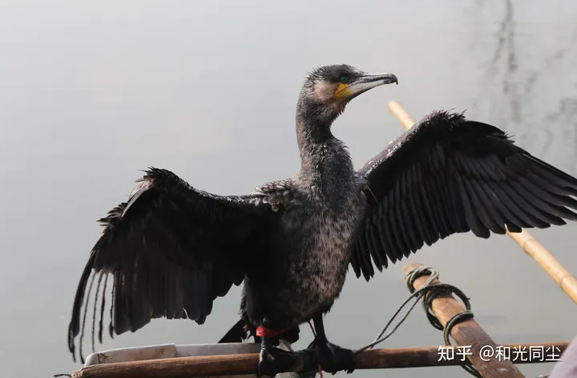
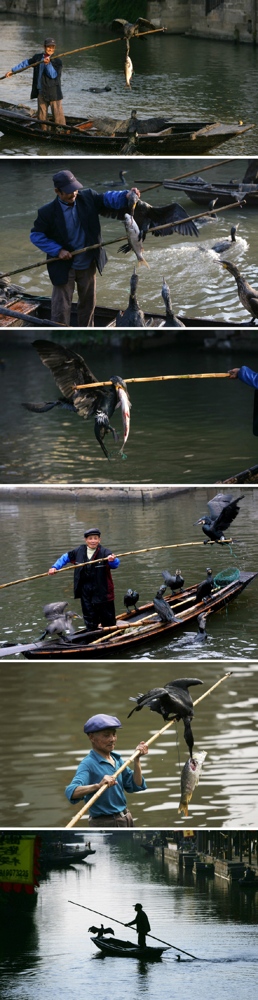
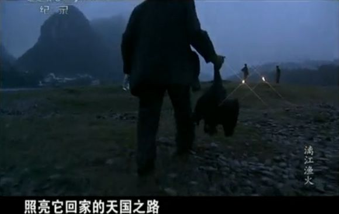
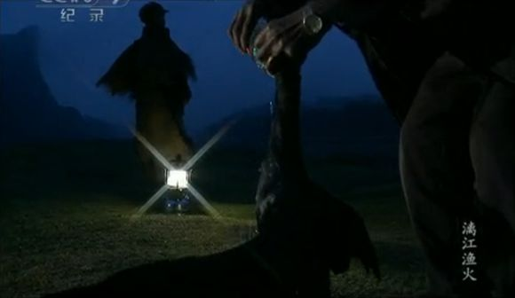

# 国鸟 • 水老鸦 [鸬鹚 /lúcí/]

**参照引用抄袭**

1. 404 [如果要选中国国鸟，你会选哪一个（要求：中国独有）？ - 和光同尘的回答 - 知乎](https://www.zhihu.com/question/638174871/answer/3362267482)

2. [渔人饲养的鸬鹚 —— 从下生起就注定悲剧的一生](http://m.news.xixik.com/content/ee86704251795841/)

***

鸬鹚是被人类驯养过程中几近灭绝的动物。

渔夫们在鸬鹚的脖子上套上绳子或环圈，鸬鹚抓到鱼也吞不下去。只有把鱼给予渔夫，渔夫才会给鸬鹚吃一些小虾米或猪内脏。若是逃跑，脖子上有绳圈的它们一定会饿死。

长期被渔夫喂虾米和猪内脏，导致鸬鹚营养严重不良，难孵蛋，由人类帮助孵出的后代大多体弱，很难长大。

鸬鹚数量已经越来越少，直至 2006 年，从**福建省**开始，将鸬鹚捕鱼设为禁止。这种生物才得以苟延残喘。

有文人写道：鸬鹚，忙碌一生，终不能饱餐一顿；渔人，终究不肯给予鸬鹚真正的回报，哪怕只是在它老去的最后时光。

再回去翻一翻现在小学中学的语文课本，里面可能没了鸬鹚，美与丑早已模模糊糊飞走了。

## 水老鸦的一生

小时侯，零星在湖边见过鱼鹰, 觉得它是很忠诚的鸟。捕了鱼却不吃，吐到船上，献给老渔翁。渔翁的生活好浪漫，有几只鱼鹰伺候着，就可以过上轻轻松松的田园生活了。鱼鹰，英文叫 cormorant [/ˈkɔːmərənt/ n. 鸬鹚 adj. 水老鸦似的；食欲大的] ，乍一听有点像 comrade [ /ˈkɒmreɪd/ n.(共产党或社会主义政党的)同志;(尤指战争期间的)战友;朋友;同事]，但这个词是从拉丁文 corvus marinus [词同 crow 乌鸦 /krəʊ/ marine 海的 /məˈriːn/]，即“海鸦”，集合而来。英文的鱼鹰可没有“同志”那么美好的联想，这个词常常用来比喻贪吃的人。而且，鱼鹰不好看；黑不溜秋，长脖子，勾喙[huì, 鸟兽的嘴]、大肚子，羽毛粗糙。同样是黑色，但渡鸦却有肃穆的威仪，而鱼鹰形象猥琐，一副刁钻的样子。它的个子比海鸥要大一些，却没有海鸥飞行得优雅，动作起来扑棱扑棱的，更无法和鹈鹕[/tíhú/]的稳健和迅猛媲美。虽然它有学名“鸬鹚”，却没听见过谁使用这雅号。南方人俗称它“**水老鸦**”，倒是和英语的本意不谋而合。

然而，鱼鹰的一生并不在于它长得难看，而在于它被驯化来为人捕鱼。我不知道人是怎么训练鱼鹰的，但一切训练都是制衡，都是条件反射。顺之有奖励，逆之有惩罚。久而久之，训练让你觉得非那样不可。主人还让你觉得那是唯一的，若非最好的生活方式，让你忘记与生俱来的自由，忘记你原有的野性，甘心情愿地接受主人给你设定的生活：从生到死，从吃食到生育，都为你安排好了，让你觉得这就是最美好的生活，至少和主人在一起有个安稳的窝，有生存的保障；而世上其他生物，少说也有三分之二，仍处于水深火热之中。

许多动物都被人驯化利用，但鱼鹰似乎最惨。渔夫在它脖子上下了套，使它无法吞咽大一点的鱼。捕到大鱼，鱼鹰不得已，只好吐到船上。渔夫就给它一条小鱼吃，以兹奖励。我不知道鱼鹰是怎么想的，也许它根本不会想，只知道主人喂了自己，因此感恩。它用大鱼换小鱼吃，也不觉得吃亏，也许还认为主人是关照自己。它不明白脖子上的套是渔夫下的，本能以为是自己天生脖子细，不配吃大鱼。它早已忘记自己的脖子本命是很粗的，也许它从小就被套着，根本不知道。如果你告诉驯化的鱼鹰，野生的鱼鹰脖子很粗，能抓到的鱼都能咽下去，没有什么梗塞的感觉，它完全无法理解。

有人可能会说，牛有鼻环，马有嚼子，被人驯化的动物都有个紧箍，由人控制着。但牛马多少还要依赖人。人给它们提供住所，抵御风霜雪雨。冬天没吃的了，人给它们干草吃。它们生病了，人会给它们医治。可对于鱼鹰, 鱼，它什么时候都可以自己抓来吃。天气也无奈它那粗糙但却厚实的羽毛，它完全可以享受动物的生活，吃自己抓的大鱼。

## 苦命的水老鸦

朋友白山是个悲天悯人的人。

一天傍晚白山登上了一条渔船，边就着鱼虾喝着小酒，边欣赏江上的美景。突然他看见一排木头架子立于江中的波涛之上，那架子上蹲着七八只鱼鹰。白山问船夫：“天都这么晚了，鱼鹰怎么还不弄回家去啊？”船夫说：“你不知道，这玩意儿特别腥，如果弄回家去不仅一家人被熏的睡不着觉，就是隔壁邻居也受不了的。” “那么它们就待在江上？” 白山问。“就待在江上。” “一年四季都这样？” “一年四季都这样。” 白山再看那些鱼鹰，个个黑不溜秋的，瞪大了眼睛，似乎在与自己对视。一双脚牢牢地抓住木头架子，就像傻子似的。白山的心中顿起怜悯，心想：这玩意儿真是可怜啊，刮风下雨时它待在江上，飞雪漫天时它也待在江上。“就这么待着” 就是它们的命运，就是鱼鹰的命运。想着想着，白山就吃不下了也喝不下了，江天美景自然也变得灰暗了些许。

船夫告诉白山，白天打鱼时他们会把鱼鹰们带上，打完鱼就把它们往架子上一拴，方便得很。鱼鹰的脖子被勒住，只能吃小鱼，大鱼吞不下，因而可用于捕鱼（这白山是知道的）。白山不知道的是这玩意儿特别腥，遭人厌恶，不像人类豢养的其他牲畜走兽，在工作之余还能与人之间结下深厚或者不深厚的感情。人一面利用鱼鹰一面又非常地讨厌它，甚至都不吃它的肉。一只鱼鹰的寿命大约二十来年，二十岁左右就是没死也不能抓鱼了。因为肉腥所以也不能吃，就这么挖一个坑将它埋了。也有人不信邪，吃了鱼鹰肉，结果恶心得上吐下泻，多少天都缓不过来。而且身上的腥味儿经久不散，别人一闻就知道你吃了鱼鹰肉了，由于厌恶大家都躲得远远的。

二十年的时间，就是一块石头也能捂热发烫了啊。人与鱼鹰相处二十年怎能忍心就这样将它埋了？船夫说，也有好心的渔民给年老不中用的鱼鹰喂一点小鱼，但大多数情况下还是把它们给埋了。自然是活埋，鱼鹰不能抓鱼活埋也很正常。

回到宾馆，白山怎么都睡不着了，他想着江上的那些鱼鹰。于是披衣下床，来到临江的阳台上。下面的江水漆黑一片，起雾了，烟波浩渺中他看不见鱼鹰，但知道它们就在江上正抓着那些木头架子　　

## 水老鸦的天国

这样的情节，总是太凄美；但这样的事情，依旧还在发生。

江枫渔火，蓑衣竹排。在久远的印象中，鸬鹚是矫健敏锐、富于活力的。我们往往会惊叹于它深潜水底、高效敏捷的捕鱼技巧，同时也会从它被主人勒住脖子、吐出鱼儿的模样中感到它们的无奈与可怜——始终是吃不饱的饥饿状态。

这样的场景，人类的精明体现无疑，动物的天性被人为利用起来。在捕鱼人眼里，鸬鹚只是捕鱼的工具，它的地位与渔船、渔网无异。渔人重视鸬鹚，也仅因为它们能够带来利益。在很早以前，鸬鹚数量的多少是与渔夫的身份地位挂钩的，旧时水上人家男婚女嫁，考量对方家境的一个重要方面就是鸬鹚的多少。

但，鸬鹚毕竟是动物，是要吃食的。现在随着鱼数量的减少，养了十几年的老鸬鹚往往很难再捕到鱼，主人就不得不考虑它的喂食成本了。由于饥饿，鸬鹚日渐消瘦，头部开始浮肿起来。

最不想看到的事情终究发生了。月亮上梢时分，渔人抓起鸬鹚，拿着烈酒、气灯上路了。在一处空旷地方，在挖好的土坑旁，点亮气灯，照亮了鸬鹚回天国的路。接着，渔人用手掰开鸬鹚的嘴巴，就像以前从这张嘴巴里抠鱼儿出来一样，只是这次是倒酒进去。鸬鹚的反抗毫无作用，扑腾几下，脖子一歪，栽倒在地。在昏黄的灯火下，渔人在鸬鹚的身体上掩上一层薄沙。

很长时间里，我一直不明白其中的道理：渔人因考虑成本而决定不再喂养年老的鸬鹚，为什么不选择放弃，让鸬鹚回归自然，在自然中慢慢老去、死亡？

后来，千方百计寻到了其中的缘由：放生的鸬鹚虽然老，但是回归到水里，还是会与人类抢夺有限的鱼资源，为了不被夺食，也只能灌酒送它西去。

鸬鹚，忙碌一生，终不能饱餐一顿；渔人，终究不肯给予鸬鹚真正的回报，哪怕只是在它老去的最后时光。

人类与人类又何尝不是如此呢？
