# 炒股的智慧丶技术分析丶辟邪剑谱

## 一　股票分析的基本知识

以我自己的经验，如果只靠走势图来炒股，不知公司到底是干什么的和干得怎么样，心里虚得很。

你认为什么因素使投资者入市买股票？华尔街有过调查，**使一般投资者入场买股价的原因，最主要是股价在升**，而不是股票的成本收益比率低或红利高！同样，**投资人卖股票的最主要原因，是因为股价在跌！**

分析股价升跌及为何升跌的知识，可以粗略地分成两大类：

(1) 价值分析 fundamental analysis /ˌfʌndəˈmentl əˈnæləsɪs/；

(2) 技术分析 technical analysis /ˈteknɪkl əˈnæləsɪs/。

技术分析是研究股价、时间、交易量之间的相互关系，即图形分析，其他都属于价值分析的范畴。

不要将两种分析完全分割开，它们其实是互相关联的。我们在技术分析中看到的股价、交易量和时间的互动关系其实反映了投资者对公司经营的看法。他们用自己的资金来为该公司的前景投票。

### 第一节　价值分析的基本知识

历史上股票操作从来都被认作投机行为，被称为投资是不到一百年的事情。**投机**的英文是 “**speculation** /ˌspekjuˈleɪʃn/”；**投资**的英文是“**investment** /ɪnˈvestmənt/”；它们的意思有本质的不同。从字面上区分，投机被认为是高风险的交易，**类似于赌博。投资属于低风险交易，用数字分析做交易指导。**

价值分析离不开公司的财务分析，怎么具体做公司的财务分析是另一个课题，我建议读者们找机会了解一下基本概念。从纸面上读其实很简单；资产就是若公司现在把瓶瓶罐罐都卖了值多少钱？盈利是公司现在赚多少钱；负债就是欠多少债；将公司这些数字除以公司的发行股票数字就得出每股股票的资产负债数。

#### 导致股价上涨的三个因素

虽然引起股价增长的因素很多，但最重要的是盈利及盈利增长。这个理由是明显的，不赚钱的公司要来做什么？下面让我们看看三个最重要的影响股价的因素。

**1　盈利的增长**

**成本收益比率是很重要的概念，即“股价÷收益”所得到的数额。**

但我发觉新手们常常过于注重成本收益比率，他们把它当成股价是否便宜的衡量标准。这种概念从根本上来说是对的，但在炒股上实用性不大。美国的微软公司上市初期，成本收益比率超过 100，就是今天，它也超过 50。13 年前你买了 1 万美元微软的股票，今天就是百万富翁。

一个健康、发展迅速的公司，其盈利必定逐年增长。这个增长的速度越快越好。一个公司的盈利若能以每年 25% 的速度增长，那么 3 年就能将盈利翻 1 倍。盈利增长的速度必须建立在合理的数字上。去年每股赚了 1 分钱，今年 2 分钱，盈利增长了 100%，但这个数字是没有意义的。如果公司的盈利从每股 5 角升到 1 元，这个 100% 的盈利增长定将使投资大众的眼睛发亮。

**盈利增长的前提是销售收入的增长。一个公司的销售收入如果无法增长，盈利增长通常是玩会计游戏的结果，对这一点读者们要留意。**

另一必须留意的是销售收入增长速度和盈利增长速度的关系。公司的营业额由 1 亿元升到 2 亿元，100% 的增长率。但盈利只从 5 角升到 6 角，20% 的增长。这时要好好调查一下为什么。是不是同类产品多了竞争者，公司只好削价求售？虽然营业额不错，但收益率却降低了！如果是这样的话，这只股票的升幅也就有限了。

最使市场注目的是盈利的加速增长。一个每年盈利增长 25% 的公司突然将增长速度提高到 40%，甚至 50%，这通常铺好了股价成倍上翻的道路。

**2　新产品** 

如果有家公司发明了根治癌症的新药，你可以想象这家公司的前景。新产品提供了公司快速增长盈利的可能。这类例子很多，如：美国的新态公司在 1963 年发明了口服避孕药，结果其股价在 6 个月内翻了 5 倍。王安电脑因为其新型的文字处理机，在 1978 年至 1980 年间，公司股价升了 13 倍。快餐店的概念成形初期，麦当劳公司的股价在 1967 年至 1971 年的 4 年间翻了 11 倍。新产品并不局限于“实物”，可以是新的生意概念，新的推销手法，新的管理方式。

**3　公司回购自身股票**

如果公司购回自身股票，这是好消息。公司购回自身股票是对本公司投信任票。通常来讲，公司只有在认为股票的股价水平不反映公司价值时才会这么做。同时，回购股票使流通的股票量减少，在相同的盈利总数下，每股的盈利数字就增加了。这就起到了降低成本收益比率的作用。另外值得留意的是公司股票总流通量的数目，数目越大，股票上升的步伐就越难迈开，因为需要大的买压才能推动价格上升。

### 第二节　技术分析的基本知识

简单地说，技术分析就是看图。

技术分析探讨股票价格、交易量和时间的相互关系，以此判定股票下一步运动的可能方向。技术分析的目的是确定股票的走势以及走势的转变。炒手们根据技术分析提供的信号，买进卖出以赚取差价。

由于人性相近，在相同的外部条件下，人们通常有相近的反应。这一切都会在图中表现出来。炒手们可以通过研究过去股价运动的规律来推测未来的走向。技术分析的心理基础是建立在人性相近这一假设之上的。这个假设成立，但并不完美。人是极其复杂的，股价变动虽然反映了投资大众集体思想和行动的结果，但它不可能完全地重复。所以说炒股是门艺术，不是科学。但只要这种集体行动的结果有类似的特点，抓住这个特点，炒手们就有可能拥有在股市上超过 50% 的获胜概率。

还有，技术分析其实在分析“钱”的走向。股票的运动图像可以说是钱推出来的。英文有句话叫：“**钱不撒谎！**” 股市充满各种各样的利益集团，有持股的，有卖空的；某公司还可能正在私下交易！一般股民根本没有能力判断这些不同利益集团散布的消息是真是假；证券行的股票分析报告也属于这类消息的一部分。大家读新闻或听名嘴推荐之时别全信，**要留个心眼。但钱不撒谎！股票升一定是买股的多过卖股的，反过来股票一定跌。** 不管别人嘴上说什么，我们看钱怎么走！名嘴们可以在股价处于高位时忽悠大家买股自己卖，这会在技术图形上显现出来。

#### 常用图形介绍

技术分析在华尔街已发展成一个体系，有关技术分析的书常有五六百页之厚。就我个人这么多年的炒股经验，觉得这些书的内容多在钻牛角尖，为了分析而分析。我在这里将我在实际操作中证明最为有用的概念写出来给大家分享。这些图和分析都很简单，但我每天都在用，它是我用来判断股票运动是否正常的指标。

**1　股票的走势及走势线**

图2—1 是典型的升势图，将波浪的低点相连，即成升势线。在升势图中，请注意交易量的变化。在上升阶段，交易量增加，下调阶段，交易量减少。每个波动的最高点较上个波动为高，最低点也较上一最低点为高。

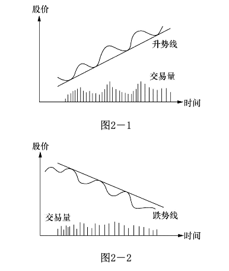

图2—2 是典型的跌势图。将波浪的高点相连，便成跌势线。在跌势时，交易量没有特别之处，但跌波的每个波峰较上一波峰为低，波谷也较上一波谷为低。

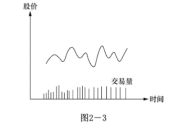

图2—3 是无势图，你根本就不知道这只股票的大方向是什么。交易量也没有特色。**一只无势的股票通常不适合炒作**。

心理分析：有人问一位投资专家：“股价为什么会升？”他想了会儿说：“因为买者多过卖者。” 现在大家明白了，股价升的原因不是低的成本收益比率，也不是高的红利或是其他堂皇的理由，而只是因为买者多过卖者。虽然成本收益比率或红利都会影响投资者买卖的决定，但它只代表了过去。**影响投资者决定的最重要因素是对未来的预期。** 一只成本收益比率很高的股票，表示这家公司过去没赚什么钱，但不表示它未来也不赚钱。

**以升势为例，升势开始时一定是买主多过卖主，因为在无势时，买卖的力量基本均衡。一下子多出了买主，在交易量上的表现就是交易增多。随着股价的升高，第一波买主入了场，这时有人在纸面上开始有收益，他们开始获利卖股，我们在图上就看到回调。这时的卖主总的来说并不多，我们会看到交易量减少。否则这便是不正常的升势。如果股票确有吸引力，如开发成功什么新产品，第二波买主会进场，重复第一波的过程。在图形上，我们看到一浪高过一浪，股价总是以波浪形上升。**

股价的运动有点像推石球上山，要往上推，你要很大的力，但石球往下滚，用不着很多力气。在股价跌势时，买主消失，不大的卖压就会使股价往下跌。虽然其间有人拾便宜货，这种下跌时的反弹是靠不住的。在图形上是一波低过一波，但交易量并不具备什么特色。

**无势图表示市场对这只股票没有什么看法，它在某一区间漫无目标地游动。买方和卖方的力量基本平衡。**

朋友，你认为什么因素使投资者入市买股票？华尔街有过调查，**使一般投资者入场买股票的原因，最主要的就是因为股价在升！** 你明白吗？一般投资者入场买股票，主要不是因为股票的成本收益比率低或红利高，而是因为股价在升！在升！除了股价在升的理由之外，其他因素都是次要的。这就是为什么股价一开始升势，它往上一波高过一波，不会马上停止。要想学习养成对股价运动的感觉，你必须牢牢记住这一点。

你能猜到为何一般投资人卖股票吗？读完上一段落，结论应该很明显。华尔街的调查证实了你的猜测：**投资人卖股票的最主要原因是因为股价在跌！在跌！** 而不是因为成本收益比率高和其他原因，这就是为何跌势一开始，不会马上停止。现在你能体会到为什么股价升时常常升得离谱，跌时跌到惨不忍睹的原因了吧？记住股民买卖股票的真正原因，耐心地观察市场，你很快就会发现股价运动是有迹可循的。

**2　支撑线和阻力线**

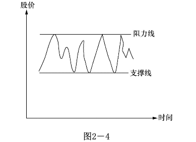

图2—4 标注了阻力线和支撑线。

当股价在一定的区间波动，把最高点相连便成阻力线，把最低点相连便成支撑线。

从纸面上解释便是股价升到阻力线时会碰到很大的阻力，不容易继续升上去，即出现很多卖主。而股价跌到支撑线时会发现很多买主，股价不容易跌下去。

心理分析：走进交易大厅，你有没有常常听到“这只股票跌到 10 元我就买进”，“这只股票升到 15 元我就卖出”之类的话？答案是肯定的，因为这也是我常听到的。为什么一般的股民会认为某只股票跌到 10 元就值得吃进，而升到 15 元就该脱手呢？

这也源自我们日常生活的经验。精明的主妇通常知道某种衣服的最低价是多少。如果衣服以这个价格出售，大家便纷纷抢购。而衣服价格升到某个价位，就没有人问津了。这可以分别称为衣服的阻力价和支撑价。

在股市上，如果参与交易的多数投资者认为 10 元是某股票的最低价，一旦股价跌到这个价位，便会有很多人买入，股价自然就跌不下去。在图上我们就看到支撑线。

阻力线的道理相同。

如果一个款式的衣服的价格在 10 ～ 15 元之间波动，想象一下服装商是怎么做生意的。

当衣服的价格在 10 元的时候，买主认为衣服的价钱便宜，入场购货。但卖主会觉得价钱偏低，再低就不卖了。在 15 元时，买主觉得价钱高，不愿买，虽然卖主想卖更高的价钱，但没有买主他无计可施。所以在 10 元时，因买主多过卖主，价格开始上升，但在 15 元时，卖主多过买主，价格只有下降。

或迟或早，有人会对这个价格区间持有不同看法，认为衣服的价钱太高或太低。无论这是一位大户还是一批小服装商，他们的行动将使买卖的力量失去均衡。如果他们的力量够大的话，将引起一连串的反应。无论是正在买卖的服装商还是在外观望的投机商，他们的行动将会改变 10 ～ 15 元的交易区间。

如果新的均势有利于买主，这将吸引新的买主入场，带来新的买压，而卖主期待更高的价钱，他们的惜售将会使卖压进一步减轻。结果是使衣服的价钱高出 15 元。随着价钱的进一步升高，卖出的诱惑力越来越大，衣服的价钱会在新的均衡区间摇摆。

这个过程便是阻力价或支撑价的突破。在股票上，我们便有阻力线和支撑线的突破。

需要指出的是，阻力线一旦被突破便成了新的支撑线，同样，支撑线一旦被突破便成了新的阻力线。

让我们以支撑线为例：在支撑线附近，足够的买方出现，卖方消失，股价无法跌破该线。几个来回之后，市场形成这便是“最低价”的概念。突然间，更大的卖压出现，股价跌破支撑线，这时认为支撑线就代表“最低价”的买主全部亏钱。其中一部分可能止损抛售，另一部分坚持原来的想法，认为股价很快就会反弹。无论如何，原来市场对该股的“底价”概念已被粉碎，市场“背叛”了他们。

现在假设股价又升回原来的支撑线，你认为原先的投资人会有什么反应？

**那些还未“止损”的人会感谢上帝给他们一个全身而退的机会，股价跌破支撑线的那段亏钱的时光令他们寝食难安，现在终于有了不亏甚至小赚的机会，他们会赶快卖掉股票以结束噩梦。**

**再看看那些止损出场者，他们原以“底价”入场，结果被烫伤。今天股价又回到这个价位，但烫伤的记忆犹新，他们大多不敢在这个价位重新入场。我们看到卖压增加，买方力量却有所减少。所以支撑线一旦跌破便成了新的阻力线。**

阻力线一旦被突破便成支撑线的道理相近，读者们可以自己思考一下其中的缘由机理。

**3　双肩图和头肩图**

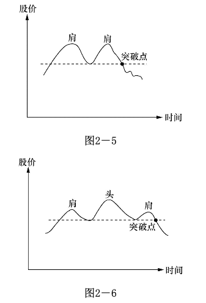

图2—5 是典型的双肩图，图2—6 是典型的头肩图。这都是炒股中常见的图形。

心理分析：以双肩图为例。它的典型特点就是两个高点。要提醒读者，这两个高点的选择是和时间的跨度相关的，很明显，一天的高点和一年的高点是完全不一样的。但它们的解释相同。

随着价钱的升高，买主们开始怀疑价钱是否能超过原来的最高点，卖主也在观察这个最高点是否还像上次一样会带来卖压，使价格的升势受到挫折。简单地说，市场参与者在观察这次会不会有和上次同样的经历。上次价格升到这点引发买卖力的逆转，这次会发生同样的事情吗？

结果只有两个：穿越上次的最高点和不能穿越上次的最高点。在双肩图中，因为无法穿越上次的最高点，市场对价格的看法产生变化，股民对在这点附近持股感到不自在。在股市中，你会看到股价逐步滑落。但假如买力不减，继续穿过上次的最高点，我们就回到升势图去了。

头肩图的道理和双肩图类似。请读者们自己想象一下在其过程中股民的心态变动过程是怎么样的。头肩图可以当成双肩图的变形。这些图还可以倒过来看（如 图2—7、2—8）。

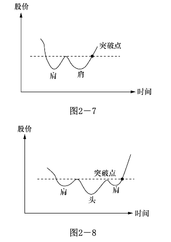

如果说正双肩图给你提供了卖的信息，那么倒双肩图便给你提供了买的信息。在这些图的后面其实是股民们**对该股票价格认定的心理变化**。你要用心来感受：如果你是股市的一员，你会怎么想，你会怎样做？这样，你**慢慢地就会形成何时入市、何时出场的直觉。**

**4　平均线**

平均线的目的主要是用来判定股价的走势。股价的运动常常具有跳动的形式，平均线把跳动减缓成较为平坦的曲线。

计算平均线的方法有许多种，最常用的是取收盘价作为计算平均值的参考。比如你要计算 10 天的平均值，把过去 10 天的收盘价格加起来除以 10，便得到这 10 天的平均值。每过一天，分子式加上新一天的股票收盘价，再减去前第 11 天的收盘价，分母不变，便得到最新的平均值，把平均值连起来便成为平均线（图2—9）。

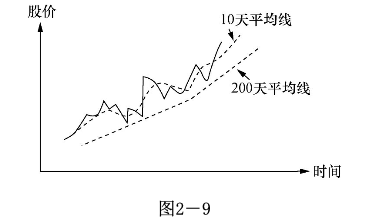

平均线的形状取决于所选择的天数。天数越多，平均线的转折越平缓。我自己习惯用 200 天平均线来衡量股价的长期走势，50 天平均线来衡量中期走势。我不怎么看 50 天以下的平均线，因为我发现其参考价值不高。股票短期的运动方向我注重股价及交易量。我通常不买股价在 200 天平均线下的股票，做短线时例外。

**5　其他图形**

我自己日常留意的技术分析图形就是上述四种。但这节的题目是技术分析的基本知识，我不得不提一下其他图形，否则名不副实。

一般的技术分析书都会提到三角、隧道、旗子等的图形。遗憾的是，我的实践经验证明它们没有什么实用价值。对我没有实用价值并不表示对其他人也同样没用，我严肃地建议炒手自己去找这方面的书学习。我将本书的范围限制在自己亲身证明最有用的知识，并不打算包罗万象，请读者原谅。

有电脑软件的朋友常常会看到 MACD、威廉指标等电脑计算的买卖指标，流行的有二三十种之多。我学股的第二年曾花了很多学费后才明白这些指标都有“见光死”的特点。也不能说这些指标错了，这些指标的发明者通常有辉煌的经历。想象一下：如果每个人都按照这些指标提供的买卖信号炒股，结果将会是什么？我自认站在巨人的肩膀之上，结果从巨人肩膀上跌下来，摔惨了！

我自己常用的前面三个图形也不是我自己发明的。但我在实践中体会到它们背后的心理因素，人性是不容易改变的，所以它们一直有效。希望它们不会因为这本书而同样“见光死”。当然，我相信不可能，人性哪有那么容易改变的？关于其他图形背后的大众心理变化的合理解释，有待行家高手的进一步研究。

**6.综合看图**

图2—10：综合走势线及阻力线和支撑线稍下的点是卖出点。支撑线一旦被突破，表示升势结束。

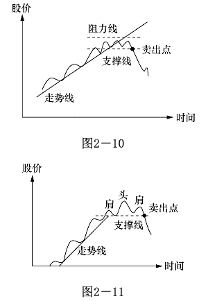

图2—11 和 图2—10 类似，但有别于阻力线，我们这里看到头肩图。道理和图2—10 类似。

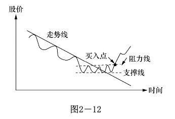

图2—12：把 图2—10 倒过来，我们就有了最常见的买入理想点。记住如果这是升势开始的话，交易量通常增大。

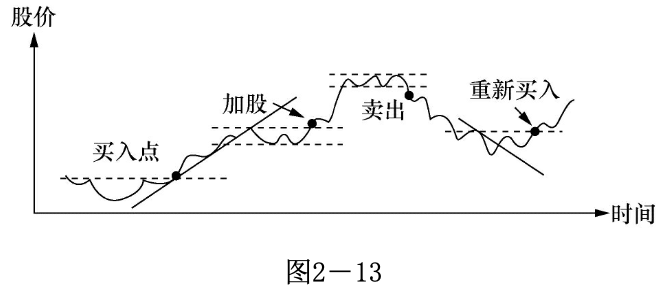

图2—13：这是我们在炒股中常见的股价运动图。我标出了各个不同的买入及卖出好点。请读者用心体会一下为什么。具体怎样操作，我将在“何时买股票”一节详细解释。这些买卖点还可以改进。

现实社会往往和理想社会有差异。股市也一样！我们以上讲了这么多图像和其后的心理脉络，一切都很明白，那是传统的股票技术分析。随着时代的进步，有报道说今天在美国股市的交易量有 70% 是电脑交易，电脑可没有什么感情！那么这些图像后面的心理过程还成立吗？答案可不容易做。毫无疑问的是，不管是人交易还是电脑交易，交易必须用钱完成；股价升了，一定是买盘胜过卖盘！无论是个人下单买还是电脑下单买，一定有资金在入场。

#### 股票的正常运动和周期运动

**1　股票的正常运动**

把握股票走势最关键的，是判断股票是否处于正常运动状态。我认为下列几点有助于读者朋友从概念和操作上体会及掌握什么是股票的正常运动。

股票的走势及走势线：在正常的升势中，每个波浪的最高点应较上个波浪的最高点为高，最低点也应较上个最低点为高。整个股价的运动应该在走势线之上。在正常的跌势中，波浪应一浪低过一浪，最高点较上个最高点为低，最低点也较上个最低点为低。

支撑线和阻力线：一旦阻力线被突破，股价应该继续上升，虽然可能有回调，但回调不应该跌到阻力线之下，否则便是不正常运动。同样，一旦支撑线被突破，股价应往下跌，否则的话，便是不正常运动。如果股价一跌破支撑线便反弹到支撑线之上，可能是买股的好时机。

双肩图和头肩图：和上述道理相同，一旦股价穿越突破点，它应能够继续，否则的话便可认为是不正常运动。

**平均线：以 200 天平均线为例，一个正常的升势，股价应在 200 天平均线之上；一个正常的跌势，股价应在平均线之下波动。否则，都可以认为是不正常运动。**

**2　股票的周期性运动**

在华尔街 200 年的历史中，发展出很多理论来描述股票的波动现象。如道氏理论、伊列波形理论等。这些理论有假设、有论证，读起来又长又乏味，但它们历久不衰，自有其参考价值。就我个人的体会，这些理论很难在实践中应用。除非你是只看大势、手握巨资的基金管理人。

随着自己对股市认识的增加，终于明白这些“玄乎”的理论无非在讲经济周期。任何学过点儿经济学的人都明白经济周期是什么。以下我简单地解释经济周期怎样在股价上反映出来。这些知识能加深你对股市的认识。图2—14：

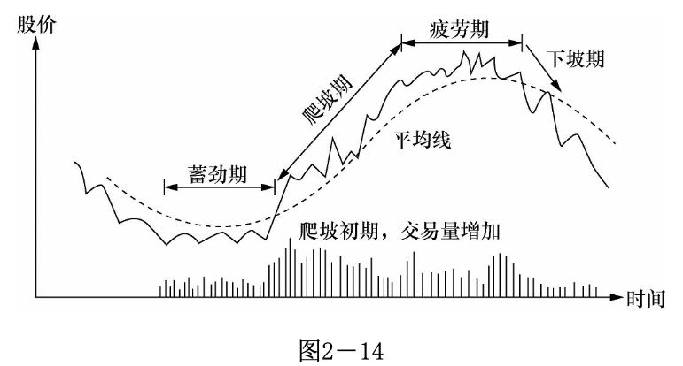

可以将股票运动大约分成四个时期，分别为蓄劲期、爬坡期、疲劳期和下坡期。

蓄劲期：买卖双方的力量基本平衡。

爬坡期：买压胜过卖压。

疲劳期：买压和卖压又基本持平。

下坡期：卖压强过买压。

在任何时期，股票的波动都是波浪形的。每个大波动内包含有很多反向的小波动。平均线将中和这些小波动且指明大趋势。必须强调，股市操纵可能改变每天的或短期的波动，但不可能改变大势。道氏理论特别指出这一点。

股票运动的四个时期其实吻合了经济周期的规律。在上个经济周期的末期，因为生产过剩，产品价格跌落，存货增加，公司的盈利减少，股价下跌。

蓄劲期便是恢复期，在这段时间，公司将不畅销的产品淘汰，减少存货，为经济复苏做准备。

经济复苏期在股价上的表现便是爬坡期。随着盈利的增加，公众又开始争购公司的股票，股价节节高。

经济复苏持续到一定阶段，又因竞争和市场饱和等原因产生产品过剩的问题，这时股价就进入疲劳期。疲劳期接着就到了下坡期。下坡期到了一定地步又进入蓄劲期。整个过程就是经济周期在股价上的反映。

有人认为资本主义经济周期对社会有负面的影响，但计划经济也有其本身的缺陷。中国今日发展市场经济，大家近来看到的肉、蛋、柑橘等生产过剩和价格下跌的现象便是经济周期其中的一环。

在蓄劲后期，爬坡初期，如果是开始一个真正的爬坡期，应有交易量增加的现象，股价一举突破阻力线。一旦进入爬坡期，股票开始升势，股票波动应具有“一波高过一波”的现象。虽然这并不绝对，但整个波动应该在 200 天平均线之上。在这段时间，投资者们必须安坐如山，不要为股价的短线升跌吓出场，但要打起十二分精神注意危险信号。

经过疲劳期，股价跌穿平均线及支撑线，便是离场的时候了。

有些小公司有特别的产品，它不受一般经济周期的影响，但其股价波动也具有相似的特点。一旦市场接受其产品，销售及盈利的潜力会反映在投资者的行动上。他们开始标高股价，我们将看到交易量上升。这些投资者很多并不是短线炒作者，他们买好股票就放在一边，使得公司在市面自由交易的股数减少。此时股票用不着很大的交易量就能攀升。这类小公司的股票在上升时其速度常常很快，短时间内可能会升数倍。自由市场的机制是自由竞争，很快你就会在市场上发现类似或可替代的产品。在今天的市场环境下，一个热门产品永葆热门几乎是不可能的。竞争的结果就是销售及盈利增长的减缓，又重复从畅销到滞销的循环。

**这些小公司的股票同样经历四个阶段，只是这四个阶段的起伏较大公司来得剧烈。**

### 第三节　股票分析之我见

对一般股民而言，唯一关心的是股价什么时候会升，什么时候会跌。而我们知道股价会升的唯一原因是买者多过卖者，股价会跌的唯一原因是卖者多过卖者。**股票分析能够定量出股价什么时候升跌吗？答案当然是否定的！**

想象一下什么会让股民买股？政治的、经济的、心理的、环境的等都是可能的因素，这些都无法定量。金融分析者发明出“本益比”之类的指标试图将股价的评估量化，但本益比同样不能指明股价明天会升还是会跌。那么这些分析理论的目的何在？答案是这些分析提高了预测股价远动方向的准确度。也就是说可以提高股民入市的胜率。

#### 我怎么看价值分析

在我看来，因为价值分析可以定量；它奠定了股价的“参考点”！股市参与者可以用价值分析得到的数字来判断股价是否“太离谱”。离开“参考点”低多了常是买入的好点，离开“参考点”高多了则是可以考虑的卖点。如果通过价值分析得到的“参考点”得到大众接受，那么大众就会围绕这个点情绪性地低买高卖；作为股市的参与者，你的任务就是**分析这个“参考点”，同时感应大众的情绪。**

#### 我怎样看技术分析

由于我自己个人以炒股为生，技术分析是我买进卖出的主要参考。简单地说，我主要靠这几个图吃饭。但对没有多少经验的炒手来讲，你也想靠这几个图吃饭可能没有那么容易。

《华尔街日报》(Wall Street Journal /wɔːl striːt ˈdʒɜːrnl/)登过一则这样的故事：一位记者靠抛硬币在十字坐标上画线，硬币出正面就升一格，反面就降一格，抛了几十次硬币后就画出一条曲线。他把这条曲线交给一位著名的技术分析专家研究，说是一只股票的价格走势图，请教他的意见。该技术分析家看图后说该股票极具上升潜力，一定要知道这只股票的名称。记者如实相告，该技术分析家听后勃然大怒，拂袖而去。这位记者便据此写了一篇报道。你读了这则故事有什么感觉？就我看，这位技术分析家犯了一个严重的错误，他没有问交易量到哪里去了。

不要把技术分析孤立起来看。**研究股票的大市，研究公司的经营情况，研究公司的产品，再看股价的走势图，特别还要注重交易量的变化，只有在这个基础上，技术分析才有意义。最重要的是记住止损。**

**这些图是死的，在实际操作中，你会碰到很多例外，只有通过实践你才知道怎么处理这些例外。这些图之所以重要，因为它提供了最好的临界点。** 

#### 我怎样看股票的大市

炒股高手利物莫(Jesse Livermore /ˈdʒɛsi lɪvərˈmɔr/)是这样强调股票大市的重要性的：“炒股的诀窍便是在牛市中全力投入，在牛市结束或接近结束的时候卖掉你的所有股票。”

**股市就似羊群，单独股票就像羊群中的羊。当羊群朝某个方向前进的时候，大多数的羊跟随着同一方向。股票也一样，在牛市的时候，大多数的股票升，熊市的时候，大多数的股票跌。**

就如做其他生意，顺势是成功的基本保证。做服装生意的要卖流行款式，不要进冷门的式样。炒股票的道理也一样。不管你选了多好的股票，在大市向下的时候，它跌的机会大过升的机会。那么怎样确定股票的大市呢？

要确定大市的走向，最重要的是每天要追踪股票指数的运动。如美国的道琼斯指数，日本的日经指数，香港的恒生指数，上海、深圳的综合指数，等等。

就我自己的经验，**用技术分析的方法来判定大市的走向及走向的变动是最为有效的工具。研究股票指数图，把它看成一只股票，看看这只股票是处于什么运动阶段，它的运动正常吗？**

留意每天的交易总量。如果股市交易总量很大，但指数不升，或开盘走高，收盘低收，这就给你危险信号了。留意一下周围发生了什么事：中央银行是否要调整利率？周边国家是否有动乱？大市的转变通常有一个过程，它较单独股票的转向来得慢。大市的转变可能需要几天，也可能是几星期，重要的是感到危险的时候，你必须采取行动。

同样，你要留意股市跌到底时所提供的信号。当股市跌了很多，跌到大家都失去信心的时候，你会发现有一天股市狂升，可能升 1% 或 2%，交易量很大，这往往是跌到底的信号，大户开始入场了。但这还不是进场的最佳时机，被下跌套牢的股民可能乘这个反弹卖股离场。如果在此之后，股票指数突破上一个波浪的最高点，你可以证实跌势基本结束，是进场的时机了。从图上看这时应有升势时具备的特点。

股市的运动不断重复，你要仔细研究过去的规律。拿份长期的综合指数走势图，研究过去发生的一切，随着时间的推移，你就能培养起对股票大市的感觉。

判断大市走向是极其重要的。我发觉新手（我自己以前也是一样）用很多心思研究单独股票的基本层面和技术层面，认为再好的市场也有股票跌，再坏的市场也有股票升，所以忽视大市的走向。我要在这里强调：**炒股是概率的游戏，逆大潮流而动，你的获胜概率就被大打折扣了。**

**将大市和单独股票结合起来考虑，是专业炒手们必须培养的心态。虽然这有一个学习过程，但一定要在心理上不断提醒自己：大市不好时，别买任何股票。**

请记住：当街头巷尾的民众都在谈论股市如何容易赚钱的时候，大市往往已经到顶或接近到顶。人人都已将资金投入股市，股市继续升高的推动力就枯竭了。而大众恐惧的时候，则该卖的都已经卖了，股票的跌势也就差不多到头了。

判断股市大市还应注意下列几点：

(1) 大的政治环境和经济环境有什么变动？今天的企业越来越具全球性，其他国家发生的政治经济危机将会影响本国的市场。东南亚发生的经济危机便是最好的例子。

(2) 本国的经济大势怎么样？通货膨胀的情形如何？外汇兑换率有无变动的可能？中央银行会调整利率吗？

(3) 所谓的股市龙头有什么表现？在股市到顶之前，你会发现股市的龙头股在大市到顶之前的一段时间开始疲软。

(4) 垃圾股有什么表现？在股市到顶的前一段时间，一些平时没有人过问的小股票开始变得活跃且向上升。龙头股的价格已贵到买不下手的地步，社会游资便开始涌向三四线股票。

(5) 每天收盘的时候，有多少只升的股票？有多少只跌的股票？综合指数有时会被几只大股票糊弄。一只在综合指数占有大份额的股票偶尔会影响真正的方向。比如某天有 1/4 的股票跌，3/4 的股票升，但 1/4 的跌股中可能有一只在综合指数占大份额的股票，如香港的汇丰银行，使得综合指数下跌。在这种情况下，综合指数不完全反映大市的真实走向。

(6) 考虑类别股。如金融股、电子股、房地产股等。

**虽然大市的综合指数走升势，其中某些类别可能在走跌势。研究大市走向时，应将类别综合考虑。**

特别是有时大市的走势并不明显，但金融股可能处在升势，电子股却走跌势。炒手们应根据类别股的运动形态来决定具体某只股票的买卖。

需要指出，以上分析都是预测的工具，您试图预测股票下一步应该怎么运动。您用价值分析的方法分析出股票很便宜了，下一步就应该往上升；您依此买股。您用技术分析得出股票在跌势，下一步应该往下走；以此得出该卖的结论。在实际操作中，买卖只是操作系统的一个部分，其他包括意外发生之后怎么回应等。股市的信条之一是“顺势而为”！并没有要求大家“测势而行”！顺势和测势在思考方法上有本质的区别。您的分析结果是该买股了；但买多少？怎么分仓？怎么止损？自己总体资产的数额和配置的安排如何等都必须包括在操作体系之内。

## 二　成功的要素

通过你自己的观察和研究，不断积累经验，将自己每，次入场获胜的概率从 50% 提高到 60%，甚至 70%；而且每次进场不要下注太大，应只是本金的小部分。这样长期下来，你就能久赌必赢。

在进入具体的买卖技巧的探讨之前，我希望读者们能明白在炒股这行成功必须有什么样的思考方式。炒股的目的是从股市赚钱，但想赚钱并不表示你就能赚到钱。你必须在正确的时间做正确的事情，赚钱只是结果。因为你在正确的时间做正确的事情，所以你得到了回报。

**你首先必须以保本为第一要务，在保本的基础上再考虑怎样赚钱。** 保本不是说保就能保得住的，除非你不涉足股市。只要你把资金投入股市，你就有亏本的可能。股票何时运动正常的概念非常重要，我在这里特地加以说明，你对股票何时运动正常完全没有概念的话，你的炒股无非是瞎猫碰死老鼠。学股之路是艰难且漫长的，要想从股票学校毕业，学股人必须有一定的素质。只有具备这些素质，你才可能熬过黑暗的时光，否则，成功只是幻想。你如果还不具备成功的投资者所具有的共性，希望你从今天开始培养。除了毅力之外，没有别的要求。

### 第一节　把握投机原理

任何有亏损的行为都可称为投机行为。在投机游戏中，你希望最好的结果，但同时为可能的失败做准备。炒股的行为便是典型的例子。

投机本身是门学问。几何学有几何原理，投机学也有它固定的投机原理。作为投机游戏的参与者，你必须遵循投机原理。以这些原理做指导，锻炼游戏的技巧，随着时间的推移，你对原理的理解越来越深，玩游戏的技巧越来越熟练，你便成为专家。

那么投机的原理是什么呢？它的精华可以浓缩成两句话：(1)败而不倒；(2)追求卓越。这两点不是我的发明，是我们祖先几千年流传下来的做生意的智慧！

本钱没了，你就倒了；无论有什么好机会，没有本钱的生意人只能是旁观者。败而不倒这句话的意思是很明白的。追求卓越是追求更高的层次；每位生意人都要有“第一桶金”及以后的发扬光大，否则你不会成为“慈善家”；你要在正确的时候狠狠地捞一把。

华尔街对投机原理有许多不同的说法。最通行的英文直译是“资本保存”和“恒久利润”。“资本保存”对上“败而不倒”，“恒久利润”对上“追求卓越”。虽然说法有点差别，意思是一样的。为解释的方便，“恒久利润”又常分为“不断盈利”和“挣大钱”两部分。

#### 保本

炒股是用钱赚钱的行业。一旦你的本金没有了，你就失业了。无论你明天见到多么好的机会，手头没有本金，你只能干着急。几乎所有的行家，他们对炒股的首要建议便是尽量保住你的本金。而做到保本的办法只有两个：**第一，快速止损；第二，别一次下注太多。**

炒过股票的朋友都有这样的经历：亏小钱时割点肉容易，亏大钱时割肉就十分困难。这是人性的自然反应。在一项投资上亏太多钱的话，对你的自信心会有极大的打击。你如果有一定的炒股经历，必然同时拥有赚钱和亏钱的经验。赚钱时你有什么感觉？通常你会在内心指责自己为什么开始的时候不多买一些，下次碰到“应该会赚大钱”的机会，你自然就会下大注。这是极其危险的。

**在炒股这一行，没有什么是百分之百的。如果第一手进货太多，一旦股票下跌，噩梦就开始了。每天下跌，你希望这是最后一天；有时小小的反弹，你就把它看成大起的前兆；很快这只股票可能跌得更低，你的心又往下沉。你将失去理性判断的能力。**

人性共通，我算是这些经历的过来人，其痛深切。

具体的做法就是分层下注。你如果预备买 1000 股某只股票，第一手别买 1000股，先买 200 股试试，看看股票的运动是否符合你的预想，然后再决定下一步怎么做。如果不对，尽快止损。如果一切正常，再进 400 股，结果又理想的话，买足 1000 股。由于股票的运动没有定规，你不入场就不可能赚钱，而入场就有可能亏钱，所以承担多少风险便成为每位炒手头痛的事。索罗斯在他的自传中提到，他对应承担多大风险最感头痛。解决这个问题并无任何捷径，只有靠你自己在实践中摸索对风险的承受力，不要超出这个界限。

**然而什么是你对风险的承受力呢？最简单的方法就是问自己睡得好吗？如果你对某只股票担忧到睡不着，表示你承担了太大的风险。卖掉一部分股票，直到你觉得自己睡得好为止。**

**把“保本”这个概念牢牢地记在心里，你在炒股时每次犯错，你的体会就会深一层，时间一久，你就知道该怎样做了。**

#### 不断盈利

读者或许会嘲笑这样的题目，炒股如果不是为了盈利，炒股干什么？难道吃饱了撑的不成？但你注意到“盈利”二字前是什么？是“不断”。在股票市场偶尔赚点钱不难，只要你运气好就可以了。难的是“不断”二字。有多少次你听到朋友说：“我今年不错，股票大市跌了 20%，我只亏 10%，我战胜了股市！”真的吗？任何专业的炒手，唯一该问的问题应该是我今年挣了多少？有谁听说过服装店老板说自己较隔壁店少亏钱而洋洋得意的吗？但我常听到炒股的人居然会为亏钱而自豪！这其实便是炒股艰难的地方。看不见、摸不着的股票使一般人的判断力走了样。

要想在股市不断赚钱，除了知识和经验之外，就是必须忍耐，等待赚钱的时机。问问一般的股民，他们的入市资金有多少买了股票？有多少是现金？你会很惊奇地发现，一般股民几乎把入市资金全部买了股票。不管是牛市还是熊市时，他们都是这样。这些人有一个共同的想法：“我的钱是用来赚钱的。”读者们若有机会到赌场看看，就明白股民们为什么会这样做。赌客们站在赌台旁，一注都不肯放过，生怕下一手就是自己赢钱的机会。直到输完才会收手。你要明白一点：**股市有时是完全无序的，你根本就不知股票下一步会怎样运动。就像你的女朋友生气时一样，你不知她在想什么，不知她要干什么。这时最佳的方法就是别惹她。在股票市场，就是你就别碰股票。**

股票在大多时是有理性、有规律的。虽然每只股票的个性都不一样，但大同小异，你需要不断研究、不断观察，等你的经验积累到一定地步，就知道怎样顺势而为。等待、忍耐、观察，只有在股票的运动符合你的入场条件时才入场。只有这样，你才能够确定你入场的获胜概率大过 50%。在这基础上，不断盈利才有可能。当然，千万别忘了保本。

只有在有确定胜算的时候才入场，你极大地提高了成功的概率，这才使得不断盈利成为可能。看看你周围的股友，大多都是有时亏一点，有时赚一点，算总账曲线通常向下走，这就是典型的没达到不断盈利层次的表象。过了这个关，你会看到账面上偶尔会亏钱但亏小钱，大多的时候在赚钱，总账的曲线是向上的。

#### 赚大钱

给读者出一道题：在你面前是两位炒手的交易记录。他们去年都翻了一倍，即100% 的回报率。一位是常胜将军，他的交易全部赚钱，有买必赚，虽然每次赚得都不多，但他的交易记录密密麻麻的一大沓，积少成多，他赚了 100%。另一位似乎运气不怎么样，交易中亏的次数多，赚的次数少。但他亏时亏的钱少，赚时赚的钱多，特别是有只股票卖出价较买入价升了 4 倍。算总账他也赚了 100%。你怎么评价这两位股票炒手？

两人中的一位是运气很好的新手，另一位可是资深的专业炒手。你现在大概能够猜到哪位是哪位了吧？从他们的交易记录，你体会到什么了吗？在现实生活中，专业炒手的记录几乎都如上面所描述的，他们明白股票买卖不可能每次都正确，那么在错误的时候为何要付大的代价？但在他们正确的时候，他们试图从中得到最大的利润。可是新手们很少有这么好的运气，他们通常把赚钱的股票首先出手，满足于赚小钱，结果通常是手头有一大堆套牢的股票。

想象你手里有 10000 元，你告诉自己要分散风险，每只股票只投 1/10，即 1000 元，一年下来，五升五跌，5 只股票跌了 10%，4 只升了 10%，另外一只升了 200%。那么一年下来，这 10000 元变成 11900 元，19% 的回报率。其中那只升了 200% 的股票是成功的决定性因素。

炒过股的朋友，你碰到过 5 元的股票升到 15 元吗？这样的机会多不多？但你抓到过多少？你是不是常常过早离场？使你过早离场的主要原因有两个：第一，人好小便宜；第二，不够经验判断股票运动是否正常。得到便宜是很愉快的，每次卖掉赚钱的股票你都觉得自己是炒股天才，想庆贺一番。你总是试图重复这类愉快的经历。所以我们看到新手赚钱时通常只赚小钱。

炒过股的朋友，你碰到过 5 元的股票升到 15 元吗？这样的机会多不多？但你抓到过多少？你是不是常常过早离场？使你过早离场的主要原因有两个：第一，人好小便宜；第二，不够经验判断股票运动是否正常。得到便宜是很愉快的，每次卖掉赚钱的股票你都觉得自己是炒股天才，想庆贺一番。你总是试图重复这类愉快的经历。所以我们看到新手赚钱时通常只赚小钱。

另一点要强调的是：如果你确定股票运动正常，你的胜算很大，这时你应该在这只股票上适当加大下注的比重。如果你的制胜概率是 60%，你下 10% 的注，但经验告诉你这次的制胜概率是 80%，你就应加注。从 10% 提高到 30% 甚至50%，从直觉上你能明白为什么应这么做。具体怎么下注的艺术请参考下面“资金管理”一节。

### 第二节　资金管理（怎样在股市下注）

**败而不倒，** 这是做生意的最基本法则。朋友，你将省吃俭用省下的血汗钱投入股市，买了某公司的股票，成为那家公司的股东，你在投资生意。你投资股票和投资住家隔壁的小卖店并没有本质的区别，区别仅在于那家公司的股票公开挂牌上市了，你家隔壁小卖店的股票未曾上市。如果小卖店的老板请你投点资，你会怎么思考？你面临投不投资和投多少两个问题。如果不投资也就算了，如果决定投资的话，投多少就**费思量**了。

#### 入市前先自问“我亏得起吗”

一个人无论做什么投资，思考的第一个问题必须是：我亏得起吗？** 你如果有福气，在某单位有份待遇优厚的好差事，不用怕被炒鱿鱼，工资福利准时发，连卫生纸都会准时发到手里来，我恭喜你！你把用不完的钞票放进股市寻刺激，胜固可喜，败亦不足忧，那么你不用考虑什么“败而不倒”之类的废话。但不幸你和我一样是位手停口停的穷小子，时时担忧下个月饭钱从哪里来的不幸人！假如败了，一家老小吃什么？**“我亏得起吗”这句话是沉甸甸的。**

我在纽约做地产经纪人时的老板是位台湾赴美的早期留学生。他在 20 世纪 70 年代末投身地产界，几年间风生水起，《纽约时报》都具专文介绍这位华裔地产新星。80 年代末期美国地产低潮，他被套牢，其间虽有小亏解套的机会，但大家知道，人有了一定地位，要亏钱认输是多么困难。最后他以破产告终，和自己的房子、车子挥手作别，不带走一片云彩。他夫妻二人都是高级知识分子，很有教养，三个孩子也非常聪明懂事。我尊敬他们的为人，但他们做生意没有遵循“适时止损”及“败而不倒”的原则，在生意场承担了超出自己承受力的风险，运气好时流星一样升起，运气不好便如流星般消失。因为这家公司倒了，我才决定进商学院修习 MBA 学位。我现在还常常想起他们，希望他们今天的生活如意。

#### 提高获胜概率

炒股是亏钱容易赚钱难的行业。假设你手上有 10000 元资本，亏掉 50% 后剩下 5000 元。但你要回到 10000 元，你必须赚 100%，5000 元要翻一倍才会回到 10000 元。任何有基本数学概念的人都知道 100% 的道路较 50% 来得漫长。股票当然不例外。对炒股票而言，赌的次数很多。对这类赌，久赌常胜的关键之一便是下好注。怎样下注是艺术，没有绝对的是非之分。但有门科学叫概率，它对怎样完善下注艺术提供了科学的参考。我以下用生活的例子而不是抽象的数学公式来引导大家思考。

我们都知道抛硬币出现正面和反面的机会各是 50%，即有一半的概率出正面，一半的概率出反面。假设你今天和一位朋友赌钱，抛硬币定胜负，出正面你赢 1元，出反面你输 1 元，你们各拿 1000 元的本金来赌。这场赌博的结果很清楚，赌久了，谁也赢不了，谁都不会输。这是一场公平的游戏。突然你朋友建议说：从下一手起，出正面你赢 9 角 5 分，出反面你还是给他 1 元。你还干吗？你当然不干，因为你知道被剃光头是迟早的事。反过来，朋友建议说出正面你赢1元，出反面你赔 9 角 5 分。你会怎么想？你会大声吼叫：好！因为这时你知道剃他光头只是迟早的事，你知道你赢定了。

现在假设这位朋友要提高赌注，每注 500 元，出正面你赢 500 元，出反面你输475 元。概率没有变，还是 1:0.95；但赌注变了，从本金的 1/1000 提高到1/2。这时你有什么感觉？你知道赢的机会还是大过亏的机会，但你“赢定了”的感觉没有了。你的本金只够连输两回，你的手开始冒汗。如果这 1000 元是你下个月的饭钱，你还敢赌吗？

上面的例子，你输赢的概率没有变化，但下注的数额变了，整个游戏的性质便发生了变化，你从赢定了变成了没有赢的把握。朋友，你炒了几年股票，觉得自己有经验了，你知道你的经验是干什么用的吗？你的经验提高了你每次进场赢钱的概率！

我曾研究过美国赌场的游戏，每种游戏（老虎机除外）的赌场盈利仅在 1%～2%。即从概率上来说，你每次下注 100 美元，只能拿回 98 ～ 99 美元，和买卖股票的手续费差不多。但概率上你每次下注都输一点，久赌必输的老人言就完全应验了。所以赌场不怕你赢钱，就怕你不来。但就我的观察，一般的赌客带 2000 美元进场，通常不到半小时就剃光头回家。当时我觉得赌场真坑人，现在明白这些赌客其实太笨了。就算你不懂技巧乱下注，以通常最低额 5 美元的标准下注，2000 美元够耗上两天，赌场包你吃住，就当一次度假也不错。这些赌客赚钱的心太急，恨不得立即就赚得十万八万的，每注下得太大，结果也就可想而知。

现在你应该明白在股市不断赚钱的秘诀了：通过你自己的观察和研究，不断累积经验，将自己每次入场获胜的概率从 50% 提高到 60%，甚至 70%；而且每次进场不要下注太大，应只是本金的小部分。这样长期下来，你就能“久赌必赢”。

数学的道理是很明白的。每次下注应占本金总额的多少，取决于你的经验及对风险的承受能力，没有死定的百分比。你要记住财不入急门。我这里给个建议：新手的话，把本金分成 6 ～ 8 份，每次下其中一份。有了经验，慢慢地把份数减少。你如果有 60% 的胜算，下注的数额比你有 80% 的胜算时应该为少。至于你怎么知道有 60% 的胜算或 80% 的胜算，完全决定于你自己的经验。

### 第三节　认识股票的正常运动

要完美地描述何时股票的运动正常是极其困难的。股票从来不按固定模式运动，就像你要完美地描述人的性格一样，你很难做到百分之百。这是一门艺术，不是科学。人在什么时候会生气？什么时候会高兴？因人而异，但大体上说，受到赞扬时会高兴，被指责时会生气。股票也是一样，被追捧时会升，被抛售时会跌，其间可能受一定程度的大户操作而改变升跌的形态，但总体趋势是不会改变的。经典的道氏理论特别强调了这一点。股票从来不是恒定不动的，它有时很活跃，有时很安静，要么上一点，要么下一点，在一个固定的区间波动，一旦股票开始一个新的走势，它通常循着一条比较固定的路径运行。华尔街将这条线称为“最小阻力线”(Line of Least Resistance /laɪn əv liːst rɪˈzɪstəns/)。就是说股票在这条线上行走时受到的阻力最少。

如果股票开始一个上升的走势，比如说准备从 20 元升到 50 元。你将发现走势开始的前几天，交易量突然增加，股价开始攀升，几天以后，升势停止，开始下跌。这是“正常”的获利回吐，下跌时的交易量较上升时显著减少。读者朋友，这个下调是很正常的，属正常运动，千万不要在这个时候将股票卖掉。如果这只股票具有上冲的潜力，你会发现在几天内股票又开始活跃，交易量又开始增加，上次“自然调低”所失去的“领土”应在短时间内收复，股票开始冲到新的高度。这次运动将持续一段时间，其间每日通常是收盘价高过开盘价，偶尔收盘价低过开盘价，其差额通常不大；交易量也不会有显著的变化，通常情况是减少。或迟或早，股票又会开始下跌，这是新一轮的“获利回吐”。这次获利回吐的股票运动和交易量的特点应该和第一次很相似。

上述是股票走升势时的正常运动。下面的 图3—1 显示出它们应有的特点。

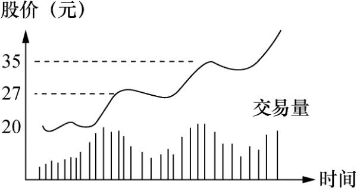

如果读者觉得还很抽象的话，我以下用数字来描述一遍，因为掌握股票正常运动的特点对炒股成功是极其重要的。在股价 20 元的时候，交易量增加，可以是平时的一两倍，股价从 20 元升到 21 元，22 元，甚至 27 元。这几天的交易量较前段时间显著增加是其特征。到 27 元时升势可能停顿，随之开始下调，股价走势为 27 → 26 → 24 元。这段时间的交易量应较从 20 元升到 27 元时的平均交易量为少，即股票从 20 → 27 元时买盘大过卖盘，从 27 → 24 元时的卖盘大过买盘。但这如果是正常的升势，从 20 → 27 → 24 这段时间总的买盘大过卖盘。在 24 元徘徊几天后，股价应重新开始上升，交易量又开始增加，这次上冲应很快超过 27 元，股价走势为 24 → 25 → 27 → 35 元。当股价冲到 35 元时，又开始停顿，随之下调，重复第一阶段的运动。这次下调同样应有交易量减少的特点。

一只正常运动的股票，每次上冲的强度通常较上一次更为猛烈。以我们这个例子，当股价再次冲破 35 元时，应很容易地直冲到 45 元或 50 元，其间不会感觉到有很大的障碍。回调是正常的。一位专业炒手绝不能在正常回调的时候被吓出场。入场后开始有利润了，每次回调都意味着纸上利润的减少，常人的第一感觉就是赶快卖掉获利，这是新手的显著特点。这也是新手很难在股市赚到大钱的原因。

仔细体会一下，上述也是一个升势具有的典型特性。所有技术分析的书对升势的描述都是类似的，这个运动形态也最符合人性的特点。**随着现代电脑自动交易的增加，成交量的意义有所下降，但升势的基本态势没有变化。**

认识股票的正常运动是“顺势而为”的基本功；我们等一会儿将介绍，“顺势而为”是华尔街奉行的行规，被绝大多数的专业炒手所遵循。“顺势而为”首先要给“势”一个定义，这个定义可能因人而异；认识股票的正常运动能够帮助股友在“股势”没有改变的情况下安坐不动，有了判断的依据。能“安坐不动”是在股市赚到钱的重要技能之一。以上描述了一个正常的升势。

股票的正常运动还包括如果在跌势的时候应该如何，转折的时候应该如何，请读者参考前面的技术分析的基本知识。

炒手的任务不仅仅在于确认何时股票运动正常，同样重要的是要能认识股票何时运动不正常。就上面那个升势的例子，股票前进两步、退后一步的过程可能延续一段时间，有时可能是很长的一段时间。这段时间炒手或许在精神上会松懈下来，这是要不得的。因为往往在你松懈下来的时候，股票的运动发生变化。股票缓缓地周期性上升，突然有一天，股票狂涨，从 50 元一下子升到 55 元，第二天升到 66元，这两天交易量突然大增，但在第二天收盘前的半小时股价从 62 元跌回 58 元收盘。第三天开盘一样强劲，股价一下子升到 64 元，但第四天，股价似乎失去了冲劲，它跌回 61 元（如 图3—2）。

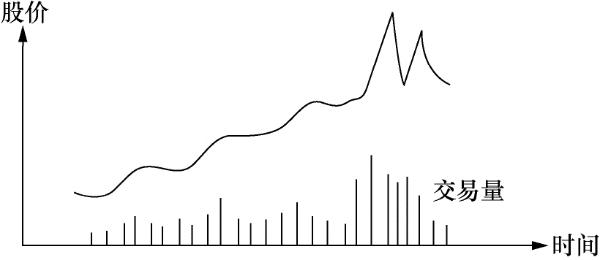

#### 注意危险信号

前述例子中，第四天股价跌回到 61 元，这是极其明确的危险信号，它告诉你：小心了，危险！！！

在股价缓慢地上升过程中，它自然地升，自然地跌，突然某天大起大落，这是在正常上升过程中没有发生过的。一旦有不正常现象出现，炒手们必须特别留意。这时的正常做法，就是将股票脱手。

我是这样理解这一现象的：

股票运动后面的主要力量是大户，这些大户通常是手握巨资的基金或保险公司等。当这些基金的管理人看好这只股票，开始吸纳，你将看到交易量上升，股价上升。通常这些基金管理人在吸纳股票时，并不希望引起大众的注意，所以这一过程通常是缓慢的，它不会上报纸或电视的头条。

一旦这些大户吸股完毕，你通常会听到他们开始公开地推荐这些股票，引起大众的注意。这些大户们的信息通常较普通人灵通，他们也会很快看到公司有好消息公布，如开发成功新产品、盈利较预期为好等。等到这些大户觉得好消息已全部反映在股价之中，他们开始准备脱手。

由于他们手中握有的股票数量通常很大，如果一下子砸进市场，市场根本承受不了，他们手中的股票很大部分只能在低价出手。为了解决这一问题，他们要找傻瓜用高价来承接这些股票。找傻瓜的最佳途径就是令股价暴升，暴升时通常伴随点好消息，如公司任命新董事长了，某证券商强力推荐该股票了，等等。报纸电视整天重复这些消息，引发小股民蜂拥入市。**想想看，小股民因股价暴升而引发贪念入市时买的股票都是谁卖的？一旦大户找足傻瓜，全身而退，还去哪里找大买主把股价继续推高？**

你现在明白了股票的正常运动及危险信号后面的理由了吗？我一直强调，炒股是艺术，不是科学。当不正常的信号灯亮起，是否表示这只股票就一定要下跌？答案是：“否！”没有人能够在任何时候百分之百地肯定股票明天会怎么样，也许暴升的理由是公司真的发明了长生不老药！你必须将股票的运动和公司的发展综合起来考虑。

让我重复一次：**炒股的最基本信条是，在任何时候，你手上持有股票的上升潜力必须大过下跌的可能，否则不应留在手里。看到危险信号，表示你的获胜概率此时已不超出 50%。**

每位严肃的炒手都必须注意危险信号，但问题是在内心深处总有些奇怪的力量使他们在该卖出的时候提不起勇气这么做。或许是侥幸心理在作怪。在迟疑的这段时间，他们常看到股票又跌了好多点，这时他们会拍着脑袋，大骂自己傻瓜，同时发誓一旦股票有反弹就走人，“股票跌了这么多，该会有个小反弹吧？”但反弹来到的时候，他们又忘记了自己的誓言，因为在他们眼睛里，这时股票的运动又开始“正常”起来。通常，这样的反弹仅是股票在下跌路上的喘息，它很快就要走继续要走的路。

人性有很多缺陷。人希望股票会怎么运动，认定股票会怎么运动，当股票的运动和预想不符合时，就会认为股市错了，自己没有错。但股友必须牢牢记住：**股市从来都没错，它总是走自己要走的路，会出错的只有你自己。你所能做的只有追随股市。见到危险信号，不要三心二意，不要存有幻想，把股票全部脱手。几天以后，也许一切又恢复正常，你一样可以重新入场。如果能这样做，你将发现你为自己省下了很多焦虑及学费。**

华尔街流行的说法是这样的：你在铁路轨道上漫步，见到火车向你冲来，你应该怎么办？你自然应该闪开一边，待火车离去后，你随时还可以重上铁道继续漫步。迟疑不决会危及生命的，在炒股上就是你的炒股生命。上述讲的是一个正常的股票升势所具有的特点。时间的跨度通常比较大，从几个月到几年都说不定。对一般的投资者，能抓住整个“势”的 60% ～ 70% 就是相当不错的成绩。这也是一般投资者最需掌握的。这些内容都算技术分析基础知识的一部分，以前谈的也请大家综合起来看，这里就不重复了。

正确地感悟股票运动何时正常需要很长时间的实践，这也是炒股成功关键的技巧之一。随着经验的增加，你的悟性越来越好，对股票运动的判断力越来越强，你就能将每次入场的获胜概率从 50% 提高到 60%，甚至 70%，慢慢地你就成了炒股专家。就我对这行的了解及体验，没有三年的全职经验连门都入不了。你要准备“熬”。

## 三　何时买股票何时卖股票

### 第一节　何时买股票

这个问题我打算从买卖股票依据的基本原则、买入操作的技巧、选择股票的程序等方面加以阐述。

#### 基本原则

在我讲何时买股票之前，我要提醒读者，就我这么多年的炒股经验，选买点最重要的是选择止损点。即在你进场之前，你必须很清楚，若股票的运动和你的预期不合，你必须在何点止损离场。换句话说，你在投资做生意，不要老是想你要赚多少钱，首先应该清楚自己能亏得起多少。有些人以 10% 的数量做止损基数，即 10 元进的股票，以 9 元做止损点。有些人将止损点定在支撑线稍下。有些人定20% 的止损额。还有其他各种方法。**无论什么方法，你必须有个止损点，这个止损点不应超出投资额的 20%。请读者切切牢记，否则这里讲的一切都是空的。**

买股票的依据主要是三点：价值分析、技术分析及大市走向。有些人买股票只看价值分析，即只研究公司的本身价值，不看其他。巴菲特便是代表人物。有些人只看技术分析，认为市场对该股票的看法尽数表现在股价及其交易量的变化之上。大多数的炒手属于第二类。

无论哪一种，只要你能做得好，都可以获得好结果。但对一般的炒手而言，仅靠价值分析来炒股是很困难的，因为你不可能获得完善的资料来判定公司的价值。你如果是位大基金的管理人，买了某公司的大批股票，你可以派个人到公司坐镇，了解公司的细节。对一般人来说，这是不可能的。公司的财务报告仅表明了过去的经营情况，并不代表未来的发展。依据华尔街的说法，股票的价格反映的是半年后或更远的未来的公司前景。

**我自己的方法是用价值分析来找股票，找到股票后的操作主要依靠技术分析。我总是选择那些我入场时胜算最大的点，而且每次下注都只是我资本的一小部分，同时把握亏钱时亏小钱，赚钱时赚大钱的原则，及时止损。说到底，我差不多就等于在开赌场，每次入场时我的获胜概率都超过 50%，而且我只下小注，所以我久赌必赢。**

在“技术分析的基本知识”那一节，我们介绍了几个图。图中所有的突破点都可以叫临界点。我总是将买卖控制在临界点附近。什么是“临界点”呢？大家知道水在 100℃ 变成蒸汽，科学上称 100℃ 正是水的临界点。把它推广开来，衣服的成本价是主妇们买衣服的临界点，在这个点买衣服，被宰的机会最小。在股票的操作上，这些点往往是公众对股价重新评估的点，也就是在这些点上，你入场的获胜概率最高。**买股票的技巧，全在怎样找临界点上。**

#### 操作技巧

以下让我们分析一下买股票时怎样具体操作。

**1　升势时的操作（图4—1）**

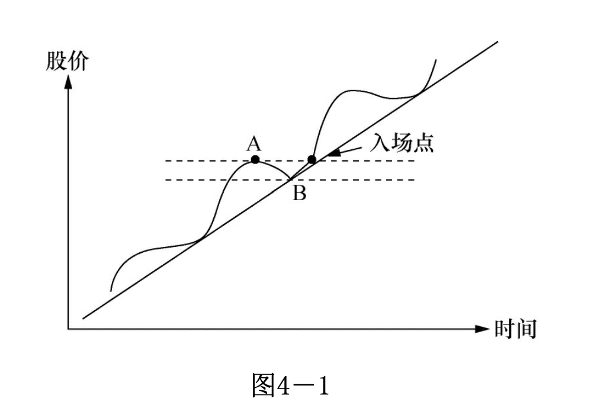

假如这是一个正常的升势，A、B 点分别是波峰和波谷。一旦股价超过 A 点，便是好的买入点。假设 A=15 元，B=13 元，则好的买入点是 15.10 元或 15.50 元。因为你可能判定这是新一波的开始。假如股价升到 16.50 元，你便可将卖出价定在 15.50 元。记住保本。

如果继续上升，你便应忘掉入场价，专注于股票的运动是否正常。止损点应怎么定呢？有两种方法：第一，A=15 元，把止损点定在 14 元；第二，B=13 元，把止损点定在 13 元。这看你对风险的承受力。但无论如何，股价跌穿 B 点必须走人。记得升势的定义吗？正常的升势应该一浪高过一浪，如果股价高过 A 但随即击穿 B，表示升势已被暂时否定。你必须在场外观望，重新寻找机会。

**2　阻力线和支撑线的操作**

图4—2 中有阻力线上的买点及止损点的标示。假设阻力线是 15 元，一旦股价突破 15 元，即可考虑入场。把止损点定在 14.50 元或 14 元。永远记住只能亏小钱。股票一旦穿越阻力线，正常运动是继续上升，如果又跌穿回头，表示股票运动不正常，早先的穿越是假信号，可能是大户在搞鬼。

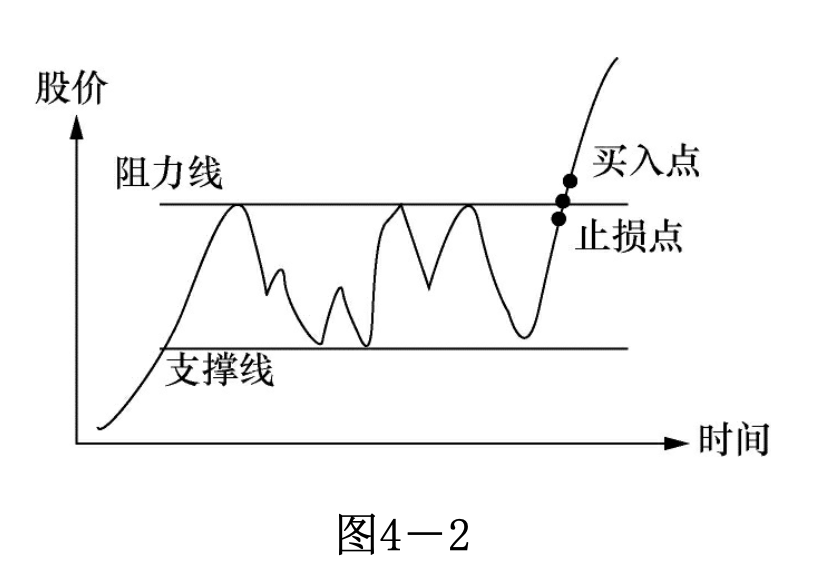

有时股票跌到你的止损点又马上回头，这也不要紧，你可以再入场，再入场的点以上一波的高点所示。这类场合常常碰到，但这是唯一正确的做法。亏的钱等于买了保险，防止了亏大钱的可能。

图4—3 中有支撑线的买点及止损点的标示。如果股价一碰到支撑线就反弹，你有理由相信此时股价接近谷底。但如果买入的话，你必须在支撑线之下定个止损点。因为股票价格跌穿支撑线，继续下跌的概率就大过上升的概率。

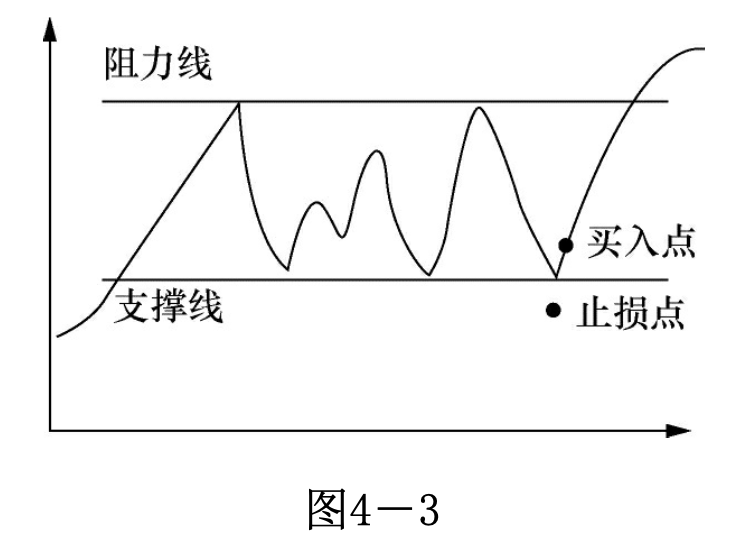

**3　双肩图和头肩图的操作**

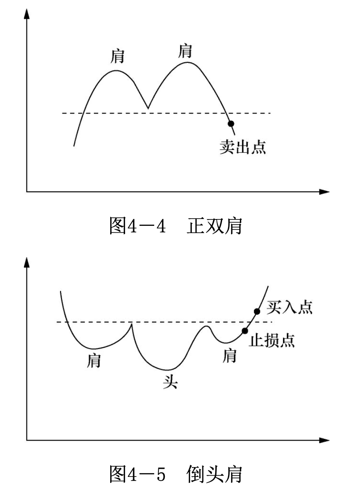

这里只标出 4—4 正双肩和 4—5 倒头肩图两种。正双肩不提供买的机会，它标明卖点何在。倒头肩图的操作法和阻力线上的操作法相同。

以上讲了三个基本图形的操作法。道理其实相当简单。读者能回到第二章第二节的“综合看图”那段，体会可能会更深一些。一般的股票波动就是这几种图颠来倒去。头肩图中的头和肩如果平行的话就变成三肩图。把升势时的波峰连接，再把波谷连接，你就看到通道。就我自己的经验，最有用的概念是阻力线和支撑线，从心理上它们最容易解释，在实际中它们也最为有效。

我们可以把买入的要点归纳一下：

**第一，在买入之前，一定要参照一下股票的走势图，因为它是大众投资心理的反映。**

**第二，在买入之前，先定好止损点，搞清楚你最多愿亏多少钱。切记照办。**

**第三，选择临界点，记住你不可能每次正确，所以入场点的获胜概率应大过失败概率。**

**第四，最好在升势或突破阻力线，准备开始升势的时候买入。**

**第五，绝不要在跌势时入市。**

**第六，不要把“股票已跌到很低了”作为买入的理由，你不知道它还会跌多少！**

**第七，不要把“好消息”或“专家推荐”作为买的理由，特别在这些好消息公布之前，股票已升了一大截的情况下。**

**第八，记住这些要点及点点照办。**

以上我们讨论了几个临界点，在基础知识的部分讨论了这些临界点形成的心理基础。但是不是临界点只有这几个呢？答案当然是否定的。学习寻找临界点的过程其实就是学股的过程，当然其中还包括学习炒股的正确心态。坦率地讲，学找临界点的技巧还比较容易，培养心态才真正困难。

#### 关键：把握临界点

为了使读者对临界点有更深的认识，让我们做些更进一步的思考。股市是讲大钱的地方，任何这样的场所，都一定有大户在兴风作浪，中国的股市是这样，美国的股市是这样，全世界任何地方的股市都没有例外。人人都知道股价突破阻力线时是好的买入点，大户也知道。你如果是大户，你会怎么做？你会在低点吸纳，再人为地创造出公众们认为好的买入点，引起公众的兴趣，这时再把股票抛掉。这就是我们常常看到股票突破阻力线后常常回调的原因。但有一点可以确定，短线操作的资金都是热钱，它不会长久留在某只股票上，除非大户真的认为该股有潜力。

**A：好的买入点 B：更好的买入点**

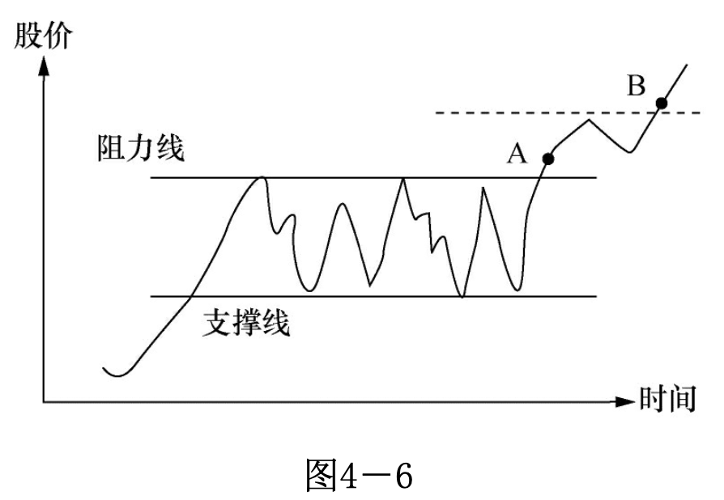

如 图4—6 中的 A、B 两点，如果股票突破阻力线，A 点便是好的买入点。在稍微回调后，股票若能突破上回波浪的高点达到 B 点，则 B 点是更好的买入点。因为你基本可以确定热钱已经离场，市场真正看好这只股票。在操作时，你可以分两段进行。如果你准备买 1000 股，可以在 A 点先进 200 ～ 300 股，将其余的部分在 B 点买入。

读者或许会问为何不将 1000 股全在 B 点买入？因为这样可以防备有些强势的股票，根本就不给回调的机会，一过阻力线便一飞冲天，你如果看好这只股票，却失去这样一飞冲天的机会，心里会很懊恼的。这样做也符合下注的原则：即对胜利的把握越大，下的注就越大。这里要再次强调交易量的重要性。如果交易量没有增加，突破阻力线的现象并没有很大意义，请读者自己思考一下其中的缘由。只有在交易量增加的前提下，突破阻力线才可以认为股票的运动进入新的阶段。

让我们再看一个例子，见 图4—7。

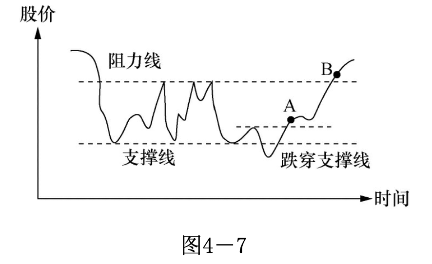

这个例子中，股价跌穿支撑线即刻反弹，A点便是极好的买点。想象一下你是有钱的大户，握有一批该公司的股票，且你已得到一定的内幕消息，公司很快有一个好消息会公布，你会怎么做？你会首先抛售手中的股票，让股价跌破支撑线，因为你知道股价一旦跌破支撑线，会引发市场恐慌性抛售，这时你开始大量吸纳。以我自己的经验，如果股价跌穿支撑线，交易量大增且股价很快弹回支撑线之上，这是极佳的买入机会。我自己碰到这样的机会十次中有九次赚钱。

大户们操纵股票其实就是那么几招，你只要专心，观察股票的运动和交易量的变化，想象你是大户的话会怎么调动公众的心理，大户的花招其实也很简单。讲白了，他们想买进的时候，要么静悄悄地，要么想法引起大众的恐慌性抛售，前者你会看到交易量增加，但不明显，股价慢慢地一步步升高，后者便是搞一些大家公认的好卖点。大户想卖的时候，要么先买进，造成股价狂升，引发股民的贪念去抢抬轿子，要么就搞一些公众们公认的好买点。由于他们通常手握巨资，要做到这些并不困难。但他们的动作必定会从股价的变动及交易量的变动中露出尾巴，只要你有足够的经验，你就明白怎样跟着玩。

你要记住：你买的股票都是别人卖给你的，你卖的股票都被别人买去了。你要尊敬对手！

想象你的对手是谁！如果是大户的话，你炒股大概常亏钱，如果是小股民的话，你大约已赢多过输。细细揣摩这几句话，哪一天你发觉自己真正明白了这段话，你就会觉得炒股的路一下子宽了许多。

以上我们谈了怎样选临界点买进股票，怎样定止损点离场。你如果是位较长期的投资者，不要注重大户的操纵，他们的操纵只能影响股票的短期波动，不能影响大势。但就老话所言：好的开端是成功的一半，一个正确的入场点会使你少伤很多脑筋。以下我们再来谈谈怎样选股票来买。买股的时机固然重要，买什么股票有同样的分量。

#### 选择股票的步骤

在选择股票之前，你需要首先选择股票的类别，如地产股、金融股、电子股等。让我将这个过程简化成以下三个步骤。

第一，什么是大市的走向？如果大市不好，你最好什么都别买，安坐不动。我知道对新手而言，让钱闲着是件极其难受的事，但你必须学习忍耐。就算你看到很吸引人的临界入场点，也不要轻易有所动作。大环境不适合的时候，你的胜算降低了。

第二，哪些类别的股票“牛劲”最足？需要指出，如果两只股票的技术图形相似，比方说同时在充分的交易量之下进入爬坡阶段，其中一只股票属“牛劲”很足的类别，另一只属“牛劲”不足的类别，你会发现属“牛劲”足类别的股票很容易就升了100%，而“牛劲”不足类别的股票要很辛苦地才能升 20%。

第三，当你判定股票大市属于“牛市”，选好“牛劲”最足的类别之后，余下的工作就是“牛劲”最足的股类中选择一两只“龙头”股。这些龙头股可以是该类别的“龙头老大”，如香港银行股中的汇丰银行；也可以是有特别产品或专利的“特别小弟”。

如果你做到了以上三个步骤，你就会发现你的资金在胜算最大的时刻投入到了胜算最高的股票之中。这时又出现另一个问题，读者会问第一、第二点都容易明白，也容易判断，但第三点怎么办？在“牛劲”最足的类别股中，怎样找最有潜力的股票？

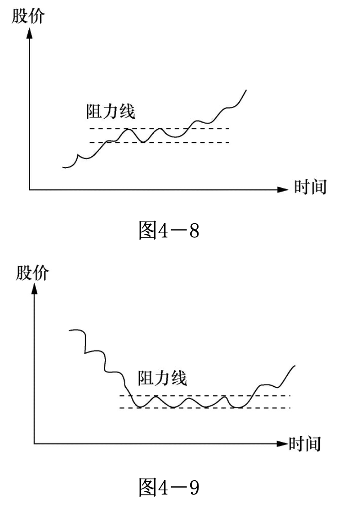

图4—8、图4—9 分别代表两只股票的走势图，这两只股票都属于“牛劲”足的类别股，你现在选一只股票，你会选哪只？假设阻力线的价格同是 20 元。

很多人靠直觉会选 图4—9，因为它从高价跌下来，是“便宜货”。答案是：错了，你应该选择 图4—8 的股票。为什么呢？

先看 图4—9，很多原先在 20 元的阻力线之上入市的股民已被套牢很久，他们终于等到了不亏或稍赚解套的机会，你认为他们现在会怎样做？他们会赶快跑，快快让噩梦结束。一般人就是这么想的，也是这样做的。再看 图4—8。每位在阻力线之下入市的股民都已有了利润，他们已不存在套牢的问题。你会发现 图4—8 股票上升的阻力会较 图4—9 来得小。

再看下面两个图。

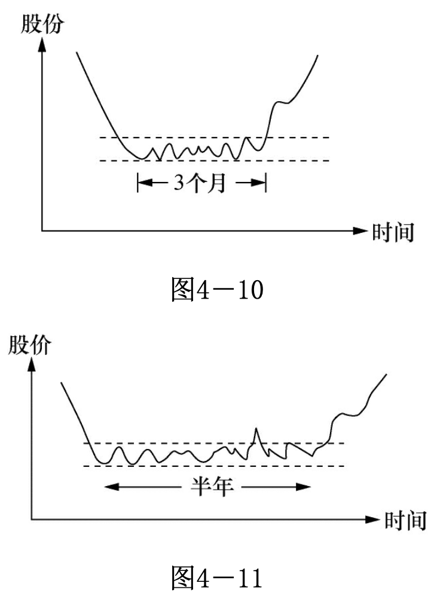

图4—10 在突破阻力线之前的蓄劲期是三个月，图4—11 是半年，你要买 图4—10 或 图4—11 其中之一，你会选哪种？答案如果是 图4—11 你就对了。被套牢是极其不愉快的经历，晚上睡觉时想到这只股票都睡不好！很多人撑不住就割肉算了。蓄劲期越久，那些被套牢还未割肉的投资者就越少，它上升时的阻力也就越小。

#### 形成自己的风格模式

股票买卖是艺术，不是科学，它没有固定的模式。我希望读者到这里已经能感觉到股价变化过程中投资大众心理波动的脉络，能明白公众为什么买股票，为什么卖股票，心理过程是怎么样的，你怎样从这个过程中受益。股票价格的短期波动很多是大户操纵的结果，但大户不能说升就令股价升，他们还是要用“买股票”的方式来令股价升，这个尾巴是掩不住的。

找个清静的地方，细细思考一下临界点是怎样形成的。你如果无法找到支撑它的心理脉络，这个临界点常常是靠不住的。走进书店，翻开任何一本《股市必胜》《炒股秘笈》之类的书，你会看到数不清的“高招”。你按这些高招炒过股吗？结果如何？如果炒股居然简单到 “20 天平均线穿越 50 天平均线是买入好点” 的话，哪里还有人起早摸黑去上班？寻找临界点的过程就是学习炒股的过程。你只要用心，你会不断发现适合你的个性及风险承受力的临界点。

用你自己发现的临界点，按自己定好的规则买进卖出，训练自己的耐性，留意市场提供的危险信号，你就走上了学股的正确道路。你很快就会发现，用这样的方式炒股票，你有极大的自我满足感，其所得利润也较其他方法所得更令你觉得喜悦。因为你不仅赚了钱，也知道了为什么能赚到钱，你将有信心按同样方法再次赚到钱。

最后谈点我个人的经验。股票和人一样，有其特别的个性，有些保守、迟缓，有些急躁、不安分。对某些股票来说，我能很容易揣摩出其个性，推断出其运动轨迹。而有些则和我无缘，其运动模式我怎么都猜不透。**对这些无缘的股票，每次碰到我都被烫伤。就如同交朋友，有些第一次见面就相见恨晚，无话不谈，有些话不投机半句多。我采用的具体做法是，如果某只股票烫了我三次，我就尽量不再去碰它。把注意力放在合心意的股票上。**

### 第二节　何时卖股票

何时卖股票的考虑可以分成两部分：第一，刚进股时怎样选止损点；第二，有利润后怎样选择合适的卖点获利。

#### 选择卖点

在读者的心中，大家应记住自己在做生意，就如同做服装生意一样，一有合理的利润，就可以卖出去。有些投资专家，他们买股票准备永远持有，这并没有错，运气好的话，30 年可以翻 20 倍。但其间会有很多的起伏，有时股票会有 50% 的跌幅，这对炒股为生的炒手而言是难以承受的。而且你还要有选长期股的眼光和信息，对一般人而言，要获得精确的信息并不是件容易的事。况且，如果股票五年都不动怎么办？你吃什么？

上述的投资专家通常靠管理公共资金为生，每月有工资可拿。对一般的炒手而言，持股的时间通常是从几个星期至几个月不等。这个时间没有硬性规定，只要股票的运动正常，你就不应该卖出。但你一旦有了一定的炒股经验后就会明白，很少有股票会在“最小阻力线”上运行一年以上。一个大走势，头和尾都是很难抓到的，炒手们应学习怎样抓中间的一截，能抓到波幅 70% 就算是很好的成绩了。这样做能预防股票常有的 20% ～ 40% 的回调可能给你的整体投资带来的大幅震荡。

让我提醒股友：不要试图寻找股票的最高点，你永远不知股票会升多高。就我个人的体会，决定何时卖股票较决定何时买股票更为困难，亏的时候你希望打平，赚时想赚更多，思想斗争不断进行。对刚学炒股的新手来讲，常有“不赚不卖”的心态，这是极其要不得的，带有这样的心态，失败的命运差不多就注定了。这就是为何我在前面“何时买股票”一节中特别强调选买点最重要的是选择止损点。

要决定何时卖股票，最简单的方法就是问自己：我愿此时买进这只股票吗？如果答案是否定的，你就可以考虑卖掉这只股票。在实际操作中，问题其实并没有这么简单，因为无论进场还是出场，都是有代价的。手续费是不应忽略的数目，频繁进出场的结果就是把利润都捐献给政府和证券商了。

和买股票一样，卖股票的点也是“临界点”。你如果能够做到仅在临界买点入场，临界卖点出场，入场时牢记止损，并注意分摊风险，你的成功概率就能提至最高，你也就真正成为炒股专家了。

#### 技术要领

让我们复习一下技术分析基础知识中的几个卖出临界点。

|   |   |
|---|---|
| 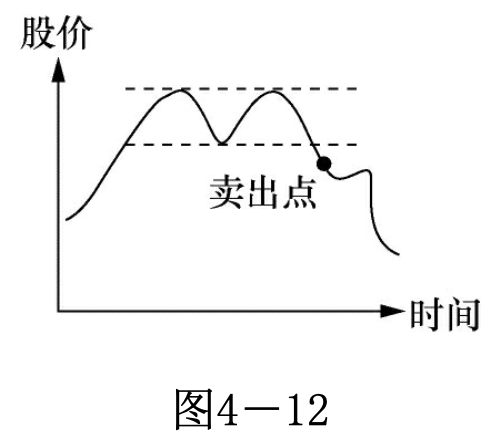  | 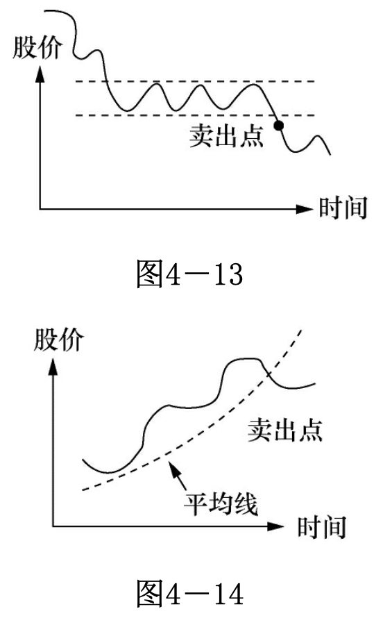  |

从这三个图中，你可以感觉这些卖点是投资大众对股价重新评估的点。图4—12、图4—13 已在技术分析基础知识中详细解释了。图4—14 的特点是股价穿过平均线，我们曾提到平均线是股价走势的标志，一旦股价穿过平均线，你有理由提问：这个走势会继续吗？是不是结束的时候？

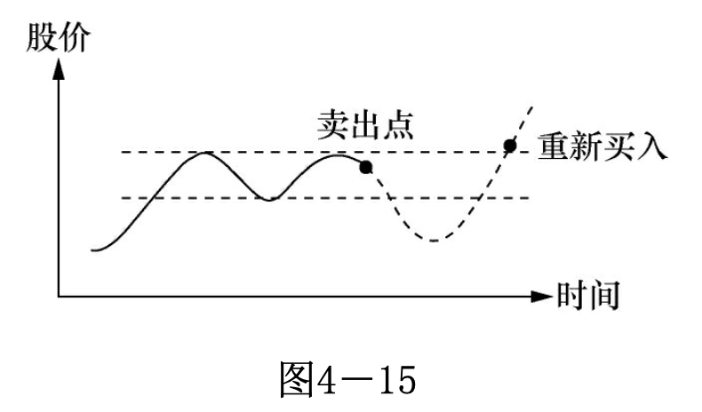

这些卖点都不是死的，随着经验的增加，你或许会把 图4—12 的卖点改成 图4—15；你把卖点移到第二个波峰附近，如果股价再次穿越阻力线，你就再买入。图4—12 和 图4—15 的优劣一目了然。这样，你的资金总是在盈利机会最大的时候留在场内。

**我希望股友们明白，这里讲的是思考方式。临界卖出点并非只有这几个。你要在实践中自己去找。如在前面“何时买股票”一节中所言：寻找临界点的过程便是你学习炒股的过程。这里讲的几个典型的临界点，都可以在实际操作中给予修正和改动，你要自己用心去体会。中心点就是只有在盈利机会大过亏损机会时才让资金留在场内。**

以下小结一下何时及怎样卖股票。

**1　注意危险信号**

随着经验的增加，你会慢慢地产生“这是该卖的时候了”的感觉。不要忽略这样的直觉，这是经验。要获得这样的经验，你通常已付出很多学费。相信自己。

**2　保本第一**

任何情况下，股价超出你的入货点，你应考虑在你的进价之上定个止损点。赚钱的先决条件便是不亏钱。10 元进的股票升到 12 元，应把卖点定在 10 元之上，如 11 元。

**3　亏小钱**

把止损点定在 10% 或更小，在任何情况下都不要超出 20%。只要条件允许，越小越好！条件允许可以这样理解：5 元的股票，10% 只有 0.5 元，50 元的股票，10% 有 5 元。对 5 元的股票，你可以给 0.75 的浮动空间，把止损点定在 4.25 元。对 50 元的股票，你可以给 3 元的空间，把止损点定在 47 元。**我自己喜欢把止损点定在入市当天的最低点。** 比如我今天以 10.75 元买进股票，今天的最高价是 11 元，最低价是 10 元，我便以 10 元作为止损点。**以我的经验，如果我的入场点选得正确，股价开始上升，它不应跌回到我当天入场的最低点。**

**4　遇到暴利，拿了再说**

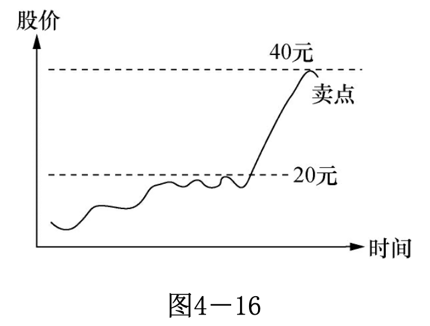

在股市投资，你有时会碰到 图4—16 表示的情况。股价在两星期内从 20 元升到40 元。在这样的情况下，第一天转头（转头表示收盘低于开盘）你就可以把股票卖掉。别期待好事情会没完没了。这样的暴升常是股价短期到顶的信号，特别是最后两天，交易量猛增，公司并没有特别的好消息。这是危险信号，它在说：我在吸引最后的傻瓜入场，当最后的傻瓜上钩之后，我就要回头了。这种短期狂升但没有惊人好消息的股票跌起来一样快。这是大户吸引傻瓜的常用手法。

**5　小心交易量猛增，股价却不升**

见 图4—17，股价升了一段时间之后，如果你忽然发现股票的交易量很大，股价却没有升高。这也是危险信号，它告诉你有人乘这个机会在出货。这通常是股价到顶的信号，起码短期内如此。

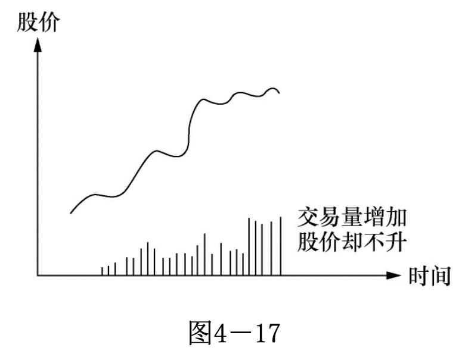

**6　用移动止损点来卖股票**

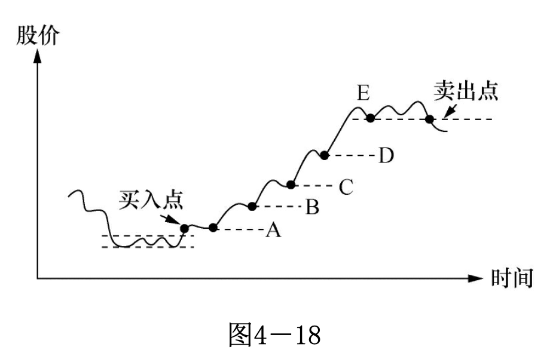

见 图4—18，买入后，如果股票开始正常的升势，它应有一浪高过一浪的特点。你可以将止损点放在每个波浪的浪谷，随着波浪往上翻，你将卖点由 A → B → C → D → E 往上移。这样就能保证你不会在升势时过早离场。同时这样做很简单，情绪上的波动很小。你抓不到这个升势的头尾，但你能抓住中间的大部分。

用移动止损来卖股票是很有效的方法。这是一般不能全时专职炒股的人的最常用方法。在实际的股票运动中，波浪不会如图这么规则，但原理就是这样。它提供了一个原则，遵照这一原则，你不会情绪化地过早离场，导致一个 10000 元的赚钱机会只赚到 2000 元。

华尔街将炒股的诀窍归纳成两句话：**截短亏损，让利润奔跑！** 英文叫：**“Cut loss short,Let profit run!”** 意思是：一见股票情况不对，即刻止损，把它缩得越短越好！一旦有了利润，就必须让利润奔跑，从小利润跑成大利润。让利润奔跑的基础当然是建立在有利润之上的。

请再读一遍何时买股票、何时卖股票这两节，再体会一下“截短亏损，让利润奔跑”这句话，炒股的诀窍尽在其中。

还必须强调：**股票买卖的思维方式不是机械式的！这是资本市场的博弈，资本市场的博弈是心理的博弈。上面讲的一些机械规矩只能用来参考！就像武术的招式，是学武的入门；招式之后是练心，目的是最终成为无招的高手。同样，资本市场的博弈需要首先用心来感应一个投资是否符合大众心理，再后投入资本来验证自己的想法；一旦市场证明自己错误就要认错出局；对了的话可以增加下注。通过不断地修正增减，最后得到一个总体的正数。上面的规矩仅仅是给新手指明了一个入门的方向。请大家谨记，博弈的游戏没有死板的对错之分，只有在不断的试错过程中努力争取得多失少，才能最后成为胜者。**

### 第三节　定位好方法，持之以恒

以上介绍了何时买卖股票的技巧及其思考的方式。总结来说，可以顺势交易，可以回调抢反弹，可以炒高低，也可以跌势抄底。方法没有对错，能够赚钱的方法就是好方法。但是在实际操作中，你无法所有方法同时运用，你只能选择一到两种适合自己的方法。因为每一种方法只能运用在特定市场，比如升势只好用买入顺势的方法操作，您选择抄底买低的方法在升势情况下是赚不到钱的。但是你又不知道下一波的市场运动属于什么类型的市场，所以股市没有一招打遍天下的方法。

股市曾流行过这样的说法：“做趋势的人多数死在震荡里；做盘整的人多数死在趋势里；做短线的人多数死在暴拉里；有方法的人多数死在执行里；靠主观的人多数死在感觉里；没方法的人多数死在乱做里。”这些说法不严谨，但挺形象地描绘了股市新手在学股过程中碰到的困难。股市走向通常可以大致分为升势、跌势和震荡市；它们常常交叉进行。新手可能在升势的时候学习了一套方法，一实施，亏钱！因为股市变跌势了！他开始修改方法，再实施，又亏钱，因为这时候是震荡市，再修改，实施时发现适合震荡市的方法还不赚钱！因为市场又变成升势了。几个循环下来，一位学股人就被淘汰掉了。

股价虽然只有升跌两条路，但有可能走出不同的大小波浪，也有可能横盘很长时间不动。这给股票炒手提出了一个很严肃的课题：我应该在什么时候用什么方法操作？

因为“什么时候”充满变数，所以“什么方法”从理论上也同样充满变数。这也就是为什么炒股赚钱难的原因！很多新手一入场买股就赚了几个钱，那是因为正好碰到升势；市场一转成跌势这些赚的钱通常是留不住的！只有具备了足够的知识和经验才知道怎么应付，才可能将赚的钱留下来。

那么应付的方法是什么呢？回答就是这节的标题：“定位好方法，持之以恒！”

人本身是千差万别的；有些急急躁躁，有些悠悠哉哉。没有好坏，个性不同。在股市，让急急躁躁的人做长线很难，实在等不了；让悠悠哉哉的人炒短线也做不了，太过紧张了！自己属于什么类型自己最清楚！那么选择方法的时候就有了依据。个性急，就不要选做长线，可以做短炒。个性慢，就别专注短炒，想想怎么长线操作。前面谈的买卖股票操作示意图没有标注时间；若用分钟格，就是短炒；用小时格，变成中短炒；用每日格，算中长炒；用每周格的话，就是长炒了。图还是这些，标注不同的时间段，可以满足不同的操作风格。

如果您认为做长线升势是适合自己的方法，那么就要持之以恒。您心中明白，这种方法在跌势和震荡市是赚不到钱的，您在出现跌势和震荡市的时候就应该减少入市深度或离市；您不试图猜测下一个走势是什么。股市总是循环反复的，长线升势又出现的时候您将全力入市。很多人试图预测下一个走势是什么，这种尝试基本是徒劳的；没有人知道下一个走势怎么样！或许您很有经验了，您预测的正确率会提升一些，长期 100% 是不可能的。走势通常只有走出来后才知道原来过去的是什么势！您应该用负面的眼光看待那些声称有这个能力的人。

若您觉得自己擅长短炒赚差价，那么记得到获利点就平仓，别有了点利润就被“让利润奔跑”这句话影响。该卖的时候别迟疑。

新股民碰到的一个困难课题是到底哪种方法适合自己？不同方法的界定其实也很模糊。炒股是艺术，艺术本身就很难用语言明确定义。炒股就是这样！有个说法叫一万小时法则，意思是若您在某个行业花了一万个小时，您将成为专家。我相信您若在股市实实在在花上一万个小时，那么哪一种方法对您合适应该就不再是问题。在没达到这个境界之前，还只好慢慢熬。

还有个非常重要的思路需要再解释。前面不断提到了炒股应该“顺势而为”；没说“测势而行”。您买股票就是分析后预测股价该升才有的动作，卖股票也是分析之后认为股价该跌才会卖股。难道这不是“测势而行”？那么到底什么才是对的？在具体实施的时候，您当然预测之后才买股；如果没有股价该升的预测，买股就是脑壳坏了！那么为什么止损呢？因为实际情况和预测不符。所以在实际操作中的思路是“测势”入市，这个预测本身就应该已经顺势了，否则你不应该得到入市的信号，所以这两种说法其实没什么实质差异。**手中一旦持有股票，您原先的预测就应该有个应对计划，情况对怎么加码？加多少？情况不对怎么减磅？全出局还是局部减磅？**

以上介绍了何时买股票，何时卖股票；我们也介绍怎么定位好一种适合自己的方法持之以恒。这个学习的过程很漫长，一个经济周期可能都不够，要第二次反复才能够真正明白为什么这样做。

何时买卖股票其实只是炒股的一部分。承担多少风险、如何资产配置等都是炒股需要考虑的课题。炒股其实是个系统工程。

用普通工程的建设举个例子，修铁路并不是简单地知道如何将铁轨铺上枕木就行；可能要修桥过河，可能要挖洞穿山；修桥会碰到修桥的问题，穿山有穿山的难处。还有其他许许多多问题；这些都是修铁路的系统工程的一部分。

股票的系统工程包括碰上大跌怎么办？遇上长期的窄幅震荡怎么办？大市长期低迷怎么办？如何分散风险？如何配置资产？这一切都需要知识和经验来处理。需要自己长时间实践才能得心应手地应付。想从股市不断赚到钱并留下来，必须要让自己在各方面都成为有经验的行家。这个系统工程还包括怎么升级自己！开始当然先学习，一旦超出自己为自己管钱的层次，就必须考虑大众理财的方方面面。自己理财可以担大风险，了不起从头再来！通常大众理财必须尽可能地低风险操作。在操作上需要做相应的变动。

我们前面专门强调了“败而不倒”。这是做生意的最高原则，也是炒股的最高原则。所以操作炒股这一系统工程需要给自己一个底线，就是不要随便让自己被剃光头。任何时候，输光了就倒了！

### 第四节　人为操纵的赌局，搞清对方的心理

股市是个博弈的场所，大家各尽所能希望成为这个博弈游戏的赢家。有赢家就一定有输家，那么了解一下有能力在一定程度操纵股市者的思维，有助于自己也成为赢家。

操纵这个话题是很复杂的！若你自己的资金多，你的买卖自然会影响股价；你可能根本没有想操纵股价，只是想买卖股票而已，但结果一样是股价随着你的买卖而变动。由于机构交易占股市交易的大部分，你的交易对象很可能是他们，了解这些大户的心理相当有必要。

操纵这个话题是很复杂的！若你自己的资金多，你的买卖自然会影响股价；你可能根本没有想操纵股价，只是想买卖股票而已，但结果一样是股价随着你的买卖而变动。由于机构交易占股市交易的大部分，你的交易对象很可能是他们，了解这些大户的心理相当有必要。

**(1) 如果股市大户想买股了，他会将股价的 K 线图搞成向下跌到很难看。**

这很明显，你想买股了，怎么才能让人便宜地将股票卖给你？这本书读到这里，这些手段是小儿科了。当然伴随着的还有媒体的坏消息。好玩的是这些小儿科手段一直有效。

(2) 股票在高位的时候以很高的交易量继续爬高是有人想出货了。

小心了，相当多的情况，可能有人想出货了！通常，报纸和网络还会流传和该公司有关的好消息。看看，好消息加上好走势，还有巴菲特的徒弟告诉你好公司股票买了不卖坐等是股市赚钱的不二法门，你自己看着办！当然，还有股市名嘴在边上鼓劲：买进，快买进！所有的外界信息都鼓励你快快入市，别失去发财机会。

(3) 股价跌到你不止损就睡不着和股价升到你不买几股就坐不住的时候，通常是股价的最低点和最高点。

别小看大户，大户不仅仅有钱，他还有人！这些大户可能养了一个排的心理学博士和电脑博士！养这些人并不便宜，不要低估这批人的能量。他们对股价升跌之时你的心理过程知道得一清二楚；升的时候你贪，跌的时候你怕，他们会照着玩！玩到你不止损睡不着或不买入不舒服。

**(4) 如果消息是真的，你通常是最后知道的一位！**

让我们面对现实，你真以为有人想尽办法将钱塞进你的口袋？如果确实如此，你大约也不需要读这本书了！所以对任何消息都多个心眼。

(5) 股市的傻瓜生生不息！

大家都知道什么是“庞氏骗局”！一百多年来同样的一招抓了多少傻瓜？当然，在中国今天它换了个名字叫“P2P金融”。以后还会再换名！同样一招重复有效，换个名字就成。别认为股市的操纵者有什么了不起的手段，用不着的！在股市只要这几招就够了，会有不断的新股民前赴后继。搞清这点你可以对自己多点信心，会重复的东西是可以学习的。

有读者会问那么是否每次股价大跌或大升都是被操纵的？当然不是！有时大跌真是董事长身体不好！所以培养自己独立的判断能力是必须的。

以上我们将操纵概念聊了聊，这样你在具体操作的时候会从不同的角度思考。这种思考会将你从科学的思维里解放出来，进入对股市理解的更高层次。炒股这种博弈类的活动，没有知己知彼，你就处在劣势。

必须再次强调，股票运动的最大原动力来自基本面的推动；股市的操纵只能是短期的，小范围的；它影响不了股价的长远走势。但如果你想买股票，同样的股票是每股 5 元进还是每股 10 元进有相当大的区别，了解股市操纵的一些思路给了你更高的胜算。

股友有时会问：“有什么好股票？介绍一下。”我们现在知道这个问法不对！这个世界没有“好股票”这个东西！如果说“好公司”还是有的，“好股票”这玩意是不存在的！对一般股民来说，价格升的股票就是好股票，价格跌的股票就是坏股票。

有以上心理脉络做基础，我们在买卖股票的时候就可以更完整地思考：

(1) 买股时我们会按走势思考！思考的内容可以是大趋势，比如投资互联网或者投资太阳能这样的大趋势；思考大趋势当然不看股价图。也可以看小走势定策略，比如按照股票的K线图画个均线看看是不是向上？我们不再为股价变动的一些小动作有情绪；我们甚至试图利用这些小动作。

**(2) 公司要有个“奔头”。请给个股价会升的理由吧！有没有根治癌症的专利？股价升要有人追买，若你自己都找不到买的理由，为什么期待别人会掏钱呢？只看图常常不够；图有时会被人造假。**

(3) 别把别人当傻瓜。巴菲特有句名言：“不想拥有一只股票 10 年，就不要想拥有这只股票 10 分钟。”打算拥有股票 10 分钟的通常都希望有位傻瓜在 10 分钟之内会用更高的价钱从你手上接手股票；这种做法有时也有效，但作为一个思路通常走不远。商业交易应永远尊敬自己的对手。

我们现在开始多了一个心眼：股价跌的时候我们不再只是负面地看待，我们观察是否有人想进股了？或许是个机会也说不定？股价升到令人心动，我们开始心生怀疑，该不是有个陷阱等着我去跳吧？将这些思考和书中其他的交易智慧综合，你对股市的理解就进入了新的高度。
