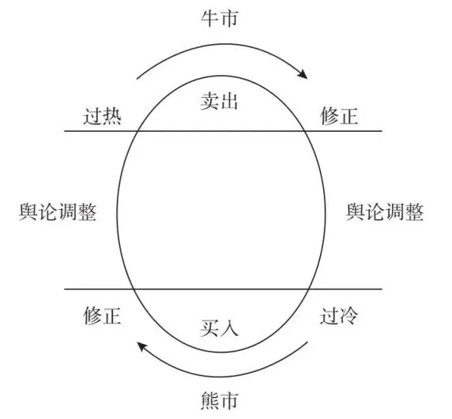
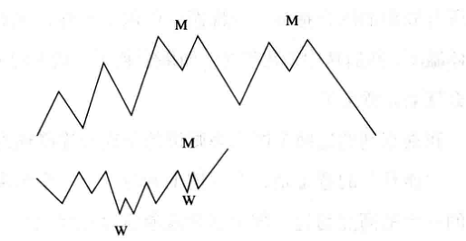

***

> 人不必富有，但是要独立。在旅途中常常要闭上眼睛，忘掉一切，才会找到自己。

***

# 第一部分 查理·芒格

> 人们低估了某些简单而伟大的想法的重要性。我相信，在一定程度上，伯克希尔·哈撒韦公司 (Berkshire Hathaway) 是一家能够传达正确理念的公司。其主要宗旨是证明一些伟大的想法确实行之有效。在我看来，**我们的投资策略之所以有用，正是因为它非常简单。**

20 世纪 70 年代末，芒格开始担任伯克希尔·哈撒韦的副董事长并参与了大部分成功的商业决策。当巴菲特仍然奉行烟蒂策略、无法获得高收益的时候，是他说服巴菲特，在购买股票或收购公司的时候，不仅要遵循量化的价值标准，还要考虑整体质量，例如品牌价值。估值体系的扩展在很大程度上奠定了伯克希尔·哈撒韦成功的基础。 

## **格雷厄姆的基本投资原则  —— 价值分析**
 
>（格雷厄姆）希望创造人人可用的投资体系。作为一名价值投资者，芒格遵循了格雷厄姆和多德提出的价值分析原则，内容大致如下：
>（1）	将股份视为参与公司的手段。 
>（2）	在股价大幅低于内在价值时购买，以创造安全边际。
>（3）	**让躁郁的 "市场先生" 成为你的仆人，而非主人。**
>（4）	理性、客观、冷静地行事。 

### 将股份视为参与公司的手段

查理·芒格这样的价值投资者不会将股份简单地看作有价证券，而是将其看作参与公司的一种手段。股票不是投机的对象，你不能只考虑以低价买入，以高价卖出。芒格认为投机行为是错误的，他说：

> 可惜的是，股票的价格很可能受到资金量巨大但非理性的投机行为影响，有时，它像债券一样，通过基于未来现金流的合理预测而被估值；有时，它也像伦勃朗的画作一样，会因为价格的上涨而备受追捧。  

### 在购买股票时综合考虑内在价值与安全边际

芒格认为，股票代表投资者在一家公司中拥有的股份，尽管可能是很少的股份。因此，在他看来，价值投资者最重视的不应该是股票价格，而应该是公司本身的价值。价值投资者要确定一家公司的内在价值，并将其与市场价值进行比较。或者，正如芒格所说："在购买和出售证券时，要以内在价值为指导，不应该依据价格走势做判断。

"价值投资之父" 格雷厄姆和他的学生多德认为，公司的内在价值是由盈利能力决定的。他们计算一家公司在过去 10 年中每股股票获得的平均收益，然后乘 10。如果这个代表内在价值的数字明显高于目前的每股市场价格，就可以购买该公司的股票。 

然而，格雷厄姆很清楚，内在价值只是一个近似值。芒格同意这一观点，正如沃伦·巴菲特明确表示："内在价值是极其重要的，但它也是非常模糊的。同样，对查理和我来说也是如此，即使我们两个人观察同一家公司，对其内在价值的判断也会存在一定的差异。" 因此，价值投资者总是倾向于在计算时将安全边际考虑在内。如果在考虑了安全边际后，一家公司的内在价值仍然大于该公司的市场价格，这家公司的股票就值得购买。这也是价值投资者购买股票的依据。

> **内在价值 + 安全边际 ﹥ 市场价格**

有关安全边际的重要性，芒格曾明确表示："一般来说，如果我们的目标是投资，我们就不能仅参考内在价值，还要注重安全边际。这是因为，任何对内在价值的估算都只不过是近似值，而不是精确的数字。安全边际为防止出现失误提供了必要的缓冲。投资者如果在没有考虑安全边际的情况下进行投资，就会面临资本持续减少的风险。"

### 让躁郁的 "市场先生" 成为你的仆人，而非主人

本杰明·格雷厄姆对 "市场先生" 有自己的看法。他并不认为市场是有效率的，而是把市场当作一个每天都会发病的躁郁症患者。有时，市场先生说："我会以比你看到的价值低得多的价格把股票卖给你。" 有时，市场先生说："我会以比你看到的价值高得多的价格购买你的股票。"  

因此，在购买股票时，不要被严重躁郁的市场先生疯狂波动的价格影响，而是要更多地考虑公司的内在价值。或者，正如芒格所说："几十年来，我们通常的做法是：当一只股票下跌时，我们会增加买入的数量。如果事情的发展让我们意识到自己是错的，我们就会放弃购买。但是，你如果对自己的评估有足够的信心，就可以利用价格优势买入股票。" 

### 理性交易

在查理·芒格看来，理性是在股市中取得成功的重要基础。他说： "理性是一种好的理念。你必须远离当前环境中盛行的无稽之谈。要做到这一点，你需要开拓思维。随着时间的推移，这将有利于提高你的成功率。" 

除了内在价值，股票的估值还可以参考其他几项财务指标，例如市盈率、市净率、市现率、股息率等。这些财务指标的定义以及它们与股票估值的关系。这些信息可以帮你寻找合适的股票。在你决定购买之前，你务必进行比较阅读理解。而且，在购买时，你要优先考虑安全边际，正如查理·芒格所言："格雷厄姆的安全边际理念…… 永远不会过时。" 

## 购买股票时的另一个重要决策标准 —— 质量

格雷厄姆也有盲点。他低估了一些需要支付较高溢价的公司。事实是我们只能从高质量的企业中获益巨大。

价值原则在芒格和巴菲特做出购买决定时发挥着重要作用，但仅有价值原则还不够。自从查理·芒格加入伯克希尔·哈撒韦以来，两人在选择股票时，除了进行纯粹的价值分析，还运用了质量原则。喜诗糖果公司在 1972 年被收购时，让人印象深刻的不是它的各项数据，而是该品牌在美国西部地区占据的垄断地位，这意味着收购这家公司是有保障的。沃伦·巴菲特用一个美丽的比喻来描述这种保障（竞争优势）："在我 16 岁的时候，我第一次和一个女孩约会，当时我拿了一盒糖果，要么给她，要么给她的父母。在加利福尼亚，如果盒子上写着拉塞尔·斯托弗（堪萨斯城的糖果制造商），女孩就会给你一巴掌，如果送的是喜诗糖果，女孩就会吻你 …… 我认为，对那些住在东海岸地区的人而言，高品质的巧克力产品很常见，喜诗糖果除了品牌，没有任何特别之处。"  

芒格为人谦虚，他从不强调自己在伯克希尔·哈撒韦公司运用质量原则一事上所起的作用，但这一决策原则经常被媒体报道。2005 年，他在接受采访时说："即使我没有加入伯克希尔·哈撒韦，沃伦也会使它成为一家重视高质量投资的公司，他对廉价烟蒂的兴趣也在减弱。烟蒂理论正逐渐走向衰落。" 实践建议定性分析中的影响因素在购买股票时，需要对公司价值进行定性分析。其影响因素如下：
-	竞争优势（例如品牌、专利）；  
-	优秀的管理；  
-	市场占有率高或占据市场领先地位；  
-	抗冲击能力；  
-	定价权（在提高产品价格后不会出现销量大幅下滑）；  
-	可靠性（持续稳定、可观的盈利）；  
-	拥有在处理监管要求方面的经验（如医疗服务）；  
-	规模经济（例如，大型零售连锁店在采购方面有明显的价格优势）；  
-	网络（例如，亚马逊、易贝等网站的评级系统）。

## 保持聪明和简单 —— KISS 原则

如果某件事情太难，我们就去做其他事情。还有什么比这更容易的呢？  

**我们有三个篮子："买入"、"卖出" 和 "太难" …… 对于一家公司，如果我们不具备全面的估值能力，它就会被放入 "太难" 的篮子。**

查理·芒格的管理智慧是把聪明和简单作为投资的主张。或者如他所说："我们更热衷于保留简单的东西。"

根据 KISS（keep it smart and simple）原则，到目前为止，伯克希尔·哈撒韦公司的大部分投资机会都进入了 "太难" 篮子。这是因为格雷厄姆的价值投资理论被芒格解释得非常严格，有风险的投资计划都没有被执行。因此，芒格专注于少数不涉及或很少涉及风险的投资机会，这让事情变得简单。只有这样的投资机会最终会被放入 "买入" 篮子。实践建议放弃复杂的投资理念。

## 开卷有益 —— 通识教育

现代教育的理念是，人们需要先接受通识教育，然后才能进行专业学习。而且我相信，要成为一名优秀的选股者，人们也需要一定的通识教育。  

在我的一生中，没有什么比不断学习让我受益更多。我一生都在实践跨学科的方法，我无法告诉你这对我的帮助有多大。

芒格是一个在很多领域接受过高等教育的人。在进入哈佛大学学习法律之前，他已经涉足其他科学领域，包括数学和气象学。在学习法律之后，他没有放弃学习数学和气象学，而是继续深入研究。对他来说，阅读是非常重要的，即使阅读的内容与他研究的领域无关，他也始终坚持阅读。阅读是他日常生活的一部分。  

> "在我的一生中，我从来没有见过任何一个在更广泛的学科领域拥有智慧却不读书的人。你会对沃伦·巴菲特和我读过的图书数量感到惊讶。" 

> 查理·芒格说："通过永不止步的阅读将自己塑造成一名终身学习者。培养好奇心，努力让自己每天都变得更聪明一点儿。" 

## 静观其变，然后全力出击

成功不仅意味着要非常有耐心，还意味着要在恰当的时机全力以赴。 

我们需要很大的灵活性和一定的纪律性，既不要做蠢事，又要保持灵活。因为人们很难忍受束缚，但可以遵从纪律，不做毫无意义的事情。  

每当发现一个机会，伯克希尔就会迅速采取行动，这一点十分值得关注。不要犹豫不决 —— 这句话适用于生活中的各个领域。

芒格和巴菲特是有耐心的投资者。当股票市场处于疯狂状态的时候，例如在 20 世纪 70 年代、世纪之交的互联网泡沫时期以及 2007 年的美国牛市，芒格和巴菲特都有意地回避投资，在策略上有所保留。他们不想投机取巧，因为他们能预见最后的结局 —— 泡沫的破灭。当泡沫最终破灭，其他投资者无力招架时，伯克希尔·哈撒韦公司才真正进入状态。在美国房地产泡沫破灭后不久，2008 年 10 月，芒格和巴菲特向通用电气和高盛集团投资了 110 亿美元。芒格的祖父曾教导他："机会难得，当机会出现时你必须做好准备。" 芒格对这件事情的做法遵循了祖父的话。 

> 繁荣时保守，萧条时激进耐心不仅对生活很重要，对股票投资也是如此。不要冲动投资，要充分分析股市动态。在经济繁荣时，不要陷入购买狂热。等到泡沫破灭或者市场萧条时，要将资金投向高收益率的股票，这样的股票已经经过了繁荣时期的考验，是值得购买的资产。

## 不要随波逐流

效仿羊群意味着回归均值。

即使是经验丰富的商人也会成为社会浪潮的牺牲品。你是否记得，几年前，一家石油公司收购了一家化肥厂，然后几乎所有其他的石油公司都跟着做同样的事情？这些石油公司没有任何特殊的理由收购化肥厂，它们只是不知道还能做什么。如果埃克森公司决定这样做，那么美孚公司也要做同样的事情。反之亦然。我想它们现在都已经退出了，但这绝对是一种灾难。 

## 不要投资自己不了解的东西

沃伦和我都不认为我们在高科技领域有任何明显的优势。事实上我们认为，当涉及软件、计算机芯片等技术的发展方面的问题时，我们甚至处于不利地位。所以我们倾向于承认自身的不足，然后置身事外。

众所周知，伯克希尔·哈撒韦长期以来避免投资新技术，始终奉行 "不懂不做" 的格言。芒格和巴菲特都表示喜欢变化，比如新想法、新产品、新流程，这些变化可以提高我们的生活水平，这显然是好事。但作为投资者，我们对处于初创期的行业的态度与我们对太空探索事业的态度是一样的：我们会为之而欢呼，但我们不会加入。

有些年伯克希尔投资大手笔投资苹果公司。巴菲特和芒格认为，与其说苹果公司是一家创新科技公司，不如说它是一个强大的品牌，拥有庞大、忠诚且财力雄厚的客户群。出于这个原因，他们决定对苹果公司进行投资。即使在今天，芒格和巴菲特也没有投资最新的技术，原因是在这些新领域中总是不断涌现大量新公司。一段时间后，市场会重新洗牌，这意味着一家初创企业可能会破产或被行业中的大企业吞并。投中少数几家能在洗牌中幸存下来的公司概率很低。因此，像芒格和巴菲特这样保守的投资者不倾向投资新市场。 

## 买入并持有

选择一只股票，投资，然后等待。这将给你带来巨大的好处。比如，向经纪人支付较少的费用，少听很多废话。如果成功执行，你在税务方面就会每年节省 1%、2%，或者 3% 的收益。在价格接近内在价值时卖出股票是很困难的。但你如果买了一些优秀的公司的股票，就可以坐享收益。长期持有对你来说是一件好事。 

芒格和巴菲特一旦确定投资一家公司，通常就会长期持有。最好的例子是他们购买的政府雇员保险公司、大都会保险公司以及《华盛顿邮报》集团的股票，这些股票在伯克希尔·哈撒韦的投资组合中已有数十年的历史，巴菲特称其为 "不可避免的事"。 

> 你如果在购买股票前经过了仔细分析，就可以长期持有这些稳健的股票。你将得到高质量的股票和持续的分红。即使价格没有显著上涨，红利也会定期增加。这将自动提高你的股息收益。此外，忠诚原则为你节省了交易成本，因为每一次卖出和买入都需要费用。

## 过犹不及  —— 反多元化

我们的投资风格有一种概括说法：集中投资。这意味着投资于 10 只股票，而不是 100 只或 400 只。

伯克希尔式的投资者往往不像其他人那样多元化。学术界对多元化理念的颂扬，对聪明的投资者造成了巨大的伤害。我认为，多元化投资的概念几乎是疯狂的。它强调了一个人的投资结果与平均水平没有太大差别。但是，既然你没有被拿着鞭子和枪的人强迫，那么你为什么要追随这样的潮流呢？ 

芒格不是多元化投资理论的倡导者。该理论认为，多元化投资 
（投资于各种不同的资产）可以将投资风险降到最低。但芒格认为，投资者应该奉行质量原则，将精力集中于手上最好的股票。在他看来，最好将可用资金投资于 10 只最佳股票，而不是到处寻找股票，将可用资金分散投资于 100 只甚至 400 只股票。

> 少即是多

## "在泰坦尼克号上也不要惊慌！"

我认为，你有能力持有股票，无须担心。如果没有准备好应对价格下跌 50% 在每个世纪发生两到三次的情况，你就不是一名合格的投资者。与其他更能从容应对市场波动的人相比，你会得到平庸的业绩。 

如果你选择了自认为可靠的股票，并且在购买前对其进行了深入的分析，那么，即使股市正在经历狂风骤雨，你也可以轻松应对。价格波动，甚至是极端的波动，时有发生，但坚固的船只和经验丰富的船员可以抵御任何风暴。股市的历史证明：无论暴风雨多么强烈，天气都会好转，太阳也会重新露出笑容。换句话说，好公司股票, 指数可能会有波动，但长期来看趋势是上升的。

> 只有学会耐心，才能度过崩溃期。价格波动之于股市犹如海浪之于大海。作为投资者，你必须意识到这一点，学会在暴风雨中保持冷静。只要相信你的股票，耐心等待市场的天气变化，就一定会拨云见日。

## 考虑硬币的另一面  —— 逆向思维  

你也许经常会看到业绩惊人的公司。问题是，这样的业绩能持续多久。"我只知道一个答案：你必须思考现阶段取得成功的主要原因，然后弄清楚它们是否有可能不复存在。" 查理·芒格在思考问题的时候，会从相反的一面开始。他如果想了解如何过上幸福的生活，就研究什么会使生活不幸福；他如果想学习如何让公司做大做强，就会首先关注公司为何会破产倒闭。他（查理·芒格）喜欢逆向思维。他说，我想知道我会在哪里死去，然后永远也不去那里。  

查理·芒格和沃伦·巴菲特都是逆向思维者，这意味着他们会通过以下方法解决开放式问题和难题：把问题翻转过来，仔细看看反面的情况。他们问自己："反面是什么？哪个错误被我忽略了？"

## 贷款投资风险很大

有三种东西会毁掉一个人，那就是毒品、酒驾和贷款投资。

沉迷毒品和酒精可以毁掉一个人，这是众所周知的。但根据芒格的说法，贷款投资也会毁掉一个人。如果用贷款购买股票，交易就会充满风险。只有在股票表现非常好、股息足以支付贷款利息的情况下，这种交易才能发挥作用。如果贷款到期，需要偿还，就必须出售股票，如果赶上价格下跌，你就要为此买单。

> 只将闲置资金投入股票市场。千万不要贷款购买股票，因为你需要用钱来维持生计。一旦遭遇意外，例如车祸，你就需要用钱来应对额外开支。如果在这种情况下必须出售股票并且股票价格正在下跌，你就会蒙受损失。

## "不要相信别人的预测。"  —— 谨慎对待预测 

预测是由对特定结果感兴趣的人做出的……美国的预测通常是谎言。应该谨慎对待预测，特别是在预测者想有意误导你的情况下。投资者往往以金融媒体上的预测报道为指导。查理·芒格认为，不应该相信任何人的预测。借用丘吉尔的格言 "不要相信统计数字"，芒格说："不要相信别人的预测。" 但这还不够全面。芒格不相信别人的预测，也不喜欢自己做预测。正如他说过的一句颇具分量的话："我不喜欢做预测，因为我不喜欢在自己的办公桌上呕吐。"

## 羁绊 

我几乎不知道有谁能在没有熟悉的人可以交谈的情况下在认知方面取得长足的进步。每个人都需要可以交谈的同伴。芒格反复强调，与信任的人交谈是非常有帮助的，也是很重要的。关于谈话的重要性，他说得很清楚："你在试图说服别人时，就会厘清自己的想法。这一点非常重要。"

***

# 第二部分 沃伦·巴菲特

巴菲特会定期发布致股东的信。在这些信中，他用普通人都能理解的语言总结公司一年的投资进展，并解释自己的投资方法以及背后的战略逻辑。  

## 抽上最后一口  —— 烟蒂投资策略  

就像在大街上发现的一个只能再抽一口的烟蒂，看起来可能并没有多少价值，然而，购买这种便宜的烟蒂型公司也是一种通往成功的投资方法。  

巴菲特在格雷厄姆-纽曼公司为他的导师格雷厄姆工作期间，就已经掌握了烟蒂投资策略，而且在他独立投资的早期，即 1957 年至 1970 年前后的合伙公司时期，他也使用过这种策略。

巴菲特买入烟蒂型公司的例子有美国国家火灾保险公司、风车制造商邓普斯特农具机械制造公司、霍希尔德-科恩百货公司以及后来的伯克希尔·哈撒韦纺织公司。巴菲特以非常便宜的价格买下了这些公司，买入价格比它们的账面价值低很多。通过前两次收购案例，他获得了高额利润，但是当他在邓普斯特艰难的整顿阶段想要将手中的股票快速脱手时，他的声誉却受到了损害。对于霍希尔德-科恩公司，他也很庆幸可以在 3 年后将其卖出，"尽管卖出价格与我的买入价格差不多"。

巴菲特把按照烟蒂投资策略购买纺织公司伯克希尔·哈撒韦描述为一个错误的决策："尽管我知道纺织行业没有什么前景，由于价格很便宜，我依然很想购买。事实证明，以这种策略购买股票，在早年确实可以获得收益，但 1965 年之后，我开始慢慢意识到这种策略并不是最好的策略了。" 巴菲特在 1990 年 3 月 2 日致股东的信中说："除非你是一名价值清算师，否则以这种方法购买公司是不明智的。"  

## 将基本面指标作为决策标准  —— 价值投资策略  

最安全的交易决策大多基于显而易见的量化指标。巴菲特一直以来都是一位价值投资者。几十年来，他一直巧妙地进行着价值投资，这是他的导师格雷厄姆和多德教给他的，他被认为是世界上最成功的价值投资者。 

巴菲特并不是凭空做出投资决定的，他会对计划购买股票的公司进行非常详细的分析。巴菲特的参考资料包括来自评级机构穆迪和标准普尔的股市研究报告，以及他感兴趣的上市公司的年报。他至今仍然会花很多时间分析这些资料。据说，甚至在他的新婚蜜月中，他都会把穆迪的报告和相关图书放在他的汽车后座上。对巴菲特来说，买入的决定性因素是，这家公司能够展示出很高的价值，且拥有很好的业绩数据。特别是在投资生涯的早期，他认为最重要的指标是公司的账面价值。账面价值是资产和负债之间的差额，换句话说，是用公司的资产减去负债。用公司的账面价值除以公司的流通股数量，就可以得到每股账面价值。如果把一家公司目前的每股股价与每股账面价值联系起来，就会得到我们常说的市净率（P/B）。  

> 市净率 = 每股股价 / 每股账面价值

市净率小于 1 倍，代表每股账面价值高于每股股价，这通常意味着一只股票在某种程度上值得购买（其他指标也需要综合评估）。然而，账面价值并不能反映公司的无形资产，比如可口可乐公司的品牌价值。 此外，账面价值也不包含那些没有在资产负债表上显示的隐藏储备金。市净率是一个重要的决策指标，但不应该是购买股票的唯一决定因素。像巴菲特这样的价值投资者用来做出购买决定的其他关键指标还包括市现率（P/CF）、市盈率（P/E）、市销率（P/S）和股息率等。巴菲特在 1991 年致股东的信中对价值投资的定义如下："通常来说，价值投资意味着购买具有低市盈率、低市净率或高股息率等特征的股票。" 然而，在同一封信中，他也明确表示，仅仅基于指标或比率做出的购买决策往往是不够明智的。巴菲特在决策时，总是将格雷厄姆提出的安全边际考虑在内。巴菲特和芒格 "搭建的严谨的评估系统既考虑了公司的基本面指标，又考虑了公司的发展历程。很重要的一点是，为了给错误预留一个缓冲地带，他们只会以比公司的内在价值低至少 25% 的价格购买资产（这个比例就是他们的安全边际）"

换句话说，"如果一个投资机会的吸引力只是来自公司的基本面数据，那么巴菲特就不会出手。只有当机会看起来令人难以置信地好，他才会选择投资"。  

## 定量与定性相结合  —— 巴菲特的现代化价值投资策略 

我们希望投资这样的公司：

-   （1）我们能够理解它做的业务； 
-   （2）具有长期前景；
-   （3）由诚实且有能力的人经营；
-   （4）可以以非常有吸引力的价格买入。 

如果你找到了合适的好公司（有前景，具备合适的行业条件、合适的管理者等），那么价格就不是问题了。真正的大钱通常是被那些做对了定性决策的投资者赚到的。  

在他漫长的投资生涯中，巴菲特一直在不断优化他的投资策略。他不断从过往的经历中总结经验教训。例如，他很早就放弃了按照格雷厄姆的方法寻找烟蒂型股票，转而采用更现代化的价值投资策略，即基于公司的财务指标做出购买决策。20 世纪 70 年代中期，巴菲特将原来纯粹的定量的估值方法改良为定量与定性相结合的决策方法。他提出，定性的衡量标准包括投资者对行业的了解、公司的长期前景和管理层的水平。这种投资决策的演化发展主要是受到查理·芒格的影响，查理·芒格在这一时期加入了伯克希尔·哈撒韦公司的管理层。巴菲特在 1977 年致股东的信中列举了收购大都会公司股票的例子，这是一个根据上述 4 个标准进行投资的典型案例。用巴菲特的话说，大都会公司 "既有独特的自身优势，管理层又具备出色的管理能力"。

### 1. 行业的了解

在了解行业方面，巴菲特在购买大都会公司之前已经表现出对媒体行业的强烈兴趣。例如，巴菲特经常提到，他小时候做报童，很早就接触过媒体行业的工作。此外，他还先后投资过几家出版公司。 

### 2. 长期前景

1977 年，广播电视技术已经是一项成熟的技术，未来前景良好。

### 3. 管理层的水平

巴菲特在 20 世纪 70 年代初经由他学生时代的朋友比尔·鲁安的引荐，认识了大都会公司的总裁汤姆·墨菲。1982 年，他在致股东的信中称汤姆·墨菲为 "超级明星经理"，在 1985 年致股东的信中，他对墨菲有如下赞美之词："汤姆·墨菲和丹伯克不仅是伟大的职业经理人，他们也是你会希望自己的女儿嫁的那种男人。与他们合作不仅是一种荣誉，也有很多乐趣，相信认识他们的人都会明白这一点。"

### 4. 有吸引力的股票价格

1977 年，大都会公司的股票价格对投资者来说非常有吸引力，它第二年的股息收益率为 4%，从今天的角度来看，这是一个很不错的数字。

## 永远不要投资你不了解的新技术

我不打算投资那些技术远远超出我的理解范围的行业。我对半导体和集成电路的了解程度就如同我对甲虫交配行为的了解程度一样低。 

我需要强调，作为公民，查理和我都欢迎变化：新的想法、新的产品、创新的工艺等都会使人民的生活水平提高，这显然是好事。但作为投资者，我们对一个处于初创期的行业与对征服太空的态度是一致的：我们为这种努力鼓掌，但我们不想一起飞行。  

通常会有大量公司急于进入新的技术领域，许多新公司的商业模式完全依赖于技术本身。经过一段时间的发展后，市场会自动进行整合，这意味着这些公司中有很大一部分会从市场上消失。因此，对这些公司的投资是具有投机性质的。在一次演讲中，巴菲特非常形象地解释了他当年为什么不投资新技术。"汽车可能是 20 世纪上半叶最重要的创新，历史上大约有 2000 家公司进入汽车行业。但这 2000 家汽车制造商中，只有 3 家存活至今。

## 过犹不及  —— 反多元化策略

任何持有很多不同股票的人都属于我所说的 "挪亚投资学派" — — 每种都得有两个。这样的投资者最适合去驾驶方舟。我无法理解为什么一名投资者要把钱投给一家在他喜欢的列表里排序是第二十位的公司，而不是把钱全部投给他第一喜欢的公司 —— 他最了解的、风险最低的、利润最高的公司。  

巴菲特不是多元化投资理论的倡导者，该理论认为分散投资可以将投资风险降到最低。而他认为，投资者应该专注于自己认为价值最佳的公司，遵循 "追求经典，避免从众" 的格言。将可用资金投资于 10 只最好的股票，比不断寻找，并将可用资金分散到 30 只甚至 50 只股票上要好。  

巴菲特将他的股票投资集中在固定范围，而不是全面扩大他的投资组合。他每年都会在致股东的信中公布自己的投资组合，里面通常只包含几只股票，然而，每只股票的持股数量却很高。

> 巴菲特的另一条原则："我买入一只股票的标准是基于股市明天收盘后，在未来 5 年内不开盘的假设。"

## 不要贸然投资，如果投资，就进行长期投资

如果你想象一生只有一张 20 点的积分卡，每一个财务决策都会用掉一点，那么你会变得非常富有。你要抵制诱惑，不要对这些点数掉以轻心，这样你会做出更好、眼光更长远的决策。 

巴菲特在给学生的讲座中就是这样解释他的 20 点投资策略的。根据巴菲特的说法，投资必须仔细考虑。他自己在工作中会花很大一部分时间研究股票市场，阅读股市报刊，以及感兴趣的公司的年报和资产负债表。如果找到了理想的标的，他就会进行投资。他的传记作者艾丽斯·施罗德说："当他给了一家公司积分卡上的一点，这家公司就成了他的一部分，而且这个决定是永久性的。" 

大多数股票，巴菲特一旦购买，就会持有几年甚至几十年。"我们在买入一只股票后，不会介意市场关闭一两年。" "或者换一种说法，我们认为卖出一只值得信赖的股票就像在妻子变老时抛弃她一样。" 巴菲特说。 

巴菲特在他长期持有股票的过程中赚了很多钱，他强调："**我赚的大部分钱都是坐着等来的**。"  

> 巴菲特的成功秘诀是： "我的成功和我不活跃的投资风格有很大关系。大多数投资者无法抵制诱惑，一直在买入和卖出。" 股票市场的一句老话：**"频繁交易会使你口袋空空！"**

##  投资具有竞争优势的公司  —— 护城河策略 

投资的关键是要确定公司具备竞争优势，更重要的是确定优势具有持久性。被广泛、持久的  '护城河'  所包围的产品或服务会为投资者提供回报。对我来说，最重要的事情是找出公司周围的护城河有多宽。当然，我最喜欢的是一座大城堡，搭配一条里面有食人鱼和鳄鱼的宽阔护城河。巴菲特是一个不喜欢投机性业务的投资者。他更喜欢投资于那些拥有领先、稳定的市场地位的成熟公司。他把这样的公司称为（对竞争者而言）拥有不可逾越的护城河的城堡。它们具有如下特点：

-	相对于竞争对手的竞争优势（例如品牌、专利）。  
-	高市场占有率或市场领导地位。  
-	抗冲击能力（在经济危机中生存的能力）。  
-	定价能力（有能力提高价格而不担心销售量大幅下降）。  
-	可靠性（拥有持续稳定的良好业绩）。  
-	处理行业监管要求的经验（如医疗集团）。  
-	规模效应（例如大型零售连锁店在采购方面有明显的价格优势）。  
-	自己的客户网络（如亚马逊、易贝和 Holiday Check 在线酒店预订网站通过其客户评价系统来发展客户

在几十年的投资生涯中，巴菲特在其投资组合中拥有大量的护城河公司。这些公司包括可口可乐、美国运通、箭牌、苹果、宝洁、穆迪和沃尔玛。

## 在正确的时间投资  —— 反周期策略

**在他人贪婪时恐惧，在他人恐惧时贪婪。**

巴菲特的投资节奏是反周期的。在美国股市非常火热的时期，比如在 20 世纪 70 年代初（所谓摇滚年代）、2000 年的互联网泡沫以及 2007 年的牛市阶段，巴菲特都选择了按兵不动。在这些泡沫破灭后， 也就是在市场低迷的时期，他又掀起了自己的名副其实的投资高潮。

> 在大众抛售股票或股价低点的时候购买，正如生活中经常发生的那样，反其道而行之在股市中通常也是有利的。在股票市场的牛市时期卖出（并获利），之后对市场进行深入观察，并在价格下跌时进行买入操作。   

## **选择股票投资没有错**

**从长远来看，你必须持有股票。社会生产力提高，股票价格也会随之上涨。在这个过程中，你不可能做错什么。**

***

## 第三部分 彼得·林奇

> 实际上，我从来没有什么放之四海而皆准的策略。我对股票的选择完全出于经验。我就像一只接受过某种气味训练的猎犬，一个脚印接着一个脚印地探究。

## 如何选择股票  —— 仔细观察，绩优股就在眼前 

> 永远不要投资那些无法用彩色铅笔描绘出来的想法。

### 观察周围的情况

> "在家里，在街上，在学校，在购物商场，你都会不可避免地看到各种上市公司的产品。" 

> "投资你了解的企业的股票是一种很合适的策略，很多专业人士在实际工作中都忽视了这一点。"

### 观察家庭成员购买的热销产品

彼得·林奇也会从家人那里得到一些启示。"几年前，我们在厨房的餐桌旁用餐，安妮（林奇的女儿）问 '清澄加拿大（Clearly Canadian）' 是否上市了。这是我们家中最令人振奋的问题之一。我早就知道孩子们喜欢这种新型碳酸饮料。" 林奇一开始并没有在证券交易所名录中找到这家公司，他把 "清澄加拿大" 抛在了脑后，但是后来又后悔了："实际上，这家公司在加拿大的证券交易所上市了。自 1991 年上市以来，它的股价在一年内从 3 美元上涨到了 26.75 美元，几乎是最初的 9 倍。" "正是孩子们的推荐，我才知道了比萨时光大剧院（Pizza Time Theater）和琪琪墨西哥快餐店（Chi- Chi's）。不过我后悔的是，当初真不该买入前一家公司的股票，也不应该没买后一家公司的股票。" 林奇也曾经在妻子卡罗琳那里得到启示： "感谢我的太太卡罗琳，她让我发现了恒适公司（Hanes），她特别喜欢这家公司生产的丝袜。"

### 投资生产简单产品的公司

"幸运的是，我从来没有在我不明白的事物上投资太多，包括波士顿附近 128 公路沿线的大多数高科技公司在内，我都没有投资。"  

然而，林奇经常购买塔可钟和饼干桶餐厅等连锁餐厅的股票，原因在于 "快餐店有着很强的吸引力，因为它们简单易懂"。所以，你如果可以在新技术或简单产品之间进行选择，就选择投资简单产品吧。正如林奇所说："如果我必须在最好的计算机芯片和最棒的百吉圈之间做出选择，那么我总是会选择百吉圈。"

### 在自身所处的行业寻找投资机会

你了解自己所处的行业，请利用这些信息优势来投资自己工作的企业，或者同一行业中其他有趣的企业。"从根本上看，那些具有信息优势的人有着更加有利的出发点，他们可以更好地随机应变。可以说，他们是最先察觉行业变化的人，和那些身处其他行业的人不同，后者总是到了最后才察觉到变化。"

培养投资视角生活中，请注意观察，仔细聆听。你如果发现了某个有意思的产品，就可以在网上做一些调查，看看生产这些产品的企业是否已经上市。按照林奇的说法，如果这样做，你就可以每年遇到至少两次机会。你如果不知道应该投资于哪家企业，就去附近的购物中心找找振奋人心的（新）产品吧。因为彼得·林奇正是这样做的。"我马上开车前往伯灵顿购物中心，那里是我最喜欢的投资想法来源。"  

## 买入股票前应该注意什么？

仔细斟酌、反复考虑。

### 1. 分析基本信息 

> 找到一家有前途的公司只是第一步，接下来还要进行适当的研究。  
> 
> 不进行相应的研究就投资，就好像玩儿扑克不看牌。  
> 
> 对于股票投资者来说，一个成功的起点是寻找一家有前途的企业，一家连续多年盈利持续增长的企业。  

假如你发现了一些有意思的企业（很有可能是从你身边、工作中或者购物中心中发现的），请不要急着买入它们的股票。请先仔细看一看相关企业的基本信息或重要指标。"选股最重要的方式就是进行研究。你选择了这家企业的股票，原因不仅在于你喜欢这家企业，这家企业也喜欢你，还因为你从各个方面仔细研究了这家企业。" 

#### 不要忘了基本面核查事实

**市盈率**

即使你不关心市盈率，至少也要记得避开市盈率极高的股票。记住这一点，你会为自己避免很多烦心事并节省很多金钱。**市盈率 = 每股股价/每股收益市盈率（P/E）** 是股票估值中最常用的指标之一。它是衡量股票是否被高估、低估或者正常估值的指标。对于市盈率较低的股票，我们可以认为市场低估了其价值。"高市盈率对股票来说是一种障碍，就像赛马鞍座上的额外重量一样。"  

市盈率可以让你了解到，投资一家公司，多长时间可以赚回本金。假设你去年以每股 20 欧元的价格买入 100 股 A 公司的股票（市盈率为 6.06 倍），投入为 2000 欧元。A 公司去年的每股收益为 3.30 欧元。对你来说，年收益就是 330 欧元（100 × 3.30 欧元）。如果收益持 续产生，那么你将需要 6 年多赚回投资本金（6.06 年 × 330 欧元/年 ≈ 2000 欧元）。  

林奇建议股市新手将市盈率和公司的增长率（盈利增长）进行比较。"一般来说，如果市盈率是增长率的一半，我们就可以认为股票评估结果十分理想，而对于一些市盈率是增长率的 2 倍的股票，我们可以认为其评估结果不尽如人意。"

**市盈增长比率（PEG）**

盈利增长较快的企业，市盈率通常较高。与此同时，盈利增长一般情况下也是比较有说服力的卖点。市盈增长比率这一指标可以帮助你对股票进行评估。市盈增长比率等于市盈率除以预期盈利增长率。如果市盈率与盈利增长相同，那么市盈增长比率为 1。如果一只股票的市盈增长比率为 1 或者小于 1，那么可以认为市场低估了这只股票（盈利增长大于市盈率）。举个例子：如果每股收益每年增长 10%，那么市盈率应该不会超过 10 倍。在这种情况下，市盈增长比率为 1 或者小于 1。如果这家企业的盈利可以增长 30%，那么市盈率接近 30 倍是相对合理的。换句话说，如果一只股票的市盈增长比率小于等于 1，买入这只股票就很划算。薄弱环节可能会出现在预测方面，有些短期经济趋势往往不可预测，比如互联网泡沫危机、金融危机等。我们很难准确预测未来两三年的增长。但是，也有一些企业可以提供相对可预测的业务数据。由此看来，市盈增长比率对于传统的市盈率来说是一种有效补充。比如，如果盈利增长较快，那么一只市盈率为 30 倍的股票并不一定被高估了。相反，如果一只股票的市盈率为 10 倍，但是其盈利停滞，那么这只股票被高估了。这些都可以由市盈增长比率体现出来。但是，你不能仅凭市盈增长比率低就选择买入一只股票，而是需要将这一指标与其他指标相结合。除此之外，我们也建议做一下研究，看看实际情况与预期增长率是否相符。需要注意的是，市盈率是一个具有实用价值的评判标准，但是和市盈增长比率一样，它不是衡量一只股票是否值得投资的唯一标准。因此，在摊销方面，我们对市盈率的假设是每年盈利持平。实际上，盈利可能会在几年内发生变化，特别是发展势头强劲的企业，其市盈率通常超过平均水平。这些企业对于投资者来说仍然是有利可图的。若公司处于亏损状态，则市盈率没有参考价值。对此，彼得·林奇给出的建议是："紧盯着市盈率是不明智的，但是也不应该忽视市盈率。"

**预期盈利增长**

寻找那些大有前途的企业，这样的企业可以让你的收益连续几年持续增加。对于市场预测，最重要的能力不是倾听，而是在别人侃侃而谈时呼呼大睡。林奇一再强调自己不是千里眼，也不是算命先生。即使是像他这种经验丰富的股市专业人士，也无法预测一家企业未来的盈利。他建议投资者留心观察一家企业是否采取措施使盈利增长。"如果一个人无法预测一家企业未来是否盈利，那么这个人至少可以研究一下这家企业是否采取了相应措施来刺激盈利增长。" 

比如，一家企业通过媒体发布消息，或者在年报中体现出它正在降低成本，这就是一种可以促使盈利增长的措施。另外，提高产品定价、开拓新市场、在现有的市场条件下或者市场复苏后增加销售额、暂停生产导致亏损的产品等措施对于未来的盈利情况都将发挥积极的作用。类似于关闭亏损部门（伴随着失业）这样的措施通常会对企业股票的上涨起到积极作用，尽管乍一看刚好相反。  

**现金储备**

如果一家企业有 10 亿欧元的现金储备，那么无论如何你都应该知道这个消息。 

另外一个有意思的选股标准就是一家企业的现金储备，或称流动资金。在公司最新的年报中找一找，看看它有没有 "流动资金之山"，比如投资。毕竟这些资金对于未来的投资来说是生生不息的源泉。还可能出现的情况是企业将现金以股息的形式分配给股东，或者 用现金回购自己的股票。你作为股东，这些方式都可以使你增加收益。

**资本负债比率**

负债状况最能体现哪些公司能够度过危机，哪些公司会破产。**资本负债率 = 外部资本 / 自有资本** 一家企业出于扩大投资规模等目的而吸收外部资金是完全正常的，但是在投资一家企业的股票之前，你应该仔细了解这家企业的负债情况。对此，林奇表示："通常情况下，一家企业的资产负债表中应该有 75% 的自有资本和 25% 的外部资本。"  如今，这个比例几乎发生了逆转。在许多行业中，自有资本占比 30% 则被视为股权比例十分稳定。尤其是在一些中等规模的上市公司中，你常常会看到自有资本占比少而外部资本占比多的情况。  
  
不同行业的负债率差别很大。如今，资本负债率为 2 的企业在大多数行业中都是可以被接受的，也就是说其外部资本约为自有资本的 2 倍。换一种说法则是资产负债表中负债约占 66.7%（负债率），而股权至少占 33.3%（自有资本率）。  

**股息分红**

林奇倾向于投资那些通常情况下向股东支付很少的股息或者不支付股息的成长型公司，但是**股息分红也是选择或评价一只股票的重要标准。**

**账面价值**

如今，账面价值受到了许多关注。

巴菲特就将账面价值作为他在分析和投资活动中做出决定的最重要标准，这也是他的尊师本杰明·格雷厄姆的传统。特别是在 20 世纪 50 — 60 年代，巴菲特以低于账面价值的价格投资了许多公司的股票。账面价值是企业的资产减去负债，从资产负债表的角度看，也就是资产与负债总额的差额。但是，林奇认为仅考虑资产估值是有问题的。资产负债表中列出的资产价值往往与实际价值不符。因此，他建议投资者在将账面价值作为决策标准时要慎重。"如果你从账面价值的角度出发决定投资一只股票，那么你需要准确了解其有效价值。例如，宾州中央铁路公司的隧道和未使用过的火车车皮都属于资产价值。"

还有另外一种情况，如果你确定一家企业资产负债表中列出的资产价值被严重低估了，那么即使账面价值很低，投资这家企业也是值得的。林奇表示："拥有贵金属、木材、石油或者土地等原材料的企业，通常情况下其账面只能体现一小部分真实价值。"

**现金流**

每当有人提出将现金流作为投资一只股票的依据时，你都要确定这个人说的是自由现金流。自由现金流指的是减去正常投资支出后剩下的部分。现金流，即一家企业收入与支出的差额，是决定是否投资一家企业的标准之一。在实际操作中，通常用市现率表示。市现率能够体现股价与上一财政年度每股现金流的比率。作为决策衡量标准，市现率越低越好。林奇认为，市现率为 10 倍比较正常。当你发现一只市现率仅为 2 的股票时，林奇会给出如下建议："你如果能找到一只股价 20 美元、现金流保持在 10 美元的股票，就应该把房子拿出来申请抵押贷款，然后尽可能多地买入这样的股票。"  但是，要小心，如果市现率出现明显低估的情况，那么请核实这家企业未来资金是否可以充足流动，或者说结果是否可预测。原因在于，假如一家原材料集团用尽了最后的储备，然后收紧管理，情况就不妙了。无论是市现率、市净率还是市盈率，指标过低都表示存在问题。在这个分析数据的新时代，再也不会有什么 "天上掉馅饼" 的事情了。在价值波动的情况下，某个指标被低估 10% 或者 20% 是完全有可能的，但是如果某项关键指标低于上市公司平均水平的 50% 甚至 80%，那么其中很有可能出现了薄弱环节。  

**存货**

对于制造业企业或者零售企业来说，存货水平增长通常是一个不好的迹象。如果存货增长速度比销售速度还快，那么这就是第一个警告信号。林奇建议投资者在决定投资之前仔细查看企业的存量，也就是库存积累。如果存货的增长比例超过正常值，你就不要买入这家企业的股票了。或者，正如林奇讽刺的那样："如果一家企业的工作人员不得不在别处停车，以便腾出停车场储存货物，那么这绝对是存量过多了。"

### 2. 根据彼得·林奇的经验标准对你的选择进行筛选 

#### 投资符合以下标准的股票 

-	投资你所了解的行业，比如连裤袜或者连锁酒店，不要投资光纤行业等高科技行业。  
-   如果一家企业的名称听起来枯燥乏味，那么这家企业很适合投资。  
-	如果一家企业的业务都是解决各种小问题，比如拧紧瓶盖，那么可以买入这家企业的股票。  
-	如果一家企业的业务是处理棘手的事情，那么可以买入这家企业的股票。林奇以美国安洁集团为例。这家企业凭借清除汽车以及厨具的油污赚得盆满钵满。  
-	如果一家企业从母集团中独立出来，那么可以买入这家企业的股票。  
-	如果一家企业的股票，大型投资人没有持股，分析师也不关注其走势，那么可以买入这家企业的股票。  
-	如果一家企业有谣言缠身，或者名声不佳，那么可以买入这家企业的股票。  
-	如果一家企业的业务让人感到压抑，比如殡葬行业，那么可以买入这家企业的股票。  
-	如果某一行业由于从业人员较少而发展缓慢，那么可以买入这一行业的股票。  
-	利基企业也值得投资，这类企业包括采石场以及当地报刊等。  
-	林奇更愿意投资生产周期较短的快消类大众商品企业，而非耐用品企业。"我更愿意投资生产药品、软饮料、剃须刀片或者香烟的企业，而不是生产玩具的企业。"  
-	林奇认为，投资新技术企业不可取，但是投资使用新技术的企业非常值得。所以，投资一家制造条码扫描仪的企业很有风险，但是投资一家使用新型条码扫描仪的连锁超市就很有前景了。  对于投资者来说，那些管理层以及员工下力气投资本公司的企业也十分具有吸引力。你可以在互联网上找到有关内部人交易的信息。  
-	如果一家企业回购自身股票，那么这家企业值得投资。  

#### 不要投资以下股票 

-	不要投资热门行业的热门股票。要避免广告炒作的股票，还有投资人口中谈论最多的股票。"这意味着你要忽视那些知名专业人士的热门提示，不要理会股票杂志上那些  '一定要买入'  的投资建议，而是要坚持自己的分析。"  
-	不要买入那些市场领军企业追随者的股票，比如 "新苹果" 公司，"新微软" 公司的股票。  
-	如果一家企业在扩张战略中陷入困境，比如通过收购行业外的企业扩张业务，那么不要购买这家企业的股票。  
-	不要购买小道消息中所谓的热门股票。尤其是在互联网时代，这种小道消息通常通过电子邮件或者网络新闻传播开来。  
-	不要购买刚上市的股票，这样的股票因为刚刚上市，没有可参考的关键指标。换句话说：远离 IPO（首次公开募股）。  不要买入只有一家或者零星几家供应商的企业股票。这种企业极其依赖这些客户，可能会因为客户订单方面的风吹草动而陷入大麻烦。  
-	避免买入名称或后缀哗众取宠的股票。在新世纪互联网泡沫中，后缀为 ".com" 的互联网公司如雨后春笋般出现，然后又转瞬即逝。实际上，人们往往容易盲目买入名称中带有时髦噱头字的股票。

### 3. 买入股票之前，给你感兴趣的这家企业致电

### 4. 只拿闲钱去投资

> 投资股票之前，了解自己的家庭财务状况很有必要。  

假设你已经有了自己的房产，根据彼得·林奇 "未雨绸缪" 的投资策略，现在是时候选择股票进行投资了。但是，林奇也建议："请只拿出闲钱来投资，不要影响现在和今后一段时间的日常生活。

### 5. 还是不确定？实践出真知！

> 人们应该先训练一下再出手，就像拿驾照之前要练习开车一样。

## 股票交易中以及买入股票之后应该注意什么？

### 1. 只关注少数几只股票 

> 求多而考虑不周是每个散户投资者的噩梦。

林奇建议散户投资者在买入股票时不要贪多，将数量保持在可管理范围内即可。毕竟选股、审查以及定期检查收益都需要花费大量时间。具体来说，他认为以下情况颇为理想："对于散户投资者来说，我认为组合 3 ~ 10 只股票比较合适。" 重要的是你买入的股票要有发展前景，因为 "你对一只股票的想法越正确，对其他股票的想法就越有可能出错。不过，即便是这样，你也可以凭借一只成功的股票享受到投资者的胜利"

> 不要贪多买入太多股票。花一些时间研究一下，有目标地去寻找那些有希望实现高增长率的公司股票。有时候，其中一只股票的股价可能会增长 10 倍。正如林奇所说："一个人如果可以在一生中抓住几只十倍股，他就赢了。这样的人生别无他求。"

### **2. 要有耐心**

> **不妨买入一些优秀企业的股票，无论涨跌都留在手中。**  

> 选择那些对的股票，其他的就交给股市吧。只有在面对牛市时和面对熊市时坚持同一种策略，你才能将长期利润最大化。  

彼得·林奇认为，投资者应该坚持持有那些经过仔细斟酌而买入的股票，就算遇到了熊市也不应该草率卖出。在这一点上，沃伦·巴菲特也持有相同观点。原因在于，无论如何，企业的内在价值都不会降低。  

### 3. 定期检查投资组合

> 定期检查投资组合中的各家公司，思考一下怎样才能使明年的收益更上一层楼。如果想不出来，就问问自己，为什么投资了这样一只股票。

### 4.什么时候应该卖出股票 

> 有些人会卖出涨势大好的 "赢家股票"，然后把那些下跌的 "输家股票" 留在手里，就像摘除鲜花保留野草。**还有一些人机械地卖出下跌的股票，把上涨的股票留在手里，这样做的结果也好不到哪里去。**

对于彼得·林奇而言，出手股票没有什么标准公式。通常情况下，他会定期检查，关注一下手中股票的涨跌情况。在这个过程中，他会把当前情况与买入时仔细记录的期望值进行对比。他特别关注每家企业基本面的变化情况。

## 彼得·林奇的 25 条黄金法则

-   （1）	投资很有趣，也很刺激，但是如果不做一番研究，就会很危险。  
-   （2）	作为业余投资者，你如果投资那些有所了解的企业和产品，就可以超越那些股市专业人士。  
-   （3）	不要盲目追随专业投资者的想法。你如果不随大溜，或者与大家逆向而行，就可以成为市场中的佼佼者。  
-   （4）	其实每只股票背后都是一家公司，投资者需要弄清楚这家公司的经营模式。  
-   （5）	长期来看，一家企业的业绩表现与其股价呈正相关。但是，短期而言，情况可能正好相反。你如果投资了一家成功的企业，就要耐心地持股，终会有回报。  
-   （6）	你要清楚你持有哪些股票，为什么投资这些股票。每次买入股票时，都要记录一下。  
-   （7）	一窍不通就入局，往往会满盘皆输。  
-   （8）	业余投资者能够管理的股票数量有限，一般情况下可以打理好 8 ~ 12 只股票。综合考虑的话，投资组合中的股票数量不宜超过 5 只。  
-   （9）	如果无论如何都找不到一只令你心动的股票，就暂时把钱存到银行里，直到找到值得投资的股票。  
-   （10）	永远不要买入你不了解其财务状况的公司的股票。买入股票之前务必看一下公司的资产负债表。  
-   （11）	避开那些热门行业的热门股票。
-   （12）对于初创企业的股票来说，要耐心等待，直到企业实现盈利再投资。  
-   （13）	你如果打算投资处于困境之中的行业，就投资那些有能力渡过难关的企业，即有财务储备的企业，而且要等到行业出现复苏信号再投资。  
-   （14）	一定要集中力量投资少数几只绩优股（也就是大牛股，指价格可以翻几番的股票），这样可获得整体上的盈利，而不必为琐事浪费精力。  
-   （15）	对于任何行业、任何领域，只要平时留心观察，业余投资者就会发现那些发展势头强劲的企业，而且能远远走在专业投资者前面。  
-   （16）	股票下跌不是什么严重的问题。可以利用这段不景气的时期收集其他投资者因恐慌而抛售的廉价股票。  
-   （17）	你如果在股市大跌时很容易受别人影响而感到恐慌，抛售手中所有股票，就不要投资股票，也不要投资股票基金。  
-   （18）	要忽视那些危言耸听的信息。只卖出基本面变糟糕的股票，不要因为熊市来袭，感觉会崩盘就急于抛售。  
-   （19）	不要理会关于宏观经济的预测，关注你想投资的企业或者已经入股的企业，留心其发展情况。  
-   （20）	股市上总会有惊喜，就是那些表现良好却被华尔街专业人士忽视的企业。  
-   （21）	在投资一家企业的股票之前没有仔细研究分析，就像玩儿扑克时不看牌一样。  
-   （22）	如果你持有了绩优股，剩下的就交给时间吧。要有耐心。  
-   （23）	如果想投资股票，却没有时间也没有兴趣做功课研究基本面，就投资股票基金吧。可以分散投资不同类型的股票基金，比如成长型基金、小盘股等。不要经常转换你投资的基金，这样做没有意义。  
-   （24）	投资者应该把目光投向海外。可以将一部分资产投资于发展中国家的国债。  
-   （25）	长期而言，一个由精心挑选的股票或股票投资基金构成的投资组合，其业绩表现肯定远远胜过一个由债券或货币市场基金构成的投资组合。但是，一个由胡乱挑选的股票构成的投资组合，其增值空间还不如把钱放到床底下。  	 

***

# 第四部分 **安德烈·科斯托拉尼**

> 我的建议不是基于国民经济学的课程，而是基于个人经验。我对经济和金融的一点儿知识，不是从学校或者书本上得来的，而是在市场丛林中学到的。  

## "遛狗的先生"定律  

> 经济和市场虽然不可能总是并肩而行，但这并不意味着二者形同陌路。  

即使行情波动起伏，投资股票长期来看也是一门好生意。对于这一点，科斯托拉尼有一个精妙的比喻：遛狗的先生。先生在公园的石板路上径直前行，而狗一会儿钻到右边的灌木丛中，一会儿又跑到左边奔跑撒欢儿。二者最终都抵达了终点：先生走的是直线，狗走的是  "之" 字形路线。 

在这个比喻中，先生代表经济的整体走势，狗代表市场，或者准确地说，市场行情。经济在 1930 — 1933 年的大萧条后持续上涨。其间有那么一两次，要么停滞一阵子，要么倒退一点儿。而市场在上涨的过程中经历了上百次上下浮动。  

"遛狗的先生" 这一比喻还有另一种解释：先生代表一家公司的价值，狗代表这家公司的股价。先生的动作相对来说变化不大，而狗却时常来来回回地跑动。狗和先生有时会相遇，代表股价和公司的真实价值相吻合。这就意味着，虽然市场短期内波动剧烈，但长期来看，它始终会围绕经济的真实价值运行。

##  科斯托拉尼的鸡蛋

> 用歌德的风格来表述：卖出吧，当呼声冲上云霄；买入吧，当市场绝望地等待死亡。  

> 当坚定的悲观主义者变成了乐观主义者，人们就必须退出市场了。

> 一位经验丰富的投机者的全部市场行动都致力于实现一个目标：尽可能地在鸡蛋的底端买入，尽可能地在鸡蛋的顶端卖出，尽量避免在中间操作。 

科斯托拉尼最著名的理论当属 "科斯托拉尼的鸡蛋" 模型。科斯托拉尼用鸡蛋的形状比喻市场周期，并给出结论，告诉投资者应该在什么时候买入，以及应该在什么时候卖出股票或其他投资品。 

科斯托拉尼把市场从牛市到熊市的走势分为三个阶段：修正、舆论调整、过冷。市场一进入过冷期，投资者就可以买入了。反之，如果市场进入过热期，投资者就应该选择卖出。 

买入股票或其他投资品的理想时机是熊市的最低点，也就是鸡蛋的最底端。在这个时间点上，市场行情最低迷，经过了长期的下跌，将会进入（积极的）修正期，转而持续上涨。 

接下来是（积极的）舆论调整期。金融新闻中的坏消息被好消息取代，更多的人重回股市。再接下来是过热期，在这个阶段，行情和市场上的成交量持续加速上涨。在科斯托拉尼看来，聪明的投机者在这时就要抛售他的第一只股票并赚取利润了。当行情攀升到鸡蛋的最顶端，最佳抛售时点随之到来。"正是这个时间点，当人人都在谈论市场时，是必须离开市场的时候。" 安德烈·科斯托拉尼这样说。接下来是修正期。下行的行情伴随着低迷的成交量，标志着市场逐渐降温。这也是聪明的投资者抛售股票的最后时机。

之后，是（负面的）舆论调整期。这段时期，金融新闻中负面信息的报道量增多，行情开始加速下跌。 

接下来，市场进入过冷期。深深的焦虑笼罩着市场，进一步影响行情。"行情如秋日的落叶一般下落。伴随着恐慌，人们开始抛售手中的投资。" 在过冷期，聪明的投机者又会行动起来，买入股票和其他的投资品。熊市买入，牛市卖出是理想的进入股市的时间，也就是买入股票的时间，是熊市的最低区间，也就是 "科斯托拉尼的鸡蛋" 的最底端。反之，最佳的抛售时间是行情到达 "鸡蛋" 最顶端的时候。抓住最高区间和最低区间只是意外情况，科斯托拉尼自己也深知这一点，他说过：**"没有哪个幸运儿总是能在最高点卖出，在最低点买入。"**

> 关于买入和卖出股票，科斯托拉尼在他的书中给出了更多建议：  
>
> "传统的投机法则要求，当你因为一种投机冲动而无法入眠时，你就必须做出行动。" 科斯托拉尼建议，要有规律地检查自己的资产情况，且检查时要扪心自问："如果我此时没有持有这项资产，我会选择买入吗？" 如果答案是肯定的，那么请务必小心保管好它。如果答案是否定的，就必须立即抛售。人们必须有意识地管理自己的资产。"有一种市场状态是非常不好的预兆，那就是：人们的日常谈话总是离不开市场，而且越来越多的人，特别是名不见经传的小人物们也在搜寻投资建议。"  
>
> "我们应该在萧条时期买股票吗？是的，因为在萧条时期，政府会刺激经济，减少利息，增发货币，而市场是第一受益者——比整个经济环境还要提前受益。因为钱是市场的氧气。"  
> 
> **"人们不能迷恋股票，当危险信号出现时，要能很容易地从中抽身。"** 

### 股市底部的可能特征

一 是如果一个市场在出现负面报道后不再下跌了，这就是市场被抛售过多的一个征兆，也就要接近它的最低区间了。

二 是如果市场在交易量很小的情况下下降，这意味着它还会下降一段时间；如果市场在越来越大的交易量下下降，这种趋势是不会维持多久的。

三 是如果媒体异口同声地说情况很糟，连最后的乐观主义者都成了悲观派，市场也就走到熊市的尽头了。

### 口袋变了，股票变了，但人性没变。

在证券市场，涨跌是对分不开的搭档，如果分辨不出下跌的终点，也看不出上涨的起点，反之亦然。根据我的经验，每一次行情的大涨和大跌都由三个阶段构成：修正阶段；调整或相随阶段；过热阶段。在上涨的第一阶段，你应该继续买进，因为这时已经越过了最低点，在第二阶段，你应该只做观众，被动地随着行情波动，在精神上做好富足的准备，在第三阶段，即普遍亢奋时退出市场。 

## 固执的投资者

投资者分两类，固执的和犹豫的，**胜利者是固执的人**。

我把证券市场对好、坏消息做出反应的强烈程度，称为市场技术状况。和多数人相反，我所理解的市场技术不是图表、量能图、随机分析方法，或其他乱七八糟的东西。对我来说，技术状态只和一个问题有关：股票掌握在什么人手里？投资者分为两类，固执的和犹豫的。长期来看固执者是胜利者。**固执的投资者必须具备四种要素：金钱，想法，耐心，还有运气。当年普鲁士陆军元帅冯模特克曾把这四点视为作战胜利不可缺的四要素。我还要再加一个要素：信念。**

什么叫做有钱？根据我的定义，一个人是否有钱，关键不在于他有多少财产，而在资本是否完整无缺，有没有负债。例如：一个人有 1 万元的财产，他没有负债，但他花 500 元买有价证券，他就是有钱人。一个人有 1 亿的资产，花 2 亿去买股票，那么就不算有钱，因为他有负债。

我在证券市场的几十年的经历，我得出肯定的结论：绝对不要借钱买股票。一次是美国总统艾森豪威尔心脏病突发，导致股市暴跌 10 - 20%。自己因为融资额度打满，导致被迫平仓，没几天总统康复，自己当时持有的有些股票不但恢复原来的行情，甚至大涨 10 倍，但是已经与我无关了。 1962 年的时候，我再次陷入相同的局面，法国总统戴高乐将军，遭遇四名将军发动反政府暴动。市场一片恐慌，这次我没有加杠杆，没有多久市场恢复了。

要有自己的想法：明智的投资者都有想法，至于想法是否正确，开始时无关紧要，重要的是必须三思而后行，而且有想象力。

**我非常赞同爱因斯坦说过的话：想象力比知识更重要！**

**有耐心才能进入市场。**

耐心也许是证券交易所里最重要的东西，而缺乏耐心是最常见的错误，谁缺乏耐心就不要靠近证券市场。

**还需要一点运气**

## 2 × 2 = 5 - 1

> 目的终会达成，但成功之路永远不会一帆风顺。  

> 我的信条是，一开始也许会发生一些意料之外的事，但最终的结果总是合乎逻辑的。或者说，2 乘 2 有可能先等于 5（这是错误的），之后再减 1（这样，所有事情都对了）。  

通过这个乍一看似乎无关紧要的公式，科斯托拉尼想让大家注意到，投资之路不会总是一条直线（如果这样的话，2 乘 2就会直接等于 4），因为这样或那样的小事，投资之路常常会看起来迂回蜿蜒，不过，它最终总会通向目的地（5 减 1 等于 4）or (-1 + 5 = 4)。

对于科学计算，比如桥梁统计学中的计算，必须要采用直接的算法。但是市场投机与之不同，科斯托拉尼认为，投机不是科学，而是艺术。所以，必须要将各种预料之外的小事（不确定因素）考虑进来。投机者必须有良好的心理素质、足够的耐心，最重要的是充足的金钱，并且能够坚持到底，直到那个一定会来的 "减 1" 到来。

> 在进行一项经过深思熟虑的投资时，你不能被外界的不确定因素打乱阵脚。当市场发展不同于预期时，请展现强大的心理素质，并保持耐心，最终你一定会实现目标。请注意，科斯托拉尼提醒过，投资者必须要认真研究并真正理解这些突发情况。"如果经过判断，你认为这只是一场暂时的风波，那么就保持定力，竖起耳朵。但是，如果真的发生了基础层面的大变动，比如战争，重大政治、经济、金融决议，政权变化等未曾预料的事情发生，必须要当机立断。紧急情况下，哪怕昨天还视若珍宝的东西，今天也要果断放弃。这就是说，一个投机家必须随时准备好放弃已经成形的想法和计划。" 

## 趋势 = 金钱 + 心理

> 金钱和心理两个因素造就了市场趋势，其影响力远胜于基础事实。  

> 最迟再过 12 个月，行情就会随金钱而动。所以，在央行大幅提高基准利率后，行情回落只是时间问题。  

科斯托拉尼认为，市场行情的发展趋势在很大程度上由两个因素决定：金钱和心理。"当金钱和心理这两个因素都处于积极状态的时候，行情就会上涨。二者都处于消极状态时，行情下跌。如果二者之中，一个积极，一个消极，那么市场不会有什么大波澜，只会平淡、无趣地发展。"

科斯托拉尼曾写道："金钱之于市场，就像氧气之于呼吸、汽油之于发动机。" 市场上的金钱充足与否，取决于央行的相关政策。如果央行降低基准利率，现金的价值就会变低。国债或隔夜拆借之类固定利率的投资，在低利率时期是不明智的，因此，投资者会更倾向于把钱投入股票市场或其他市场。综合这些情况，科斯托拉尼总结出了一条重要定律："利率下降，必须投资，这一点几乎没有例外情况。"  

除了金钱，心理也是决定市场趋势的重要因素。科斯托拉尼认为，心理是大众对股票市场的总体认知与态度。"如果大众的心理状态都是消极的，没人愿意购买股票，市场行情就不可能上涨。" 金钱因素可以通过当前的基准利率进行测算，心理因素却是不可测算的。

## 自上而下策略  

> 我是一个宏观趋势预判者。这就是说，我首先预判全球资本市场的整体趋势，以此为接下来的所有判断打下基础。我先判断全球情况，然后是各国情况，接下来寻找前景广阔的行业，最后分析具体项目的价值。  

### 1.预判整体趋势

关注经济（比如报纸、网络新闻和经济研究机构发布的报告），研究经济发展的整体趋势。同时，也要关注市场指数。除此之外，还要随时紧盯利率形势。如果对当前经济的预判是消极的，那么市场将会进入熊市。同理，如果央行提息，固定利率投资产品比股票更受欢迎，也会导致熊市。"如果整体趋势下行，只有极少数的股票可以成为例外。" 所以，当舆论骤变，极有可能出现熊市时，投资者应该撤出市场，然后等待好转的信号。 

### 2.寻找朝阳行业 

当市场中出现第一个行情利好的消息时，就可以着手寻找最具增长潜力的行业了。

### 3.筛选股票

下一步，仔细观察活跃在你所选定的成长市场的公司。找出最有发展潜力的公司，然后购买它们的股票。

### 4.捷足先登 

执行决策时要有前瞻性。就像谚语所说，"早起的鸟儿有虫吃"，发现了具备上涨潜力的公司，就要尽早投资。如果能够赶在大批资本涌入之前，投资那些在成长市场表现活跃的公司，就能够以低价获利。用科斯托拉尼的话说："投机者必须要尝试比大众更早地识别出成长市场。只有这样，才能有机会以合适的价格进入市场。"

## 做空者被上帝所不齿，因为他们觊觎他人的钱财。

> **市场上没头脑的人特别多，因此造成这样一种结果：聪明的投机者应该按大众意见的反方向投资，也就是逆势而行。**

## 行情图表: 能赚但必赔

许多人试图借助行情图表来找更好的股票。经常有人问我怎样看这个问题，我的答案早就明确了: "看图表是一门徒劳寻求使之成为科学的东西的科学。" 尽管如此, 我还是喜欢看行情图表。因为孔子早就说过:"告诉我过去，我就能看出你的未来。" 从一张图表上，人们看到的只是昨天和今天怎样，但这就是全部了。直到今天价格曲线还是正确的，如果继续往前画，那么便是创作，其结果可能好，也可能坏。图表只是人们可以作分析的各个马赛克凑起来的一块石头。但如果被不同的图表形状所误导，如 "头肩形"、"三角形"、"茶托形"，诸如此类的形状，那就意味着 "赔钱"。

大多数图表分析家都想从每个小的曲线中推导出锯齿形波动，并从中看出将来的市场走势曲线。根据他们的图表就能确定在何种行情买入，在何种行情再把它卖出去，或许在跌了 50% 时，或许在升了 300% 时。在我的实践中，我认识许多交易所投机手，他们根据图表发展趋势进行交易。他们没有一个人成功，相反，很多人不久便退出交易所。

相同的话，我在库姆巴赫所做的报告中也讲过。那次有个图表出版商站起来说: "科斯托拉尼先生，你得小心，停在门口的梅塞德斯是我的，我可是一个地道的图表分析家。"

"对，" 我说，"因为你只卖图表，而不是用它去交易。"

当然图表分析家有时也能猜中趋势。交易所中只有两匹马在跑一上升或下降，有没有图表人们都可能猜中。对一个猜中的图表分析家来说，最不幸的事是他在获利后，变得更狂热了。

有一次，有人告诉我的一个朋友，说他儿子在赌场玩轮盘赌。"他是坐着还是站着?" 他本能地问。因为如果他是站着，那么他只是偶尔玩一玩罢了，他会输，但也可能赢。如果他是坐着，这就说明他在不停地赌, 那么他离开赌场时肯定连一分也剩不下。就像赌博、轮盘赌、赛马一样，从长期来看，图表分析也只有一个规则:人们能赢，但肯定会输。

今天在每个银行和交易所的分析部门都有图表专家，他们让公众每日的交易符合 "图表"。这也没有什么奇怪的，因为这种顾客是经纪人最好的赚钱对象。这些人四处玩耍,支付几百万佣金。他们喂饱了经纪人，却使他们自己的后代失望。

根据投机手的口味不同，存在十几种图表理论。这种理论精确地告诉人们，该在何时买入或卖出。我却一点也不看重这些理论，但有一条规律是符合所有图表专家的。他在严格坚持他的图表理论时，不该把任何业务上的、政治上的或经济上的考虑加入其中。因为股市的发展已经是所有相关因素的综合结果，其中包括那些我们不知道的因素，也包括一个坚定的图表专家根本不知道的因素。整个图表哲学归根到底建立在这样一种假设之上: "关心未来的人，必须敬畏地接受过去"，正如法国哲学家约瑟夫·儒贝尔(Joseph Joubert)说的那样。

但是我认为有两个图表规则是非常有趣的，它们在图表专家的全部书目中都没出现。这两个规则涉及的只是单个股票，而不是所有股票的综合指数。就像医院的医生一样，他观察一个病人的体温图，然后从中得出结论。如果绘制所有病人的平均体温图，那么就毫无意义了。

我观察到的这两个图表规则讲的是连升连降理论和 **M、W** 规则。"连升"的意思是，在行情上升时，上一个最高点会被接下来的一个最高点超过。如果这种现象重复几次出现，股市可能还会继续向上攀升。如果图像几次出现 **M** 形，那么就意味着出现了天花板, 也就是冲破不了的制高点, 因为显然有更多人想卖出股票。只要这一龙头不被拧紧，行情就不会再升。让我们假设有人继承了 100，000 股股票，并想卖掉。他委托经纪人在每股 90 元时卖出，于是每当这只股票的价格接近 90 时，就会有大量股票涌向市场，股市会重新下跌。只有当这批"继承来的股票"全部卖出后，行情才会重新上升。

这一理论同样适用于下跌的情况，即一个最低点比前一个最低点还低，这意味着继续下跌的行情。**W** 形的图表表明行情在下跌到达了难以冲破的某一点。此后也许会有大财团想买股票，也可能是辛迪加或大银行想人为地维持企业的股票行情。在交易所的行话里，人们把这称为"股市保护"。

**M** 和 **W** 理论是最古老的图表规则。虽然我不是图表专家，但它们还是经常帮助我。连升连降理论和 **M、W** 规则是投机商凭经验能看出的征兆中最有意义的。

但对大多数图表观察者来说，曲线不仅是一种辅助工具，他们热衷于这一体系就像利用电脑玩轮盘赌的人一样狂热。在许多赌场都有赌博辛迪加，一个人用计算机算数，另一个坐在桌边，第三个人则在他们中间跑来跑去，通报计算结果，他们会这样合作好几个小时。我在蒙特卡洛和巴登一巴登就见过这种人，人们不用问这场赌博是怎么结束的。在晚上他们还在吹，他们的成功是必然的，并且相信他们已经找到了数学公式。早上三点钟他们乞讨来一马克，用它来继续那不会出错的游戏。实际上大部分图表专家也是如此。

> 一位投资人是否成功，只能由他的遗产继承人来判断。

## 科斯托拉尼的 10 条准则与 10 条戒律

> 人们如果听从这些建议，并在买入、卖出或决定继续持有一项投资之前，对照清单检查一遍，那么肯定能省一笔学费。 

### 10 条准则：

-   1 凡事有想法，做事动脑筋。在投资前先思考，这笔投资有必要吗？如果有必要，那么，它处于哪个行业，属于哪个国家？  
-   2 保持资金充足，不让自己陷入困境。  
-   3 保持耐心，因为事情总是不断变化，而变化又总是出人意料。  
-   4 一旦认定是正确的事，就要坚持到底。  
-   5 懂得变通，时刻反思自己的想法是否可能是错误的。  
-   6 若形势有变，立即抛售。  
-   7 时刻关注价值变化，判断自己当下需要购买什么。  
-   8 只投资有前景的项目。  
-   9 考虑所有危机，无论这些危机发生的概率有多小。也就是说，时刻考虑不确定因素。  
-   0 无论觉得自己的决策多么有道理，都要保持谦逊。

### 10 条戒律：

-   1 不要盲从他人的建议，打听小道消息，妄图靠秘密情报赚钱。
-   2 不要相信人们知道自己买入或卖出的原因。换句话说，不要认为别人知道的比自己多。
-   3 不要试图赚回损失。 
-   4 不要沉湎于过去，一味考虑过去的股市行情。
-   5 不要只躺在证券上睡大觉，妄想行情会变好。也就是说，不要在买入后停止决策。
-   6 不要持续不断地跟踪行情的每一个微小变动，对每一个小波动都都牵肠挂肚，并对此做出反应。  
-   7 不要不停地记账，过度关注每一笔损益，永远想保持收支平衡。
-   8 不要只有在有利可图时才卖出。
-   9 不要被个人好恶左右情绪，如一些情感因素，政治上的好感或厌恶所左右。 
-   0 不要被利益冲昏头脑，如赢利后过分情绪化。

***

| 证券教父安德烈科斯托尼.jpeg) | 价值投资玄冥;二老.jpg) | 交易之神利弗莫尔.jpg)  |
|---|---|---|
