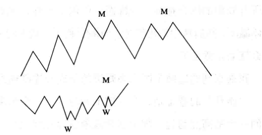

# ChinA 帕吉

***

> 人不必富有，但是要独立。在市场中常常要闭上眼睛，忘掉一切，才会看得清。

***

# 一 漫步华尔街（原书第 12 版）伯顿·马尔基尔 第 10 章 行为金融学

> —— 迈尔·斯塔特曼（Meir Statman）
> 行为金融学并非传统主流金融学的一个分支，它在更好地描述人性方面取代了传统主流金融学。

到现在为止，我们已阐述了有关股票市场的理论和技术，这些理论和技术都建立在投资者是完全理性的这一前提之上。根据这些理论和技术，投资者做决策时，目标是实现财富最大化，他们只受风险承受能力的约束。非也！一批新派金融学家如此宣称。21 世纪初的几年间，这些行为金融学家开始崭露头角。他们认为很多（或许甚至是多数）股市投资者的行为根本谈不上完全理性。毕竟，想想这些人的行为吧：你的朋友和熟人、你的同事和上司、你的父母，或许不妨也加上你的配偶（当然，孩子是另一回事）。这些人中有谁的行为是理性的吗？如果你的回答是“没有”，或者是“也有不理性的时候”，那么你会很高兴踏上下面一段旅程，在行为金融学开辟的“不那么理性”的旁道小径上领略一番。

有效市场理论、现代投资组合理论，以及论述风险与收益之间关系的各种资产定价理论，全都建立在股市投资者是理性的这一前提之上。总体而言，投资者会对股票的现值进行合理估计，因而他们的买卖行为确保了股价可以公允地反映股票的未来前景。

到现在应该很清楚了，“总体而言”这个说法正是这些经济学家的“逃生舱口”。这意味着他们可能承认有些单个市场参与者可能根本就不理性。但他们很快又找到了逃脱理由，宣称非理性投资者的交易总是随机出现的，因而会相互抵消，不会对股价产生什么影响。再者，有效市场假说的信奉者断言，即便投资者以相似的方式表现出了不理性，精明而理性的交易者总会来修正因非理性交易者的存在而产生的任何误定价现象。

心理学家可不愿接受经济学家的这些胡言乱语。其中尤其是丹尼尔·卡尼曼（Daniel Kahneman）和阿莫斯·特沃斯基（Amos Tversky）这两位，他们猛烈抨击经济学家关于投资者行为的观点，并在此过程中创立了一个全新的经济学流派，这个流派就称为行为金融学。

这两位学者旗帜鲜明地亮出观点：人们并非像经济学模型假设的那样理性。别看对一般大众以及非经济学家来说，这个观点是一句大实话，但在学术界被广泛接纳，却用了 20 余年的时间。就在这个观点逐渐赢得越来越多的信任时，特沃斯基于 1996 年去世。卡尼曼因在这方面做出了贡献，于 6 年后荣获诺贝尔经济学奖。经济学奖居然没有授给经济学家，这就特别引起人们的关注。卡尼曼听说获了奖，就发表感言说：“这个奖项 …… 再清楚不过了，是颁给我们两位共同参与研究的人，但很可惜，按照惯例，人去世了不能得奖。”

卡尼曼和特沃斯基阐明的一些真知灼见影响了涉及决策过程的所有社会科学，尤其是给全美各地大学经济学系和商学院带来了强烈的影响。想象一下，有个全新领域可以让人发表文章，赚取高额讲座费，还可以撰写硕士博士论文。

这对教授和学生可能很好，但对这个世界上想投资股票的其他人有什么好处呢？行为金融学能给他们什么样的帮助呢？说得更直接些，你能从行为金融学那里得到什么呢？事实上，的确有不少见解值得学习。

行为金融学家认为市场价格很不准确。而且，人们的行为与理性在一些方面存在着系统性偏离；投资者的非理性交易往往是相互关联的。行为金融学进一步断言可以量化这样的非理性行为，或对这样的非理性行为进行分类。大致说来，有四种因素使非理性的市场行为得以存在，这些因素是：过度自信、判断偏差、羊群效应、风险厌恶。

不错，听起来挺好。信奉有效市场假说的人这样说，但是（我们这些有效市场假说的信奉者总会说“但是”），这些因素造成的扭曲行为会被套利交易者的行为抵消。“套利交易者”这个别致的词语是用来描述这样一类人：只要市场价格偏离其理性价值，他们就会进行交易从中获利。

从严格意义上说，“套利”这个词的意思是从同一商品在两个市场上的不同价格之中获取利益。假设你在纽约可以按 1.5 美元兑 1 英镑的价格买进或卖出英镑，而在伦敦可以按1英镑兑 2 美元的汇率交易美元。套利交易者就会在纽约拿 1.5 美元买进 1 英镑，同时在伦敦以 2 美元的价格卖出 1 英镑，这样便可以赚到 50 美分的利润。同理，如果一只股票在纽约和伦敦的交易价格不一样，那么，在价格便宜的市场买进这只股票，并在价格高的市场卖出它，就是非常合理的事情。“套利”这个术语一般而言已扩展应用到这样的情形：两只很相似的股票以不同的估值进行交易，或者如果两家公司计划中的并购交易获准通过，一只股票预期将以更高的价格来交换另一只股票。从最不严格的意义上说，“套利”这个术语是用来描述买入看上去“价值被低估”的股票，卖出价格已涨得“太高”的股票。在这样的买卖过程中，辛勤操作的套利交易者可以抹平非理性的股价波动，从而创造出有效定价的市场。

另外，行为金融学家认为存在着大量阻止有效套利的障碍。我们无法指望套利行为会使价格与理性估值保持一致。股票价格可能会严重偏离有效市场假说所预期的价格。

## 个人投资者的非理性行为

投资者总会有不理性的时候。然而，行为金融学认为，非理性行为是持续不断的，并非阵发性的。

### 过度自信

认知心理学研究者已证实，人们在不确定的情形下做出判断时，会有一些方面与理性产生系统性偏离。这些偏差中最普遍的一种是人们往往对自己的信念和能力过于自信，对未来的评估过于乐观。

有一类实验说明了这种综合征的存在。实验时，实验人员询问一大群被试者中每一位，与被试人群的平均水平或街上每一个会驾车的人比较起来，其驾车能力如何。驾车显然是一种有风险的活动，驾驶技能在其中起着重要作用。对这一问题给出的回答会很轻易地揭示，人们在和其他人进行比较时，是否对自己的技能有切合实际的认识。就大学生而言，在对他们进行实验后发现，总是有 80%～90% 的实验对象说自己比同班同学在驾车方面水平更高，也更安全。就像在小镇沃比根湖（Lake Wobegon）中一样，（几乎）所有学生都自认为高于平均水平。

在另外一个涉及学生的实验中，实验对象被问及他们自己和室友的将来可能会有怎样的结果。他们一般都认为自己的未来很美好，想象着将来会事业有成、婚姻幸福、身体健康。然而，当叫他们猜想室友的未来时，他们的回答就实际得多了。他们相信室友嗜酒成瘾、罹患疾病、婚姻破裂、遭遇其他各种人生不顺之事的可能性比自己都大多了。

这类实验在不同情境下已进行了很多次。比如，在工商管理畅销书《追求卓越》（In Search of Excellence）一书中，彼得斯（Peters）和沃特曼（Waterman）描述过一个实验。实验从成年男性中随机抽样，让他们就与他人相处的能力做出等级评价。100% 的实验对象将自己划在样本总体中相处能力强的 50% 之内。25% 的人认为他们处于样本总体最强的 1% 之中。甚至在判断体育运动能力时，对于这样一种似乎更难做出自欺欺人判断的能力，也有 60% 的男性实验对象将自己划在最优秀的 25% 之列。即使最笨手笨脚的人也自己骗自己，认为自己运动能力不赖。只有 6% 的实验对象相信自己在中等水平以下。

丹尼尔·卡尼曼指出，这种过度自信的倾向在投资者中表现得尤为强烈。与其他多数人群比较起来，投资者往往更会夸大自己的技能技巧，更会否认机会运气的作用。他们会高估自己的知识水平，低估有关风险，夸大控制局面的能力。

卡尼曼的实验显示，通过询问实验对象的置信区间，可以了解投资者的概率判断会有怎样的校准度。他曾向实验对象提过这样的问题：

你对一个月后道指点位的最佳估计值是多少？接下来，选取一个高点位，让你有 99% 的把握相信（但不是绝对相信）道指自今日起一个月后将低于该高点。再接下来，选取一个低点位，让你有 99% 的把握相信（但相信程度不高于此）道指自今日起一个月后将高于该低点。

如果你按照指示好好地回答了问题，那么道指比你估计的高点更高的概率应仅为 1%，比你估计的低点更低的概率也应仅为 1%。换句话说，投资者应该有 98% 的把握相信道指点位将落在他给定的范围之内。对利率、通货膨胀率、单只股票价格等方面，也已进行了同样的实验。

事实上，鲜有投资者能够设置准确的置信区间。准确的置信区间本应导致实际结果仅在 2% 的时间里会超出预期范围。而实际结果超出预期范围的意外情况，其发生时间通常却接近 20%，这就是心理学家所说的过度自信。如果一位投资者告诉你他有 99% 的把握，那么他最好假设他只有 80% 的把握。这样的精确度意味着人们根据自己的预测所冒的风险往往比合理的更大。另外，一般而言，男性表现出的过度自信比女性多得多，尤其在涉及钱财管理事情上的高超技能时，更是如此。

从这些研究中我们该得出什么结论呢？显而易见，人们在自己做预测时设置的置信区间太过精确。他们夸大自己的技能，对未来持有的看法太过乐观。在股票市场上，这些偏差会以各种方式体现出来。

最重要的是，很多个人投资者错误地确信自己能够战胜市场。结果，他们会过度投机，过度交易。两位行为金融学家特伦斯·奥迪恩和布拉德·巴伯（Brad Barber）研究了一家大型佣金折扣经纪券商在很长一段时间内的个人交易账户。他们发现，个人投资者交易得越多，投资表现就越差。而且，男性投资者比女性投资者的交易频繁得多，投资结果也相应地更加糟糕。

这种理财技能错觉很可能是由另一个心理学发现造成的，该发现称为后见之明偏差。这样的偏差是靠对成功的选择性记忆维持的。你会记得那些成功的投资。事后想来，你很容易就让自己确信你“本来就知道谷歌在 IPO 后，立马会飙升 3 倍”。人们倾向于将好的结果归因于自己的能力，而辩解说不好的结果是由不寻常的外部事件造成的。两三次成功的趣闻逸事，总是比一般的过去经历更能让我们动心。事后聪明会使过度自信更加膨胀，并让幻觉潜滋暗长，以为这个世界比其实际情形好预测得多。即使那些贩卖毫无价值的理财建议的人，也可能认为自己提出的建议非常好。《福布斯》杂志的出版商史蒂夫·福布斯（Steve Forbes）对此了解得更为透彻，他曾引用过一条建议，这条建议是他尚在祖父膝下玩耍时祖父送给他的：“贩卖建议比接受建议赚的钱多得多。”

很多行为金融学家认为，投资者对预测公司的未来增长性的过度自信，这导致所谓增长型股票普遍具有被高估的倾向。如果令人兴奋的新型计算机技术、医疗器械和经销渠道激发了大众的想象力，那么投资者通常会推断相关公司将获得成功，预测其将拥有很高增长率，而且对这些想法所持有的信心，比在合理预测的情况下要大得多。高增长预测会使增长型股票的估值更高，但这些对未来充满希望的美妙预测常常会落空。公司的盈利可能会下降，因而股票市盈率也可能下滑，继而导致投资绩效非常糟糕。因此，在对令人振奋的公司进行增长预测时表现出来的过度乐观，可能是行为金融学家认为增长型股票往往表现逊于价值型股票的一个原因。

### 判断偏差

每天，我都会遇到这样的投资者：他们确信自己有能力“控制”自己的投资结果。图表分析师尤其如此，他们深信通过查看以往股价就能预测未来。

拉里·斯韦德罗（Larry Swedroe）在他撰写的《非理性时代的理性投资》（Rational Investing in Irrational Times）一书中举了个极好的例子，说明连续好运或连续不顺出现的次数大大高于人们的想象。

每年给学生讲课时，一位统计学教授在新课伊始，就让各位同学写下自己想象中连续抛掷硬币 100 次依次出现的结果。不过，教授会选一个同学实际抛掷硬币，并让其记下投掷结果。然后，教授离开教室，15 分钟后，教授返回，学生们的结果已放在她的讲台上。她告诉全班同学，她只要猜一次，就能从交上来的 30 份结果中分辨出实际投掷硬币的那个结果。经过一番辨认之后，她正确无误地一次猜准，全班同学都惊叹不已。这看起来非常神奇，她是怎样做到的呢？原来，她知道，连续出现 H（正面朝上）或 T（反面朝上）最多的结果极有可能是实际投掷硬币的结果。原因是这样：当提出 HHHHHTTTTT 或 HTHTHTHTHT 哪一个序列更可能出现这样的问题时，尽管统计学表明两个序列出现的可能性完全相同，但多数人会挑选“更加随机”的后者。因此，他们写下的想象中的序列，看起来往往更像 HHTTHTHTTT 而不像 HHHTTTHHHH。

撇开股市长期向上的趋势不谈，连续出现股票收益过高的情形并不会持久，这之后的未来收益一般而言会走低。均值回归总是存在。同样的道理，金融万有引力定律也会反向起作用。至少对股市总体来说，下跌的终究会涨回来。然而在每个时代，人们典型的普遍看法却是认为异乎寻常的好行情总会更好，非同一般的糟糕行情总会更加糟糕。

心理学家早已发现，个体往往会受到错觉的愚弄，对实际上并不具有控制力的局面，会错误地以为具有一定的控制力。在一项研究中，实验对象坐在计算机屏幕前，屏幕被一条水平线一分为二，一只球在屏幕的两个半区上下随机跳动。实验对象可以用一个按压装置来向上移动小球，同时也受到警示，屏幕的随机震动也会影响小球，使他们无法做到完全控制。然后，实验对象被要求做一个游戏，游戏的目标是让小球尽可能长时间被控制在屏幕的上半区。在一组实验中，按压装置甚至都没与小球连接上，因而这些玩游戏的实验对象根本无法控制小球的运动。尽管如此，玩了一段时间之后，实验对象被问起时，都确信自己对小球的掌控非常好（未受此错觉影响的实验对象，却是那些已被医生诊断为患有严重抑郁症的人）。

在另一项实验中，研究者使用两副完全相同的棒球卡在办公室内进行摸彩游戏。一副卡片被放在一只贮藏箱里，其中一张卡片将被随机拿出。另外一副卡片被分发给参与摸彩的人，一半参与者自主选择拿到一张卡片，另一半参与者就直接发到一张卡片。主持实验的人告知参与者，中彩者将是手上持有的卡片与从箱中随机拿出的那张卡片相匹配的人。然后，又告知每个参与者，虽然所有的卡片已分发出去，有位新来的参与者想购买一张卡片。这样一来，参与者面临的选择是：要么以某一商定的价格卖出手中的卡片，要么将卡片一直留在手中希望中彩。显然，每张卡片中彩的概率都一样。然而，自主选卡片的参与者愿意卖出手中卡片的价格，却系统性地高于直接发到卡片的人。从这类实验结果中获得的启发，使州彩票发行人决定让州内彩民自行选择号码，尽管是否中彩只是运气决定的。

正是这种控制错觉，可能会引导投资者看见实际上根本不存在的趋势，或者相信能够发现某个将预测未来股价的股价运行模式。实际上，尽管有人不辞辛苦，从股价数据中梳理出某种形式的可预测规律，但从一个时期到另一个时期，股价走势却非常接近于随机漫步，未来的股价变动与过去的股价变动之间实质上并不相关。

判断偏差会因人们具有某种倾向而得到强化（要有心理准备，下面还会涉及一些专业术语），这种倾向就是人们往往错误地用“相似性”或“代表性”来代替合理的概率性思考。卡尼曼和特沃斯基设计的一个著名实验就说明了这种“启发式”。实验对象先看到关于对琳达的以下描述：

琳达 31 岁，单身，心直口快，非常聪慧。她的本科专业是哲学。在学生时代，她极为关心歧视和社会公正问题，也参加过反核示威游行。

然后，实验对象被要求做一个评估，说出关于琳达的八个不同陈述合乎事实的相对可能性。其中有两个陈述是：“琳达是银行出纳员”“琳达是银行出纳员，她积极参与女权运动。”超过 85% 的实验对象判断“琳达既是银行出纳员又是女权主义者”的可能性要高于“琳达是银行出纳员”。但是，这种回答违反了概率论的一个基本法则（合取规律）：某人既属于 A 类又属于 B 类的概率小于或等于她只属于 A 类的概率。显而易见，没多少实验对象学过很多概率论的知识。

对琳达的描述使她看起来像一个女权主义者，因此“既是银行出纳员又是女权主义者”的陈述显得更像是一个自然的描述，从而比“只是银行出纳员”的陈述更能代表琳达。这个实验已反复进行过多次，涉及的实验对象既有幼稚型的也有成熟型的（包括在概率论方面有所学习，但并未探究其所有细微之处的实验对象）。

卡尼曼和特沃斯基想出“代表性启发式”这个术语来描述这一实验发现。这一术语的应用又导致若干种其他判断偏差的发现，比如忽视基础比率的偏差。概率论的一个基本法则（贝叶斯定理）告诉我们，在判断某人属于某一特定群体的可能性时，我们应该将“代表性”与基础比率（各类群体占样本总体的百分比）结合起来考虑。用日常语言来说，贝叶斯定理意味着，如果我们见到某个看起来像罪犯的人（他似乎代表了我们对罪犯形成的刻板印象），我们在评估他是罪犯的概率时，也要求我们知道基础比率，即人们犯罪的百分比。然而，在一次又一次的实验中，实验对象都表现出了这样的现象：做预测时，对基础比率知识并未充分加以利用。尽管这一切显得有些神秘，但代表性启发式很可能给一些投资错误做出了合理解释，比如追逐热门基金或根据最近的证据进行过度外推。

### 羊群效应

研究表明，一般说来，群体做出的决策往往比个体更好。如果更多的信息可以被分享，各种不同观点都被考虑周到，那么群体进行的有根有据的讨论会优化决策过程。

或许自由市场价格机制可以最好地说明在经济体中群体行为是明智的。由消费者和厂商做出的各种各样的单个决策，会引导经济体提供人们希望购买的商品和服务。在回应需求与供给的影响时，价格机制通过亚当·斯密“看不见的手”指导经济体生产出数量合适的产品。

同理，无数个人和机构投资者通过集体性买卖决策，会使股票价格以这样的情况展现在他们面前：买入一只股票，较之买入另外一只股票，看上去都一样合算。而且，尽管市场对未来收益的预测常常发生偏差，但这样的预测作为一个整体，比起任何单个投资者所做的预测都更为准确。当自己的投资业绩与低成本、涵盖范围广泛的股票指数基金放在一起做比较时，多数主动管理型投资组合经理一定会羞愧难当地低下头来。

本书的所有读者已明白，市场作为一个整体在做定价决策时，并非一贯正确。市场时不时也会出现疯狂的群体行为，我们已从 17 世纪的郁金香球茎热到 21 世纪初的网络股热中看到了这种群体性的癫狂表现。正是这种偶尔发生的病态群体行为，吸引了行为金融学者的注意。

在群体行为的研究中，有个被广泛认可的现象，就是“群体思维”的存在。群体中的个体有时会相互影响，从而更加相信某个不正确的观点“实际上”是正确的。毋庸置疑，2000 年年初，对互联网盈利前景所做的过度乐观以至疯狂的群体预测，以及对新经济股票的错误定价，都是病态群体行为的佐证。

社会心理学家所罗门·阿希（Solomon Asch）是最早研究群体行为何以可能导致错误决策的学者之一。20 世纪 50 年代，阿希进行了一项著名的实验室实验，他让实验对象回答一个任何孩童都能正确回答的简单问题。他先向实验对象出示两张画有垂直线条的卡片，这两张卡片就像 图10-1 中显示的那样，左边卡片上画有一条垂直线。然后，他问实验对象，右边卡片上哪条直线与左边卡片上直线长度相等。7 位实验对象依次回答了这一问题。

但是，阿希给实验加了个“恶毒”的变化。在一些实验中，他动员 7 位实验对象中的 6 位，让他们故意给出错误答案，而且是在第 7 位实验对象还没来得及说出自己的意见时，就给出错误答案。实验结果令人吃惊，第 7 位受试者经常会回答错误。阿希推测实验对象即使明知自己的答案不正确，社会压力也会迫使他们选择错误答案。

2005 年，一位神经科学家格雷戈里·伯恩斯（Gregory Berns）进行了一项研究。他使用核磁共振扫描仪研究大脑的活动情况，以期确定人们是否明知自己的答案不正确仍会屈从于群体意见，或者人们的感知是否真的发生了变化。这一研究的思路是：如果在群体面前放弃己见是由社会压力造成的，那么我们应该看到控制冲突的前脑区域会发生变化，但是，如果在群体面前放弃己见是因感知实际发生了变化而引起的，那么我们应该期待控制图像和空间感知的后脑区域会发生变化。实际上，该项研究发现当人们给出错误答案以与群体保持一致时，管理空间认知的大脑区域的活动增加了。换句话说，他人的意见看上去真的改变了实验对象对自己所见事物的看法。由此看来，他人的错误真的会影响一个人对外部世界的感知。

在另一项研究中，社会心理学家安排一个人站在街角，叫他抬头朝空空如也的天空凝望 60 秒。心理学家观察到，街上只有很少一部分行人停下脚步想看看这个人在看什么，而大部分行人径直从他身旁走过。接下来，心理学家安排 5 个人站在街角朝天空凝望；这次，有 4 倍于上一次的行人驻足凝望空阔的天空。当心理学家安排 15 个人站在街角看着天空时，几乎有一半过路人停下了脚步。安排更多的人看向天空，吸引了更多行人朝天空凝视。

很显然，1999 年至 2000 年年初的网络泡沫提供了一个经典例证，说明不正确的投资判断会引导人们集体走向疯狂。迎合新经济热潮的股票提供的巨大获利前景使个人投资者激动不已，他们都感染上了不可理喻的从众心理。与高尔夫俱乐部的朋友、工作场所的同事、牌桌上的牌友口口相传的交谈中，都传递着一个富有感染力的讯息：互联网的发展正在创造巨大的财富。然后，投资者开始购买股票，不为别的，只因股价在攀升，其他人在赚钱，哪怕根据盈利和股利这类基本面因素来判断，股价上涨根本就毫无道理可言。经济史学家查尔斯·金德尔伯格（Charles Kindleberger）说过：“没什么能比看到朋友发财赚钱更能打破自己舒适的心境，扰乱自己的判断了。”畅销书《非理性繁荣》的作者罗伯特·希勒指出，疯狂的过程会以“正反馈环”的形式进行自我升级。最初的股价上涨会鼓动更多人买入股票，这又使股票收益水涨船高，从而诱使越来越多的人参与进来。这种现象也是一种“庞氏骗局”，最终，“庞氏骗局”因再也找不到更傻的傻瓜而宣告终结。

这种羊群效应，并非只发生在不谙投资之道的个人投资者身上。共同基金经理往往也随波逐流，采取同样的投资策略，一拥而上购买同样的股票。的确，三位行为金融学领域前沿学者洪（Hong）、库比克（Kubik）和斯坦（Stein）进行的一项研究证明，如果同一城市其他经理正持有相似的组合，那么共同基金经理更可能持有相似的股票。这类研究结果与一种“流行病”模式完全一致，在这种模式中，投资者会迅速而无可挽回地通过口耳相传散布股票信息。这样的群体行为已对个人投资者造成了毁灭性的创伤。虽然股票市场赋予的长期收益颇为丰厚，但对一般投资者来说，投资收益却比这糟糕得多。原因在于投资者买入股票型共同基金之时，正是“非理性繁荣”导致市场见顶之际。在 2000 年 3 月之前的 12 个月间，大量资金涌入股票型共同基金，其规模之大，此前任何时期都不能与之相比。而在 2002 年秋季和 2008 年秋季，市场正接近底部区域，此时个人投资者却从股票投资中大量撤出资金。戴尔巴协会（Dalbar Associates）展开的一项研究表明，一般投资者因错误地选择进出股市的时机而自食了苦果，他们的收益率可能低于市场平均水平 5% 以上。

另外，投资者往往会把资金投入近期业绩不俗的一类共同基金。比如，2000 年第一季度，大量流入股票型基金的资金全都涌进了高科技增长型基金，所谓的价值型基金因此遭遇了大量资金流出。此后两年间，增长型基金的价值急剧下滑，而价值型基金创造的实际收益却是正数。因错选基金而遭受的惩罚，使上面描述的因出入股市的时机选择错误而遭受的惩罚更为惨重。行为金融学告诉我们的最重要的教训之一便是，个人投资者千万要避免被群体行为冲昏头脑。

### 损失厌恶

卡尼曼和特沃斯基做出的最大贡献在于创立了前景理论（prospect theory）。该理论描述个人在面临存在得与失、损与益前景的风险局面时会有怎样的行为表现。一般而言，在诸如哈里·马科维茨之类的金融学家建立的模型中，都有这样的一个假设：个人做出的决策，建立在决策选择对个人最终财富可能产生何等影响的基础之上。前景理论则挑战这一假设，认为人们的选择是由他们对得与失、损与益赋予的价值所驱动的。相对于合乎意愿的收益来说，等值损失被认为令人厌恶得多。而且，陈述得与失、损与益时使用的语言，用心理学术语来说就是“如何框定选择”，会影响最终做出的决策。

举个例子。有人告诉你，抛掷一枚质地均匀的硬币，如果正面朝上，你将获得 100 美元。不过，如果反面朝上，你必须付出 100 美元。你乐意接受这样的赌局吗？即使从反复抛掷硬币后你会盈亏相抵的意义上说，这个赌局非常公平，多数人恐怕也不愿参与。一半时间你会赢得 100 美元，一半时间你会损失 100 美元。用数学术语来说，该赌局的“期望值”为 0，计算方法如下：

$$ 期望值 = \frac{1}{2} \times (100 美元) + \frac{1}{2} \times (-100 美元) = 0 美元 $$

卡尼曼和特沃斯基后来对众多不同的对象进行这一实验，他们不断变换赌赢收益的数字，以测试赌赢收益达到多少才会诱使人们愿意接受这个赌局。他们发现赌赢收益得在 250 美元左右。请注意，若赌赢收益定为 250 美元左右，赌局的收益期望值便是 75 美元，因此参加这样的赌局就非常有利。

$$ 期望值 = \frac{1}{2} \times (250 美元) + \frac{1}{2} \times (-100 美元) = 75 美元 $$

卡尼曼和特沃斯基下结论认为，损失令人厌恶的程度 2.5 倍于等值收益令人渴望的程度。换言之，损失 1 美元的痛苦是获得 1 美元快乐的 2.5 倍。100 美元的财富变动，对多数资产殷实的人来说几乎注意不到，但即便如此，人们还是表现出了极端的损失厌恶。在后面的内容中，我们将看到损失厌恶如何让很多投资者犯下了代价高昂的错误。

然而有意思的是，这两位心理学家发现，个人在面临损失确定的局面时极有可能放手一搏。思考下面两个选项：

（1）确定损失 750 美元。
（2）有 75% 的可能损失 1000 美元，25% 的可能不会遭遇任何损失。

注意，两个选项的期望值完全相同，也就是说，都有 750 美元的损失。但是，几乎 90% 的实验对象选择了第二个选项，准备赌一把。面对确定损失时，人们似乎表现出了追求风险的行为。

卡尼曼和特沃斯基还发现了一个与此有关且非常重要的“框定效应”（framing effect）。以不同的方式给决策者框定选择，可能会导致截然不同的结果。两位学者提出了如下问题：

想象一下，美国正准备应付一种罕见疾病的暴发流行，预计这次疾病流行会造成 600人 死亡。现已提出两种与此疾病做抗争的备选方案。假设两种方案结果的精确科学估计是：

如果采纳方案A，会有 200 人得救；
如果采纳方案B，有 1/3 的概率会有 600 人得救，有 2/3 的概率无人得救。

如果采纳方案 A，会有 200 人得救；如果采纳方案 B，有 1/3 的概率会有 600 人得救，有 2/3 的概率无人得救。

但是，假设我们以另外一种方式框定这个问题：

如果采纳方案 A*，会有 400 人死亡；
如果采纳方案 B*，有 1/3 的概率无人死亡，有 2/3 的概率会有 600 人死亡。

请注意，选择 A 和 A* 以及选择 B 和 B* 是一样的。但是，第二次框定后的问题，是从人们遭遇死亡风险的角度进行描述的。当问题以这样的方式被框定时，超过 75% 的实验对象选择了方案 B*。这既证明了“框定效应”的存在，又证明了人们在损失值域内追求风险的偏好。当医生面临为癌症病人做出治疗方案选择的决策时，如果问题以存活概率而非死亡概率的方式陈述，医生往往会做出不同的选择。

### 自豪与悔恨

行为金融学家还强调，自豪与悔恨之类的情绪也是影响投资者行为的重要因素。投资者甚至对自己，也很难承认在股市做了什么不好的决策。如果必须得向朋友或配偶承认这一点，悔恨的感觉可能会因此放大。但是，投资者通常会很得意地告诉他人，自己做了什么成功的投资，获得了很大的收益。

很多投资者可能会觉得，自己若坚守正在赔钱的仓位，最终总会把亏的钱赚回来，这样便可以免去悔恨之情。投资者往往会抱着亏钱的仓位不放，却卖掉正在赚钱的仓位，这种倾向的背后可能就有自豪与悔恨情绪的原因。巴伯和奥迪恩对一家大型折扣经纪券商10000名客户的交易记录做了研究，他们发现明显存在一种“处置效应”（disposition effect）。投资者中有一个处理股票的明显倾向：卖掉赚钱的股票，而抱牢赔钱的股票不卖。卖掉已上涨的股票会让投资者实现利润，也让他们能够建立自豪感。如果抛售赔钱的股票，他们会招致损失，产生懊悔的痛苦情绪。

这种不愿接受损失的心理，根据理性投资理论显然不是最优选择，从常理角度看也非常愚蠢。卖掉赚钱的股票（有税收优势的退休金账户除外）必然涉及缴纳资本利得税；卖掉损失已成现实的股票会降低在其他已实现收益上的应纳税额，或者可获得一定限额的税款抵扣。即使投资者认为自己赔钱的某只股票以后会涨回来，但卖出这只股票，并买入一只前景和风险特征相似的同行业股票，也是要付出代价的。在住宅房地产市场似乎也能清楚地看到这种不愿接受损失的现象。房价上涨时，房屋销量上升，房屋往往会很快以报卖价或更高的价钱卖出去。然而，在房价下跌期间，房屋销量下滑，个人房主长时间在市场上压着房子不愿脱手，报卖价还高于市价很多。对损失的极端厌恶，有助于解释房屋卖主为何不愿以亏损价将自己的房产卖掉。

## 行为金融学与储蓄

行为金融学理论也有助于解释为何很多人不愿参加所在公司的 401（k）储蓄计划，即使公司为其提供与其交付的养老金等额的资金。如果一个雇员已习惯于拿到某一特定数量的实发工资，你再叫他拿出1美元拨入自己的退休计划以增加养老金，对于因此而出现的工资扣减（即使实际扣减额不足 1 美元，因为参加退休计划而缴纳的养老金可以从应税收入中抵扣相当可观的数额），他会视为对当前消费能力造成的一种损失。个人对这些损失比所获利益看重得多。心理学家告诉我们，当这种损失厌恶与自我控制的难以展现、拖延耽搁带来的心情放松，以及不做任何变化带来的安逸自在（维持现状偏差）同时存在时，就完全可以理解为什么人们往往储蓄极少了。

已有人提出两个建议来解决人们不愿储蓄的行为。第一个建议是通过改变选择的框定方式，来克服惰性心理和维持现状偏差。我们知道，如果我们让雇员主动报名参加 401（k）储蓄计划，很多人会婉言拒绝，不愿参加。但是，如果问题以不同方式进行框定，使得雇员必须主动“决定不参与”这项储蓄计划，那么参与者的比例将高得多。以自动加入为特征（雇员必须有意识地主动填写“决定不参与”的声明）框定 401（k）储蓄计划的那些公司，其雇员参与计划的比率，较雇员必须主动“决定参与”计划的公司要高得多。

经济学家理查德·塞勒（Richard Thaler）和什洛莫·贝纳茨（Shlomo Benartzi）提出另一个劝诱参加储蓄计划的绝妙建议。有些雇员即使面对自动加入的储蓄计划，也会拒绝参加，因为他们靠现有的工资收入几乎入不敷出。塞勒—贝纳茨“明天会储蓄更多”计划的实质，在于让雇员预先承诺从增加的薪金收入中拿出一部分放进退休储蓄金。如果雇员参加这个计划，那么从加薪后的第一份工资单开始起算，他们为自己的退休储蓄金拿出的钱就会增加。这种特色的储蓄计划减轻了因实发工资被削减而感到的损失厌恶情绪。雇员从工资中扣除一部分用来交养老金的比率，在每次加薪时都不断增加，一直到该比率达到法律许可的最大抵税限额为止。这样一来，惰性心理和维持现状偏差便朝着使人们持续参加储蓄计划这个方向发挥作用。任何时候，雇员都可以决定不参加这个计划。

1998 年，塞勒和贝纳茨第一次在一家中等规模的制造业公司实施了他们设计的计划。当时，这家公司面临的问题是雇员参与退休储蓄金计划的比例很低。事实证明，“明天会储蓄更多”计划颇受欢迎，该公司超过 3/4 的雇员同意加入。而且，这些同意加入的雇员中有 80% 以上的人在此后数次加薪中都一直参与了这个计划。即使中途退出的雇员，也没有将从工资中扣除的养老金比例降到当初的水平，他们只是将来不再想增加养老金了。因此，即使是这类员工，其储蓄的金额也比参加这项计划之前显著地增加了。

## 套利限制

至此，我们已考察了影响投资者行为从而影响股价的认知心理偏差。个人投资者的行为经常表现得不理性，或者说至少与经济学家理想的最优决策行为不完全相符。在或许是最为病态的情形下，个人投资者似乎会集体发狂，将某些类型股票的价格推向不合理的高度。既然非理性投资者造成的偏差不会相互抵消，反而经常相互强化，如何才能让股票有效定价呢？有效市场假说的信奉者照本宣科地声称，即使很多个人投资者不理性，“套利交易”也总会让市场变得有效。像华尔街专业交易员和对冲基金经理之类的套利交易者，应该会建立起抵消作用的头寸，比如卖空定价过高的股票，买入定价过低的股票，结果，由非理性投资者造成的任何误定价都会迅速得以矫正。理性交易者应该会抵消非理性交易者带来的影响。因而，一些行为金融学家驳斥市场有效的理由便建立在第二个重要基础之上：这样的套利交易会受到严重约束。行为金融学家认为，市场上存在着重要的套利限制，阻止了异常价格得到修正。

我们假设，非理性投资者的交易致使一家石油公司的股票相对于其基础价值以及品质相当的同行公司股票已定价过高。套利交易者可以直接卖空定价过高的股票，买入一家类似的替代石油公司的股票。这样，套利交易者便做到了对冲，因为影响石油行业的有利或不利事件对两家公司都会产生影响。石油价格的上涨会引起被卖空股票的价格上涨，同时也会使套利交易者多头仓位的价值上升。

但是，这种套利风险极大。假设“定价过高”的那只股票报告了一些不同寻常的好消息，比如此前未曾预计到的一次重大石油发现，或者假设“定价公允”的那只股票遭受某个意外挫折，比如一处深海油井爆炸，引发其股价下跌，想象得出，套利交易者可能两头受损。先前卖空的股票可能上涨，而多头仓位的股票可能下跌。要求这种套利交易去矫正已观察到的误定价是极其危险的。

交易者试图“矫正”已观察到的误定价，还面临着另外一种风险：对于“定价过高”股票的前景，投资者可能会变得更加过于乐观。假设在 1999 年，一个套利交易者确信网络股的定价高得离谱。该交易者便可能卖空网络股中最受青睐的股票，希望以后能以更低的价格买回。但是，随着人们对新经济的热情持续高涨，新经济股票的价格继续攀高，其中很多股票翻了一番之后，又翻了一番。我们现在回顾过去，才知道网络泡沫会在 2000 年爆裂。在此期间，很多套利交易者输得衣衫不保。市场保持非理性的时间有时会比套利交易者保持偿付能力的时间更久。当套利交易者受到信贷约束的时候，更是如此。长期资本管理公司（Long Term Capital Management）原是一家对冲基金，公司内有诺贝尔奖得主设计交易策略，却最终发现自己处于一种无法承受的境地，因为其对冲仓位的价格向对其不利的方向运行，而自己并无足够的资本让那些仓位保持下去。

在卖空定价过高的股票并买入定价过低的股票这种游戏中，全球对冲基金是再自然不过的玩家，它们有着数万亿美元的资金可供投资。你可能以为这些对冲基金会认识到网络股的价格难以为继，因而会通过做空来利用误定价从中渔利。马库斯·布兰梅尔（Markus Brunnermeier）和斯蒂芬·内格尔（Stefan Nagel）进行了一项研究，仔细考察对冲基金在 1998～2000 年的表现，希望发现这些基金是否抑制了最受追捧的投机性股票的价格疯长。

研究结果出人意料。在网络泡沫期间，像对冲基金这样成熟老到的投机者并不是一股矫正力量。他们没有狙击泡沫，而是借助泡沫，实际上助长了泡沫的膨胀。自 1998 年至 2000 年年初，对冲基金始终是网络股的净买入者。他们的操作策略反映了他们持有的信念，即认为缺乏经验的投资者，其蔓延的热情和跟风行为会使误定价更加严重。对冲基金在这期间玩的游戏，就是早先凯恩斯所描述的著名报纸选美比赛的游戏。虽然一只卖价 30 美元的股票可能仅“值” 15 美元，但是，如果一些更傻的傻瓜愿意在将来某个时候为这只股票支付 60 美元，那么按 30 美元买入就很合算。

在 2005 年和 2006 年的石油市场上，对冲基金似乎也扮演了兴风作浪、制造不稳定的角色。2004～2006 年，每桶原油的价格上涨了一倍多。尽管世界经济增长之类的经济力量为油价的上涨压力提供了一些基本面理由，但看上去正是投机活动，尤其是对冲基金的投机活动，助长了油价的大幅飙升。在石油期货市场做空的几家对冲基金也都遭受了重大损失。显而易见，为矫正已观察到的价格泡沫而进行套利交易，本质上是有风险的。

再说，有时候卖空操作无法实现，或者说卖空操作至少会受到严重制约。在卖空操作中，通常要借入被卖空的证券，以便将其交付给买家。比如，要是我卖空 100 股 IBM 股票，我必须借入股票以将其交割给买家（在我持有这个空头仓位期间，如果有股利宣布发放，我还得把它们支付给买家）。在某些情况下，可能无法找到可以借入的股票，因此从技术角度看，即使要实施卖空操作也无法做到。在一些最明显的无效定价实例中，卖空操作的技术限制阻碍了套利交易者矫正误定价。

如果定价过高的股票的近似替代股票难以找到，套利操作也可能很难确立。一次套利操作要产生预期效果，必须有一只相似的定价公允的股票可以借来对冲空头仓位，而且，若发生某个影响整个市场或该股票所属行业的有利事件，可以预期该股票的价格会上涨。

行为金融学家用来说明市场价格可能无效的最佳例证之一是，两只完全相同股票的交易价格却并不完全相同。人们认为荷兰皇家石油（Royal Dutch Petroleum）与壳牌运输（Shell Transport）是“连体孪生”公司。1907 年，这两家公司同意结成联盟，将 60% 的税后利润分割给荷兰皇家石油，40% 的税后利润分割给壳牌运输。在有效市场中，荷兰皇家石油的市场价值应该总是壳牌运输的1.5 倍。实际上，一直以来，荷兰皇家石油股价对壳牌运输股价的溢价常常达到了 20%。在有效市场中，相同的现金流应该以相等的估值进行交易。

这个案例的问题在于，两只股票在不同国家的市场进行交易，这些市场的规则不同，而且将来的限制因素也可能不同。但是，即便荷兰皇家石油与壳牌运输在所有方面被视为等同，在这两只股票之间进行套利交易也会有内在风险。如果荷兰皇家石油对壳牌运输的交易溢价为10%，那么恰当的套利操作应该是卖空定价过高的荷兰皇家石油股票，买入便宜的壳牌运输股票。不过，这一套利交易是有风险的。一只定价过高的股票可能会一直涨上去，给做空者造成损失。今天的便宜货明天可能会变得更加便宜。显然，我们不能完全依赖套利交易来消除市场价格与基础价值之间的偏离。毫无疑问，在 21 世纪头 10 年的最后一段时间里，卖空操作的约束在房市泡沫的膨胀中起到了一定的作用。在美国某些地区，当卖空房市实质上不可能实现时，便只有乐观者才说了算。当乐观者能轻而易举地利用抵押贷款让自己进行杠杆操作时，我们便很容易明白为什么房市泡沫不太可能因套利交易而受到约束。

## 行为金融学给投资者的教训

像我这样的夜猫子经常收看深夜电视节目。“愚蠢的宠物技巧”单元是戴维·莱特曼（David Letterman）以前深夜脱口秀节目中比较滑稽的片段之一。在这个节目单元中，宠物主人会让自己带来的动物表演各种愚蠢的搞笑动作。遗憾的是投资者的行为也经常与这个电视节目中的主人及其宠物非常相似，只是不可笑。投资者会过度自信，遭受群体的踩踏，囿于控制的错觉，拒绝承认投资失误。实际上，相比之下，节目中的宠物显得非常聪明。

我们已看到人类行为的多个方面会对投资产生影响。在投资过程中，我们常常是自己的最大敌人。正如波戈（Pogo）所言：“我们现在遭遇了敌人，敌人就是我们自己。”了解我们如何受自己的心理影响，可以帮助我们避免愚蠢的投资者错觉和妄想，从而避免破坏自己的财务安全。有一个古老的谚语与玩扑克牌有关，说的是：如果你在牌桌边落座，辨不出谁是容易上当受骗的傻瓜，那就起身离开牌桌吧，因为你就是那个傻瓜。关于投资者心理的这些真知灼见，可以帮助我们免做那个易受愚弄欺骗的替死鬼。

查尔斯·埃利斯（Charles Ellis）长期观察股市，写了一部才华横溢的投资图书《赢得输家的游戏》（Winning the Loser's Game）。他根据自己观察到的情况指出在业余网球比赛中，多数得分并不是凭你这一方打得如何聪明、如何有技巧获得的，而是靠你的对手一方失误得来的。投资中的道理也是如此。埃利斯提出多数投资者采用错误的股市投资策略，不接受本书推荐的依据指数买入持有的消极被动策略，从而自己打败了自己。从多数投资者的行为方式上看，投资股市对他们来说变成了永远只赔不赚的游戏。

2000 年年初，你买的科技股一涨再涨，这时你很容易就让自己相信你实在是个投资天才。这时，你也很容易就说服了自己，追逐近期表现最好的共同基金是万无一失的成功策略。而对于在泡沫期间放弃工作全心进行短线交易的少数人来说，上午 10 时买入一只股票，到中午就发现已涨了 10%，真是万分刺激。所有这些交易策略最终都以灾难收场。频繁进出的交易者赚到的收益总是比稳定地买入持有型投资者更少。

要避免我们的不良行为习惯造成的恶劣影响，第一步是要认清这些行为怪癖。还是屈服于市场的智慧吧。正如业余网球手不用花拳绣腿的招式，只是尽量把球回过去，通常就会赢得比赛，投资者若简单地买入持有由市场上交易的所有股票构成的多样化投资组合，通常也会是赢得投资成功的一方。不要做你自己的敌人，避免使用愚蠢的所谓投资技巧吧。行为金融学为我们提供了以下几个最重要的教训。

### 避免跟风行为

行为金融学家了解导致投资者随大流的反馈机制。当网络股一路高歌时，面对人们异常欣喜兴奋的情绪，尤其是看到你所有的朋友都在夸耀从股市中赚到了大把钞票时，你很难不失去自制力。大量文献资料的记载说明，朋友对一个人的投资决策产生的影响无所不在。罗伯特·希勒和约翰·庞德（John Pound）调查了131 位个人投资者，询问是什么引得他们最近买入了某只股票。典型的回答是个人交往接触的人，比如亲戚或朋友，推荐他们买了这只股票。投资者接触的人会对投资者的决策产生重要影响，关于这一点，洪（Hong）、库比克（Kubik）和斯坦（Stein）提供了更加系统的证据。他们发现根据财富、种族、教育程度、风险承受能力进行分类，社交家庭即与邻居有交往或参加礼拜的家庭比起非社交家庭，投资于股市的可能性大得多。

任何投资，只要变成人们交谈中广泛热议的话题，都可能对你的财富造成特别的危害。20 世纪 80 年代早期的黄金投资是如此；20 世纪 80 年代后期的日本房地产和股市投资也是如此；20 世纪 90 年代后期与网络有关的股票投资是如此，21 世纪头 10 年加利福尼亚、内华达和佛罗里达的公寓楼投资以及 2017 年的比特币，也同样如此。

无一例外，在一个时段最热门的股票或基金，在接下来的时段都是表现最差的。而且，正如在极度狂热的时段，跟风行为会诱使投资者甘愿承受越来越大的风险；同样，在悲观情绪弥漫市场之际，跟风行为也让投资者认赔服输，黯然离场。媒体为吸引观众和听众，大肆宣传行情跌得如何之惨，在一些事件上小题大做，也往往助长了投资者的这种自毁行为。即使媒体不进行过度报道，市场的大幅波动也会怂恿人们做出基于情绪而非理性的买卖决策。

由于错误地选择了出入股市的时机，典型的共同基金投资者从股市获得的收益率，都低于只是简单地买入持有市场指数基金本应带来的收益率。之所以如此，是因为投资者往往在市场处于顶部或接近顶部时（此时，每个人都热情洋溢）把资金投在共同基金上，而在市场处于底部时（此时，悲观气氛主宰着一切）却将资金撤出。图10-2 表明了这一点。从 图10-2中，我们可以看到 2000 年年初市场达到高点时，新涌入共同基金的净现金流也达到了高峰；2002 年秋季市场处于谷底时，投资者撤出了资金；2008 年年末和 2009 年年初，市场正处在金融危机最严重的时候，撤出市场的资金比以往任何时候都要多。

你可以在 图10-2 中看到错误选择出入股市时机造成的惩罚效应。

还存在一种“错误选择基金造成的惩罚”。2000 年年初市场处于顶部位置，资金流向增长型共同基金，这类基金一般都会投资于科技股和网络股，而价值型基金则遭遇了资金流出，这类基金通常持有市净率和市盈率偏低的“旧经济”股票。接下来的三年间，价值型基金为投资者创造了丰厚的收益，而增长型基金的价值急剧下挫。纳斯达克指数从最高点下跌 80% 之后，2002 年第三季度，增长型基金遭遇了大量赎回。由此可知，今天追逐火热的投资品种，通常会让你在明天遭遇投资的严寒期。

### 避免过度交易

行为金融学家发现，投资者往往对自己的判断过于自信，并且为了追求自己的财务幸福感，总是过度交易。很多投资者不断地换股，或者不断地更换共同基金，仿佛在玩金拉米纸牌游戏时选牌和弃牌一样。除了产生大量交易成本，以及支付更多税款之外，投资者从频繁的交易中一无所获。短期资本利得是按照固定的所得税率课税的。买入持有型投资者会延迟支付在资本利得上的税款，如果股票一直持有到作为自己的一部分遗产分配给继承人，还可能完全免税。请记住传奇投资家沃伦·巴菲特给出的建议：近乎树懒似的无所作为，仍然是最好的投资风格。对股票投资来说，正确的持有期限是永远。

过度交易的成本是相当大的。巴伯和奥迪恩对 1991～1996 年约 66000 个家庭的交易数据进行了研究，他们发现这个样本中家庭年平均收益率是 16.4%，而同期的市场回报率则是 17.9%。比较之下，交易最频繁的家庭的投资组合年均收益率只有 11.4%。也就是说，交易最频繁的家庭的投资组合，其业绩显著低于作为参照标准的消极被动的市场回报率。另外，男性往往比女性更加过度自信，交易也频繁得多。奥迪恩给投资者的建议是：如果你打算进行一次股票交易（并且你已结婚），就问一下你太太是否该交易。

### 如果一定要交易，就卖出赔钱的股票，而非赚钱的股票

我们已看到，人们赚到钱固然十分开心，但承受损失会让他们痛苦得多。因此，有一点非常矛盾，投资者为了避免损失而承担的风险，可能比为实现等额收益而承担的风险更大。而且，为了避免损失变成现实，为了避免必须承认自己投资失算的局面，投资者可能会避免卖掉价格下跌的股票或基金。另外，投资者一般来说会心甘情愿地扔掉赚钱的股票，因为这可以让他们享受行事正确带来的成功感。

有时，在市场崩盘期间，尤其是如果你此时有理由相信公司的经营仍然非常成功，握牢手中下跌的股票则是明智的选择。如果你将股票卖掉而市场随后又回升，你会心生双倍的懊悔。但是，抱住像安然和世通这样的赔钱股票不放，原因只是你错误地相信如果不卖就没有遭受损失，那就不是明智的做法。“账面损失”与已实现的损失一样，都是实实在在的。决定不卖与决定以现价买入同样的股票，其意义完全相同。况且，如果你是在应税账户中持有该股票，卖掉它会让你减少税款，政府将通过降低你的税额，减轻你所遭受的打击。卖掉赚钱的股票，总会给你增加税收负担。

### 避免其他愚蠢的投资技巧

**1. 要提防新股**

一家公司即将通过 IPO 上市，你是否认为通过购买这家公司的股票就能赚到很多钱呢？特别是在 2000 年的巨大网络泡沫破裂期间，购买 IPO 股票似乎是十拿九稳的通向财富之路。有些成功实现了 IPO 的股票，一开始交易价格便两倍、三倍，（有一例）甚至七倍于首次向公众发行的价格。无怪乎一些投资者开始相信，凑热闹买进 IPO 股票，是在股市“铸造”金钱最简单易行的办法。

我的建议是：你不应该以最初的发行价买入IPO股票，并且，在这些股票一般以比发行价更高的价格开始交易之后，你也千万不应该买入。从过往历史的角度看，买入 IPO 股票都不合算。通过衡量所有 IPO 股票发行 5 年之后的表现，研究者发现这类股票的收益率与股市整体比较起来，大约每年低 4 个百分点。IPO 股票上市交易之后，大约 6 个月便开始表现不佳。一般而言，这 6 个月被设定为“锁定期”，在此期间，内部人士不得向公众抛售股票。一旦此限制解除，股票的价格常会剧烈下跌。

对个人投资者来说，投资的结果甚至更糟。真正质地好的 IPO 股票，你永远也没有可能以最初的发行价买到手。IPO 热门股都被大型机构投资者或承销商最优质的富有客户抢购走了。如果你的经纪人打电话，说你可以买到 IPO 股票，那么你可以肯定，这只新股质地很差。经纪券商只有在不能把股票卖给大机构和最优质的个人客户时，才会给你机会以初始发行价买入股票。因此，系统性的结果总是你将只能买到最差的新股。我很清楚，也许除了赌赛马或在拉斯维加斯赌博之外，没有哪一种策略比买入新股更可能危及你的财富了。

**2. 对热门建议保持冷静**

我们都听说过人们兴致勃勃地提供热门建议的故事。比如，你舅舅吉恩了解到扎伊尔有个钻石矿，投资这座矿包赚不赔。请记住，一座矿通常就是一个地下的窟窿，有个骗子站在这窟窿的前面。再比如，有人神秘兮兮地告诉你表兄的老婆格特鲁德，有一家小型生物科技公司“养在深闺”人未识。“这家公司便宜得要命，现在每股才卖 1 美元，而且他们正准备发布一种治疗癌症的新药。想想看，你拿 2000 美元就能买到 2000 股！”各种投资建议会从四面八方向你袭来——亲戚、朋友、电话，甚至网上。不要去掺和。只要有人向你提供热门建议，你就躲开。这些建议涉及的投资对象，极有可能会变成你生命中最糟糕的投资品。另外要记住：永远不要从自顾不暇的人那里购买任何东西。

**3. 不要相信万无一失的策略**

总会有业余和专业的投资者告诉你，有些策略可以遴选出最优秀的基金经理，可以在股价下跌时让你置身股市之外。遗憾的是，这些都不可能做到。当然，有些投资组合策略事后看起来产生了高于市场平均水平的收益率，但这些策略渐渐地全都自残自毁了。甚至还有一些择机进出股市的策略，在几年甚至几十年里都有不错的效果。不过，从长期角度看，我赞成 20 世纪早期传奇投资家伯纳德·巴鲁克的观点，他说：“只有骗子才可能实现择机出入股市。”20 世纪后期的传奇投资家约翰·伯格尔也说：“我不认识有什么人始终如一地做到这一点（择机出入股市）。”

投资者还应该永不忘记一句古老的箴言：“如果有什么东西太好了，好得不真实，那么它就是假的。”倘若有些投资者听从了这句箴言，他们也不至于沦为有史以来最大规模的庞氏骗局的牺牲品：2008 年，伯纳德·麦道夫（Bernard L. Madoff）诈骗案浮出水面，据说让投资者损失了多达 500 亿美元的资金。麦道夫一案的真正问题是，人们上了一个荒诞传说的当，以为麦道夫能在他管理的基金中持之以恒地每年为投资者带来 10%～12% 的收益率。

麦道夫诈骗案的“天才之处”在于麦道夫提供的收益率看起来又适中又安全。倘若他提供的收益率是 50%，对这样天上掉馅饼的承诺，人们很可能会心生疑窦。但是，每年获得 10%～12% 的收益率，看上去却是大有可能的。然而，实际上，年复一年地赚取如此高的收益率，在股票市场（或其他任何市场）上毫无可能，这样的声称本应很容易让人看清背后的真相。在很长的时间跨度中，美国股市大约平均产生了超过 9% 的收益率，但其间伴随有大幅波动，包括在有些年份，投资者的本金损失多达 40%。像麦道夫所报告的那样的投资表现，只有伪造业绩记录才能做到。请投资者也不要指望监管层会保护你，让你免受欺诈阴谋的陷害。曾有人警告证券交易委员会，麦道夫的投资业绩是不可能的，但该机构未能有所作为。唯一能保护你的，是要认识到：任何东西若看上去太好，显得不真实，那毫无疑问就是假的。

## 行为金融学教给我们战胜市场的方法了吗

有些行为金融学家认为，投资者所犯的系统性错误能为不受情绪和情感影响的理性投资者提供战胜市场的机会。这些学者认为，非理性交易会产生可以预测的股市模式，聪明的投资者可对其加以利用。这些观点比起上文说到的教训，争议要大得多。

# 二 以交易为生（原书第2版）亚历山大·埃尔德 第 5 章 成交量和时间 28　成交量

成交量反映了交易者和投资者的市场活动。每单位成交量代表着两个个体的行为：一方卖出一股或一份合约，另一方买入该股份或该合约。日成交量指的是单个交易日内股票或者合约成交量的总额（见 图28-1）。

## 成交量

苏富比控股股份有限公司(BID)是世界上最大的公开交易拍卖商，它提供了一个窗口来观察世界上有钱人炫耀性消费的情况。2013 年在来自亚洲的新财富的支持下，该公司的业务得到了提升，但是其股价在该年最后一季度达到了顶部。

在 A 和 B 区域内，成交量在反弹期间上升，确认了上升趋势并预示着未来更高的价格。在 C 和 D 区域内，成交量在多方的每个反弹过程中显示其势力在减弱的预警信号，可以看到这些区域内的假突破和 C 区域内不规则的袋鼠尾图形。右边不断增加的成交量表明了空方的力量。

交易者们常常将成交量绘制成线柱图——其竖线的高度代表每个交易日的成交量，通常将其画在价格的下方。成交量的变化体现出多空双方对价格波动的反应，并且蕴含着趋势是持续下去还是发生反转的线索。

一些交易者忽视成交量这一指标，他们认为价格已经反映了被市场知晓的一切信息。他们常说：“你赚的是价格，而不是成交量。”

然而，专业投资者知道分析成交量可以帮助他们更深刻地理解市场并更好地交易。

成交量取决于交易人群的规模以及买卖方的活跃水平。如果你比较两个市场的成交量，你就可以从中看出哪个市场更加活跃，流动性更好。相对于流动性差、成交量清淡的市场，你的买卖需求在流动性好、成交量高的市场上，将更可能得到满足并且承担的价差损失更少。

这里有三种测量成交量的方法：

(1) 股票或合约的实际成交量。比如纽约证券交易所就采用这种方式来报告成交量，这也是测量成交量最客观的方法。

(2) 发生的交易笔数。一些国际商品交易采用这种方式来报告成交量，这种方法比较不客观的原因是它只考虑了交易笔数，对于 100 份额的一笔交易和 5000 份额的一笔交易之间不做区分。

(3) 跳动量是指在某一选定时段内——例如 10 分钟或者 1 小时内，价格的改变量。它之所以被称为跳动量是因为大部分改变是在跳动的一瞬完成的。一些交易场所并不报告一天内的成交量，这样便驱使交易者使用跳动量作为真实成交量的近似值。

给外汇交易者的一条建议是：由于外汇市场是十分分散的并且不报告成交量，可以用货币期货的成交量作为其近似。所有以美元计价的主要货币期货都在芝加哥以及电子交易平台交易，我们可以假定那儿的成交量趋势和外汇市场的很接近，因为它们都受同样的市场力量影响并做出反应。

## 群体心理学

成交量还反映了众多市场参与者之间金钱和情感的卷入程度，就像疼痛一样。交易开始于两个人之间财务上的投入。买或者卖的决策或许是理性的，但是买或卖的行为却引起了大部分人情感上的投入，买方和卖方都渴望自己是正确的，他们对着市场尖叫、祈祷或者运用幸运符，成交量水平也反映了交易者们的情感投入程度。

每一次价格的跳动都夺走了失败者的金钱并将其转移到了胜利者的腰包。当价格上升时，多头挣钱而空头赔钱；价格下降时，多头赔钱而空头挣钱。胜者总是兴高采烈，而败者则懊恼沮丧。不管价格何时跳动，总有一半左右的交易者要因其而受伤。当价格上升时，空头痛苦不已；当价格下降时，多头黯然神伤。成交量越大，市场里包含的痛苦就越大。

交易者对于损失的反应就像青蛙对于热水的反应一样。如果你将青蛙丢到开水里，它会由于烫伤的疼痛感而产生本能的避害反应，立马跳出来；然而如果你将青蛙放到冷水里然后将冷水慢慢加热，你就可以活活将其煮死。如果一个突然的价格巨变袭击了交易者，他们会立马远离危险并斩仓止损。反之，失败者会对于损失的缓慢增加很有耐心。

在不活跃的股票或期货市场上你也可能会损失一大笔金钱，比如玉米期货市场，在这个市场上，玉米价格变化 1 美分只会引起每份合约变化 50 美元。如果玉米价格朝你预期的相反方向每天只变化几美分，这种损失带来的疼痛是很容易忍受的。如果你去坚持，那些几美分能累积成上千美元的损失。反之，价格的剧烈变化，会使得参与者在恐慌中斩仓止损。一旦市场中不坚定者被洗出局，留下巨大的成交量，市场就到了将要趋势反转的时刻。趋势可以在相对温和的成交量的支撑下持续很久，也可以在成交量骤增后逐渐消失。

谁会从割肉止损的多头手中接货呢？可能是想要兑现利润的空头，也可能是因为价格已经太低而入场的投机商。抄底者接过止损出局的输家手中的头寸，他要么成功抄底，要么成为下一个输家。

谁卖货给那些想要了结自己空头头寸损失的交易者呢？可能是想兑现自己多头头寸盈利的精明老练的交易者，也可能是认为现在价格“过高”，从而卖空的顶部做空者。他承接了那些做空失败者的空头头寸，只有未来的结果才能证明他的判断是否正确。

当空头在上涨过程中认输时，他们的买入将推动市场进一步高涨。价格上升又会冲洗掉更多的空头，反弹便不断自我加剧。当多头在下跌过程中放弃抵抗时，他们的卖出将加剧市场下跌。价格下降又会扫除更多的多头。同样，下跌趋势也不断自我加强。输家放弃自己的头寸推动着趋势。有稳定成交量支撑的趋势更有可能持续下去，显示不断有新的输家替代那些出局的交易者。

成交量降低意味着输家供应变少了，趋势即将发生反转，这经常发生在足够多数量的输家知道他们判断错误了之后。老的输家持续出局，但是越来越少的新的输家加入他们。成交量的降低是趋势即将发生反转的信号。

成交量的暴增同样显示一段趋势即将到头。它表明大量的输家被洗出局。你或许能想起有过这样的经历，持有某一亏损头寸时间过长了，一旦亏损带来的疼痛变得无法忍受，你最终选择清仓出局，而趋势随后便发生反转，向符合你之前预期的方向发展，但是你已不在其中。这种情况一再出现，因为大部分人类对压力的反应模式类似，并且在大致相同的时间被洗出局。专业投资者在被市场打败后，从来不会继续跟市场作对。他们迅速了结错误的交易，转向或在场外等待，时刻做好再进来的准备。

在下降趋势中的成交量迅速上升相比于上升趋势中的成交量迅速上升更有可能意味着趋势即将反转。下降趋势中的成交量骤增反映出恐惧情绪的爆发。恐惧是一种极具力量但持续时间又较短的情绪——人们飞快逃离，丢弃手中的筹码，然而这时趋势很可能反转。上升趋势中的成交量骤增往往由贪婪驱动，而贪婪是一种缓慢变化并且带来快感的情绪。上升趋势中的成交量骤增或许会使得趋势短暂停止，但之后趋势更可能继续上涨。

成交量在震荡区间内常常相对较低，因为在该区间段里的疼痛较少。小幅度的价格波动会让人们感觉到舒服，所以平缓的市场能够持续很长一段时间。成交量的骤增通常会带来市场的爆发，因为成交量骤增时输家仓促逃离。在低成交量下的市场爆发往往意味着新趋势下的人们的情感付出不足，意味着此时的价格也更倾向于回归到原来的波动区间内。

成交量在震荡区间内常常相对较低，因为在该区间段里的疼痛较少。小幅度的价格波动会让人们感觉到舒服，所以平缓的市场能够持续很长一段时间。成交量的骤增通常会带来市场的爆发，因为成交量骤增时输家仓促逃离。在低成交量下的市场爆发往往意味着新趋势下的人们的情感付出不足，意味着此时的价格也更倾向于回归到原来的波动区间内。

当成交量在上涨过程中缩水时，这意味着多头的买入意愿不再强烈，同时空头也不再逃跑。那些精明的空头们很早之前就逃离了市场，跟在他们后面的是那些无法忍受亏损痛苦的脆弱空头。成交量的降低表明支撑上升趋势的燃料不足，趋势将发生反转。

若在下行趋势成交量中枯竭，这表明空头不再急切地卖空，同时多头也不再仓促逃离市场。精明的多头们很早之前就已清仓走人，脆弱的多头们也已被消灭。成交量的降低表明留下来的多头对于亏损的容忍力极高，或许是因为他们不缺钱，或许是因为他们买入的价位较低，或者二者都有。萎缩的成交量暗示着下降趋势将有可能得到反转。

以上的论证适用于所有的时间周期。作为经验法则，如果今天的成交量高于昨天，那么今天的趋势将很可能会持续。

## 交易指针

“高成交量”和“低成交量”这两个概念都是相对而言的。对于亚马逊这一热门股票来说，其某一低成交量放在另一只冷门股票上就是极高成交量，就像对于黄金来说一个很低的成交量对于铂来说却很高一样，如此等等。我们比较不同股票、期货、期权之间的成交量高低时，只选取各类型中成交量大的品种进行比较。大部分时间，我们将股票当下的成交量与其历史平均成交量来进行比较。作为经验法则，在任何一个市场上，“高成交量”意味着高于其过去两周成交量平均值 25% 以上的成交量，而“低成交量”意味着低于其过去两周成交量平均值 25% 以上的成交量。

(1) 高成交量可以确认趋势。如果价格和成交量同时达到新的顶峰水平，价格将很可能保持高位或超过前期顶部后再创新高。

(2) 如果市场价格创下新低但成交量却创下新高，则该底部将再次确认或者创新低。一个极高成交量的底部后面常常会跟着一个较小成交量的底部，这时便是绝佳的买入机会。

(3) 如果在趋势持续的过程中成交量缩水，那该趋势将发生反转。市场达到新顶峰时，其对应的成交量却不及达到上一个顶峰时的成交量，你就应该兑现多头头寸上的盈利或者抓住做空的机会。但这一技巧并不一定在市场处于下降趋势中时管用，因为下降趋势可能以一个很低的成交量来持续下去。华尔街流传着这样一句话：“将价格拉上去需要大家来买入，但价格会自行下降。”

(4) 观察趋势中反弹的成交量情况。当上升趋势出现回落时，由于慌张的获利了结盘，成交量会增加。当这种回落持续但成交量缩水时，表明多头不再逃跑或者抛压被消耗。当成交量耗尽时，下跌带来的抛售效应已经接近其尽头，上升趋势将重新开始。此时便是一个很好的买入机会。主要下降趋势也常常被高成交量的反弹所打断，一旦脆弱的空头被消灭干净，随后成交量缩水便是卖空的信号。

# 三 证券教父·安德烈·科斯托拉尼(Andre Kostolany)

## 如何在短期内成为百万富翁

根据我的经验，有三种途径可能会使你迅速致富:

1. 一次有钱的婚姻;
2. 一个幸运的商业理念;
3. 投机。

## 我是投机者，并且一直是

许多记者称我为交易所大师，但是我从来没有接受过这个头衔。大师是必不可少的，可我绝对不是。我只是一位年龄很大、比较有经验的职业选手罢了。明天会怎样，我也不知道，但我知道昨天和今天的事。这已经不简单了。因为我的许多同事连这也不知道。我八十多年的交易所经验让我认识到，投机是一门艺术，而不是一门科学。如同绘画一样，人们在交易所中也必须对超现实主义有所理解，有时脚会朝上，头会朝下。如同在印象派那里一样，人们根本不能清晰地看出画上的轮廓。像那位著名的美国金融家、政治家、四位美国总统的私人金融顾问一贝尔纳·巴录一样，我也自信地称自己为“投机者”。我能从这个词的崇高的意义上来理解这一称谓。对我来说，投机者就是高智商、有头脑的交易所投机手。他能正确预测经济、政治和社会发展的动向，并能设法从中赢利。

怎样才能成为投机者呢?这就像一位少女从事世界上最古老的职业一样，起先她是出于好奇心，接下来是为了获得乐趣，最后就只是为了赚钱。投机者是一个美好的职业，特别像我这样还处在第二个阶段时。我必须承认，它不属于普通的职业，也别指望一定会成功。但它却能每天提供一些新的智力挑战，并使我不停地做精神体操。在我晚年我更需要这些东西。

遗憾的是，这一人群中没有几个好榜样。绝大多数交易所参与者都不经思考，慌乱地在交易所跑来跑去。他们早就把交易所变成了赌场。

## 小投机手: 交易所的赌徒

假设上图代表了股市在某一时间段内的趋势。进行短期投机的投机手，将会上演一出杂技，为的是每次都能在X与Y之间捞取赚头。他在短期内就能获得成功。如果他只进行买空投机并且股票市场处在一般的上升期，那么他碰上上升行情的机会也就相应会多。但是股价在X与Y之间波动，人们很少能够及时得到他们想要的那一点。当股市震动或下跌时，投机手迟早会破产。他表现得就像一位从一张桌子跑到另一张桌子的轮盘赌赌徒。

我知道，我这样说会遭到每一位交易所小投机手的反对。他们当然有自己的章程和计算机程序，并且这些程序会告诉他们应在何时买进或卖出。但是每台计算机都和他们的程序设计员一样聪明。在我 80 年的交易所生涯中，我还没认识一位能长期取得成功的交易所投机手。

银行和经纪人都想把他们的顾客变成交易所的投机手。他们的分公司厚颜无耻地给所谓的“当日交易”做宣传。现在通过因特网，每个个体投机者也可能进行“即时”交易。许多没有经验的个体股民受到诱惑，参加到这种交易中来。我认为这么做是不负责任的，并且在道德上也很成问题。我在《交易报》上读到，现在德国也有像美国那样的交易大厅了，在那儿当日交易者也可以租一个位子。有位女理发师被吸引到那儿，把工作也放弃了，因为她认为那儿比她的工作挣钱多。用维也纳人的话说，她可真是个小莫里茨(天真简单的小孩子)。

这些天真的投资者认为，他们在不断地买入卖出的快速交易中和那些大基金会有相同的机会。后者早就把交易所变成了赌场--他们不是只把股票市场变成赌场，外汇市场、原材料市场和借贷市场也是如此。

但是最后我还得为交易所小投机手辩护,虽然我很讨厌他们，但我仍然非常需要他们，他们对一个交易所的运行至关重要。如果他们消失了，我们必须得创造这样一批人。投机手越多，市场就变动得越大，流动性就越高，这样也就能更好地减轻市场震动，抑制牛市和熊市的过猛发展。当一种股票的行情下挫时，会出现新的买者，这样他们就可以阻止股市的全面崩溃。当一种股票的行情上升时,会出现新的卖者,这样他们就会阻止牛市的发展势头。他们就像发动机里的气缸,上百万的投机手有他们存在的合理性。如果只有购买股票且在手里放十几年的投资者，那么市场就会完全不流动了。

## 股票市场中的逻辑

股票分析家们每天都很费力地去解释一天中股市的波动，无论是升或是降，可能都有数不胜数的原因。

当利率升高时，股价就会下跌;如果利润比预想的要高，某一种股票的价格可能会升高，而另一种则会下降。因为尽管利润比预想的要高，专家们却认为这家企业的前景并不乐观，所以在第二天的报纸上,这家企业的股价下降就被归咎为“利润过高”了。今天坚挺的美元或许还是股市上涨的基础，而在第二天，在同一份报纸上，它就成为导致跌盘的罪魁祸首。这些评论对投机者来说实在是多余的垃圾。在评论中发表见解的专家们努力寻求合适的解释，可是股票市场是有其内在逻辑的，这种逻辑和普通消费者的逻辑毫不相关，她就像一个漂亮的女人，或是像天气那样令人捉摸不透。她善于用她的魔力幻化出千姿百态，从而诱捕到她的猎物。而当人们不再钟情于她时，她就会把头一扭，只留给人一个冷漠的背影。我的忠告是:人们应该冷静地摆脱感情的束缚，而最要紧的是，别为“它”找什么合乎逻辑的解释。

评论家们或许会把自己局限在下列三种解释之中:股市下挫，因为供大于求;或是股市上扬,因为供不应求;或是股价稳定不变，因为供求达到平衡。

因为，以短期或是长期的眼光来看，情况绝没有像“好的股票升，差的股票降”这样简单，有时情况甚至相反。股价下跌时一家企业仍然可以实现不错的利润，可以分给股东可观的红利，同时也可以拥有良好的前景,而只有在供不应求时,股价才会上涨，这是股市逻辑的唯一命题。

## 有关供求的命题

直到今天我还能清楚回忆起我在巴黎股票交易所的第一天。一位老先生走到我面前说:“年轻人，我从没在这里见过你。你叫什么名字?”我回答道:“今天是我第一次到股市来，我是某某公司的一个实习生。”“那么，既然你的老板是我的朋友，我，就教给你点儿重要的东西吧。看看你的周围，这里所有的东西都取决于一件事:就是看傻帽比股票多还是股票比傻帽多。”这句话已成了我的信条。人们可以这样解释这句箴言:股市的走势取决于卖家想把手中的股票脱手的心情是否比买家想要买入股票的心情更加迫切。当股票的持有者出于一种心理上的或是物质上的压力想抛出他的股票时，如果货币持有人这时虽然想买进可并不十分着急时，股价就会下跌;如果货币持有人想急切买进股票而持股人没有心理上或是物质上的压力并不急于出卖时，股价就会上涨。这个原则我从未忘记:一切都取决于供与求。我的整个股市理论也正是以此为基础而建立的。

从这一观点出发，一家企业的收益是好是坏，局势是战争或是和平，就只是些无关紧要的事了。诚然，这些因素都有一定的影响，但这种影响只是间接的。只有当货币以及股票持有人注意这些事，而由此改变自己的决策时，它们才会对股市起作用。

每一个靠股市吃饭的人都必须深刻体会这一事实，否则人们就无法理解为什么有时股市会出现完全不合逻辑的波动。对于股市走势的研究意义也正在于此，就是认知而后评价各种影响未来某个时期市场走势的不同因素。

## 股市心理

成为一个好的投资者和投机者，需要具备资金、想法、耐心和运气四个因素。

## 问题是懦弱还是固执

股市对于好坏消息反应的紧张程度，我称之为市场的技术状况。与大多数人不同，我所理解的市场技术并不是指图表、振动、随机或其他无用的东西，这些是数学家们了如指掌的东西。对我来说，技术状况只取决于一个问题:大多数的有价证券都掌握在谁的手里?

因此我才把股市投机商分为懦弱一族和固执一族。固执一族是指我所理解中的投资者和投机者。长期来说，他们属于股市的赢利者。他们的赢利是由懦弱一族所付出的。归入懦弱一族的首先是股市的赌博者。

懦弱一族是怎样从固执一族中区分出来的呢?固执一族具备以下四个因素:资金、想法、耐心、运气。普鲁士陆军元帅也曾将其视为成功地指挥战役所不可缺少的。

### 资金

按照我的定义，一个人是否有钱，并不是看他财产的多少，而是看他的资本是不是完好的，并且有没有任何负债。

我的结论是:利用贷款去买股票是绝不可行的。

### 想法

聪明的股市交易商们总是有想法的，但至于想法是对还是错并不太重要，重要的是他们经过深思熟虑，并且拥有想象力，坚信他们的想法。如果他已经想好了某种策略，那么就不应该被朋友或者某种说法和当天的重要的事件所动摇，否则最天才的考虑对他也不起作用了。所以我在莫尔托克元帅的四个要素后面又加了一个因素:坚信自己的想法。

人们可能会把“想法”译成“幻想”。我在沙俄和德国贷款的例子中已经说明，对于投机者来说，幻想是多么的重要。其后，我还要补充爱因斯坦说过的一句话，“幻想比知识还重要”。

### 耐心

“证券交易所的人不是靠头脑，而是靠坐功来赚钱的。”法兰克福证券交易所的交易员这样说道。他说得非常有道理。耐心也许就是交易员所必需的最重要的一项素质。没有耐心就会犯错。如果你没有耐心，就别进证券交易所的门。

我认为,靠投机赚的钱其实就是赔偿金。首先人们要经历痛苦，然后才能赚到钱。在人们的设想还没有成为现实之前，总会发生什么意外。如果人们事先的判断是正确的，并且以正确的前提条件为出发点，那么人们就可以实现自己的设想。什么时候才能实现呢?这就要取决于事件的具体情况、信息的可靠性和发展的趋势，总之一句话，无法估量的因素。如果人们能够把握住投机的有效性，那么一切只是时间问题了。然而，大多数交易商都缺乏耐心和沉着的精神来排除一切暂时的灾难。当他们看见股市下滑的时候，就立刻会变得惊慌失措，抛售所有的股票。

我为证券交易所发明了一个公式: 2 x 2 = -1 + 5。我的意思是，结果应该会像它应该发生的那样发生。 2 乘以 2 等于 4，这是应该的。然而为了达到这个最终结果，我们走了一个弯路，而不是直路。这个公理与科学上的方法不一样，因为一项科学的推导不应该由这种等式来推出，数学上 2 乘以 2 就是 4。如果一位工程师要建一座桥，他的计算就必须十分精确。如果桥按照 2 x 2 = -1 + 5 的式子来计算，桥就会坍塌了。

但如果投机商没有足够的耐心，坚持到底，见到“-1”出现的时候就放弃，那么他也就失败了，他也不能从中获利。

### 运气

当然，投机商也需要运气。战争、自然灾害、政治变革，新发明或者欺骗都能够破坏投机得以成功的前提条件。

如果一个投机商投资于药厂，该药厂生产一种主要针对风湿病的药。然而不久，一家竞争性的生物技术企业突然生产出了针对该病的新药，那么尽管投机商起初的决定是正确的，事先没有预料到的新药物的发明却打破了前提条件，使其毫无价值。除了资金、想法、耐心以外，投机商还需要一个因素:运气。

缺少任何一个因素，顽强的投机商都有可能变为懦弱的投机商。

如果他没有钱或者负债，那么他也不能很有耐心。像大多数情况一样，如果事情的状况完全不同或者股市的走向与他设想的完全不同，他就必须清算他所有的项目。

如果他没有任何想法，那么他也不可能有对策了。在这种情况下，他也不能有耐心，因为他会感情用事地随波逐流，人家买，他也跟着买，人家卖，他也跟着卖。

如果他根本没耐心，资金和思想对他就不起任何作用。他不能等到“-1”出现的时候，在他的某种想法还未实现的时候，他会因为一点点的挫折就挥霍掉所有的家当。

如果他总是没有运气，那么他早晚会失去对自己及对自己的想法的信任，也会变得没有耐心。

股市的技术状况原则是:市场对好坏消息的反映的剧烈程度只取决于一个问题，那就是有价证券在顽强的还是懦弱的投机商手里。如果是在懦弱的投机商手里，那么好的消息对他也不会起多大的作用，而一个坏的消息能导致毁灭性的灾难。如果顽强的投机商手里拥有大部分的股票，那么好消息会使行情上升，坏消息也不会有什么大的波动。第一种情况，我称之为“过度购买”;第二种情况，我称之为“过度销售”。

## 科斯托拉尼的鸡蛋

为了评价一个市场是过度购买还是过度销售，人们必须首先理解这个上升下降运动的规律，这样就要对每种情况作细致的观察。如果人们认识不到下降运动的结束，那么人们就认识不到上升运动的开端;如果人们认识不到上升运动的结束，同样也不能预见到下降运动的开端。

根据我的经验，股市上的任何一次牛市和熊市(即可投机的所有市场，比如说股票、长期贷款、原材料或者金属市场)都由三个阶段一-反弹阶段、适应阶段、膨胀阶段组成。

因为上升和下降运动的不同阶段相互交替,我视它为陀螺形，或者又称为科斯托拉尼的鸡蛋。

我总是保持冷静。当我发现我心中有一丁点儿不安时，我就会想到我的好朋友奥义加纳·万和普丁这只训练有素的“股场老狐狸”来。他从 10 岁起就开始玩投机了，有一天他的秘书紧张不安到他那儿去。“股价正在暴跌，我们该怎么办?”他极平静地回答道:“股票跌了?有什么可激动的?我曾在奥斯维辛待了 3 年 ……”

## 繁荣与崩盘: 一对分不开的搭档

1982 年至 1987 年之间的股市发展情况对其他数不胜数的情况有指导作用。每一种股市循环-无论是在股票市场、借贷市场、原料市场、外汇市场还是在不动产市场一都是按照这个模式发展变化的。伴随着向上或向下的膨胀，股市的涨与跌正是人类精神活动的一个缩影，它在恐慌和鲁莽之间摇摆。繁荣和股市崩盘是一对分不开的好搭档，离开了一方，另一方也无法生存。在经济发展中，繁荣膨胀着，最终会变成一只胀得鼓鼓的气球。这是一条不变的法则:没有不先出现繁荣的崩溃，就没有不以崩溃收场的繁荣。

## 成功的法则: “反其道而行”

一个投机者在股市的跌宕起伏中应该如何做才能获得成功呢?在我们描述完巨大的繁荣以及巨大的崩溃后这一问题很容易回答。他必须成为勇敢者中的一员，必须“反其道而行”。

在第三阶段，也就是下跌运动时的过渡期，他应该买入而不是看到股价下跌就被吓倒。因为就像那些上年纪的股民在布达佩斯的粮食证券交易所中所说的那样:“谁在粮价下跌时没有小麦，那么在价格上涨时也就没有。”而在上涨期的第一阶段他也应该买进,因为此时股价的最低点已被克服。在第二阶段他应保持观望，不要积极地进行买入活动，而应作好精神准备在第三阶段，也就是大家都迷醉时退出市场。

全部的奥秘其实就在于如何辨别股市处于哪个阶段。即使无法用言语表达,一个有经验的股市老手也能用指头尖儿感觉出来。就像没有完美的投机活动一样，这没有教科书可供学习，这也没有人们闭着眼就能用的简便方法。要是这样简单的话，每个人都可以靠股市养家糊口了。只有长时间的经验才能给人一种所谓的“指尖感觉”的东西。即使是在股市中摸爬滚打多年的最有经验的投机家也会犯错，他甚至会为了积累经验而出错，而这种经验可以帮助他辨认出股市供不应求或是供大于求时的症状、兆头和某些标志来。

比如说，如果一个市场在出现负面报道后不再下跌了，这就是市场被抛售过多的一个征兆，也就要接近它的最低点了。

股票现在已经都在勇敢者的手中。他们可对坏情况不感兴趣，他们拥有幻想和对美好生活的憧憬,他们股票的保证金已经交够，他们也有足够的耐心等待好消息的出现。

如果与此相反，一个市场不再对好消息做出反应，这就是处于一种买入过多的情况中，即它达到了一个至少是暂时的顶点。这时，胆小鬼的手中握满了股票，尽管有好消息他们也无力再买入什么了，而勇敢者此时虽然有钱却不愿意以这样的高价再买入股票了。

交易量则是另外一个标志。要是在价格下跌时的一段时间之内仍然有相当数量的交易成交的话，这表示大量的股票正从胆小鬼的手中转移到勇敢者的手中。这甚至会演变成胆小的人卖光了所有股票，而它们都流入了勇敢者们“可靠”的宝库中。而这些股票只有在价格反弹时才会从这个藏身之处重新卖出，这也就是说，当交易量不断增加而价格却在下跌的时候，这时就意味着人们即将看到下一次反弹开始。大多数情况下，这是一种不合理的下跌，它仅仅是由于公众的歇斯底里以及股票持有者的大肆抛售造成的。这是下滑运动的第三阶段，此时胆小鬼把包括最好的、最有抵抗力的股票统统卖光,而这在之前是被他好好保存起来的。如果股市交易不旺，价格下滑，这说明市场的前景不容乐观。因为此时股票仍然在胆小鬼的手中,他们还在等待市场恢复生机。可是，如果股市突然再次大幅下挫的话，他们就会害怕得一股脑儿地把股票卖个精光。一种普遍的说法是“小交易量时价格下跌是没有意义的”，可我并不这样认为。这种观点的提倡者说，广大公众在这种情况下并不卖出股票，可这些话一点儿用也没有。重要的只是，股票仍然握在胆小鬼的手里。这些人也许今天不卖，但这绝不意味着，他们明天，一周之后或是一月之后也也不会把股票统统卖出去。

与此相反,如果股票在不断增大的交易量中也不断升值的话，这也意味着未来的前景不容乐观。交易量越大，就意味着市场的破坏性越强。也就是说,此时的股市已经步入了上升期的第三阶段。这时，我也要反驳被广泛认可的观点:大交易量情况下的股市上涨是有利可图的。人们认为，那时大部分人都会买，这是件好事，这不错，但仅仅在他购入的当天是有利的。但是，如果实际上大多数人，也就是胆小鬼们都在买入，这难道也算好事吗? 他们在下一周仍然会买入吗? 难道没有这样的危险即股票在下一个月又卖了回来，胆小鬼们把他们的股票又都抛了回来。

相反的，如果市场在交易量很小的情况下仍然看涨，这绝对是极端有利的。尽管交易者们会说，这种市场情况什么也没有告诉我们。当然，经纪人只对大款的佣金感兴趣。可事实上，股票仍然留在勇敢者手中，还没有移交到胆小鬼手中。股价还会继续上升，以此来吸引胆小鬼们加入，同时勇敢者也做好准备把股票全都卖给这些人。

总而言之，如果市场在交易量很小的情况下上升或下降，这意味着它还会持续上升或下降一段时间;如果市场在越来越大的交易量下上升或下降，这种趋势是不会维持多久的。

广泛的共识是我的第三个，可能也是最明确的暗示。如果媒体的腔调十分乐观，那些不久之前还不明白股票是个什么东西的人就会对证券交易所产生兴趣。当最后一个悲观者也变成了乐观者时，市场也就走到“牛市”的尽头了。在这时所有正面的现象‘都协调一致，股市失去了与现实的最后的联系，它完全蜕化成了毫无意义的空洞的数字，变成了人们不假思索便能说得滚瓜烂熟的电话号码。分析家们认为，一些标志性数值，比如股价与利润的比率，或是股息率也不再像从前那样具有巨大意义了。人们只是为了未来投机，工业增长的速度是唯一重要的东西了。

多亏我的知名度，我才能特别好地感觉到人们思想的变化。比如说，一个驾驶员把我请进驾驶舱只是想征求我的几个建议，或是咖啡厅的伙计问我应该买戴姆勒还是买 IBM 的股票时，我就感到，这时的市场已经很热了。

反之亦然。如果媒体异口同声地说情况很糟，比如说就像是 80 年代初期《商业周刊》的文章选摘中那样，连最后的乐观主义者都成了悲观派，市场也就走到“熊市”的尽头了。在这一阶段，正面的报道毫无用武之地，悲观人士极有市场，这时投机者就会加入。这听起来是多么容易，然而它又十分困难。

## 一个性格刚强的问题

对于一个投机者，特别是一个相对缺乏经验的投机者来说，面对同事、朋友、媒体和专家普遍一致的卖出建议，却做出买入的举措，这是相当困难的事情。因为就连那些了解交易理论并愿意遵循这些规律进行行动的人，在最后一刻也会在从众心理的压力下改变自己的想法，他们会对自己说:“虽然理论上我现在应该上车，但是这次情况有所不同。”事后的结论是，这一次的最佳方案仍然是与大众意见相反的。要想摆脱大众激情的影响，必须要经过充分的锻炼，冷静，甚至要玩世不恭，这是成功毋庸置疑的条件。所以在交易所里只有少数人才能成功进行投机。投机人必须有勇有谋，敢于承担风险，哪怕自负也未尝不可。他们必须对自己说:“只有我才清楚这一点，其他人都是傻子。”

如果投机者能够克服从众心理，在极端夸张的下跌势头下选择了买入，那么接下来他无论如何要在精神上具备刚强的一面，坚定地持有股票一即使它们仍然持续下滑。当然这里存在着极大的危险一-被折磨得筋疲力尽，最终丧失一切而一无所有。

即使越过了这一关，市场形势开始呈现上涨的趋势，投机者仍要面对在此期间出现的反复倒退，这种倒退在形势看好时常常出现。如果投机者不懂得这种发展规律，那他就必须要对形势重新做出审视。如果诊断的结果只是暂时性的麻烦，那么他可以原地不动，竖起耳朵倾听消息。但是当彻底的变化来临时，如战争或和平，重要的政治、经济或金融决策，政权易手等等，这类人们未曾预料的事情，那么人们只能自己承担行为的后果，不得已时应该在今天就抛出昨天还炙手可热的股票。也就是说，一个投机者必须随时准备对他的想法和计划重新进行深刻的思考。如果你对一个想法确信无疑，那你就必须坚持到底。不过如果形势从根本上发生了变化，你突然发现原来自己上错了船，这时你应该以最快的速度从船上跳下来，也就是说你必须同时具备坚定性和灵活性。

下一个考验出现在上涨形势下的第三阶段。如果乐观的形势是慢慢呈现出来的，那么投机者当然可以在开始阶段马上下车。但丰厚利润的来临往往是在第三阶段牌价大爆炸时出现。而如果资金要素始终坚挺的话，第三阶段的持续时期可能会很长。在这段时间里，投机者可以适当约束自己的逻辑分析。他不光要聪明，甚至要有足够的智慧去“扮演一个傻瓜”。他可以暂时关闭他的批判理智，让自己从洪水中解脱出来，甚至可以把这些做法当成基本的原则，但是他还应小心不丧失全部的理智。即使表面上看好像只有天空划定了一条界线，但是我们仍然应该清楚地知道，树是绝对不会长到天上去的。因为在这一时期，当资金要素带来的普遍快感突然恶化时，我们必须及时从市场中跳出来，哪怕在这种欢愉的气氛下这样做极为困难。我们绝不可以受乐观的数据和预言的影响，因为乐观主义在 24 小时内随时可能转变成黑色的悲观主义。从某种程度上可以说，我们必须从后门溜出市场，就像一个名声极差的人从房子里溜出来时一样，这样才可以不引人注意。因为如果不这样做的话，我们就可能受到其他人的乐观情绪的影响再次转身走进去。

我以前曾说过，一个交易所投机者为了免于面对是否改变自己主意的考验,首先应该做到不进入交易所。他应该宁愿绕个远路，只为了不遭到被那种如海滨上空的天一样易变的气氛所传染的危险。

在今天这个充满互联网和电视的信息时代，毫不理会大众的声音变得越来越难了。今天我必须给大家这样的建议:“卖掉你们的电视，剪断你们的网线!”但即使这样，我们不论身处何地，源源不断的信息流还是会向我们涌来。只有训练有素、性格坚强的投机者才能在这种形势下毫发无伤。刚刚踏入这片交易所丛林的人，不可避免地会被卷入其中。

所以我在过去的几年里给了大家这样一个窍门:服下安眠药，然后买入不同种类的一流股票，接着就去睡上几年，不用理会此间外面震耳欲聋的响雷和风暴。谁按照我的这个建议去做，谁以后就会获得令人愉快的意外。

## 建议、推荐和谣言

如果我去一家餐馆吃饭，我就故意不去点侍者推荐的菜，因为那些正是他们急于要卖掉的。90%的股市建议和推荐也是这样做的,只有在极少数情况下它们才是善意的建议。在大多数情况下，这仅是某家银行或某家企业联合组织为某支他们希望大家购买的股票所做的促销和宣传。预测美好前景的分析被大量写出并得以通过媒体或口头宣传而广为传播，信息被巧妙地干预了。然后，股票被操纵至某个高点，因为再没有比向公众贩卖已经升值的股票更简单的事情了，而购买者则促使该股票进一步上涨。如果所有的股票都被购进，那么终有一刻大家会发现，所有预测美好前景的分析都只不过是一场空，崩溃是无法避免的了。

这种假惺惺的表演已出现在德国新市场的每日日程上。它不像其他的股票交易所那样是赌场,而是一个玩暗号牌的游戏地狱。甚至有名的股评人也在向电视观众或者他们的股评读者兜售他们自己已经购买的股票，这绝对是现代的拦路抢劫。对于很了解股市的人而言，它们可以很容易地洞穿这一切，但对于一个门外汉而言就很难了。每个人都可以操纵股市，艾贝尔特先生也不例外，对于他的经历我已经观察好几年了。他是一个可爱且又聪明的年轻人，但这并不能阻止我揭露他交易行为的真相。我绝对没有对那些股票在新市场上进行交易的企业提出批评的意见。为风险基金建立新的机构是完全可以有利于经济的，事实完全有可能脱离控制。但我必须强调:我的责备只适用于对某些股票进行的交易一这种交易完全是犯罪，例如操纵戴姆勒一克莱斯勒或IBM的股票使他们的股价上升10倍。遗憾的是，位于法兰克福的证监会却对这一切保持沉默，要么是这些先生们睡着了，要么就是他们根本不知道什么在操纵股市。在美国、英国或法国，这样的事情是不可能发生的，证监会的人早就注意到了。

有目的的谣言是另一种巧妙地操纵股市的方法。自从有了股市，就有了谣言，以便把公众引领到某一个确定的方向。早在17世纪就出现了这方面的大师级的人物，他是弗内斯爵士，担任英国银行行长。他拥有一个出色的信息网，一旦有重要的信息，他在欧洲大陆的心腹就会通过信鸽向他传递信息。如果他想买，他的代理们就在伦敦交易所上演一出大型喜剧。他们紧皱眉头，神秘兮兮地跑来跑去，就好像他们得到了一个坏消息，他们通过分发几个抛售的单子而引起人们的注意。而由于银行行长的很高的地位，这些代理人哪怕是最细微的表情变化都会被窥视。在扑克牌游戏中人们称之为“嘴巴诈骗”，是被禁止的。而其他的投机商也会慌慌张张地效法他们的做法，由于大量的抛售而使股价下跌。他的计划成功了，他可以以低价买入。

但对于好朋友或多年以来业绩良好的投资顾问的推荐，人们还是可以信任的。但有一点人们必须要明白，推荐者绝不会是为了我们自己的利益。在得到“热切建议”时,我们只有一件事可以做，即做与建议相反的事情。

## 正确选择股票

迄今为止，我仅对总体股市分析进行了评论。但只有拥有了正确股票的人，才能获得 1000%，甚至 10000% 的巨大利润。

股票都是被精心选出的。据我所知还没有人是那么擅长挑选股票,以至于在股市普遍低迷时仍能获利。如果普遍的趋势是下滑，那么只有特别少的股票能够逃脱这一趋势。至多所谓的增长型行业能够保持原先的水平，而这一行业中最好的企业的股票或许能够上涨，但有谁又能预先知道哪些企业是最好的企业，而我们又不能期待大规模的行情看涨。如果资金短缺，那么被看好的股票也没有资金。但如果普遍的股市在某个时间好转并且资金充裕，那么这些增长股就会像火箭般被推至一个峰值。

普遍的上升趋势也是这样。如果有足够的资金流，那么那些已经度过黄金期的甚至处在收缩期行业的表现也会很好。但一旦行情下降，这些股票马上就下跌。

结论: 如果行情看涨, 那么即使是最差的股民也能赚到一些钱但如果行情下跌，甚至是最棒的人也不能获利。所以首先要考虑普遍行情，然后才是选择股票。只有那些投资股票至少 20 年以上的投资者才可以不考虑普遍的行情。

## 增长型行业:成为富人的机会

如果普遍的行情很积极，那么股票投机者必须挑选有很大增长潜力的股票。首先他必须问自己，哪一种行业，哪一种工业能够特别从未来的发展中获利。找出了这个行业，他就要找出这个行业中最具增长潜力的企业，然后购买该企业的股票。但要小心!我记起了我的一个原则:股市上人人皆知的东西已经不能让我激动。如果公众已经选出了增长型的行业，那么股价总是特别高，而该股票以后几年，甚至几十年内的增长都已经被认识到了。但只会有个别的股票被全部买进，而总体市场仍处于上升运动的第二阶段。

行业的上升或者是下降也是依相同的模式运作的，刚开始时会出现大量的新企业。而它们所在市场的增长又是如此巨大，以至于最差的企业也可以生存下去。但以后行业的增长减慢，增长下降而对质量的要求提高了，这个过程就好像一个筛子。大多数企业没能扛过它们的童年期或者最好也不过是被人收购，现在剩下了最具竞争力的企业。

如果在某个时间，这个行业出现了萧条，第二轮的筛选就开始了。所有的企业都会遭受损失,只有实力强的企业才能度过危机。最后，瓜分市场的是最大型的康采恩。今天它们更愿意称自己为全球化的游戏者。

19 世纪的铁路以及 20 世纪初期的汽车和石油工业都经历了从股市中赚钱这么一个过程。无数的汽车制造商因为损失而倒闭，而通用、福特和克莱斯勒却达到了它们今日的巨大规模。或者有那么多的石油公司从地图上消失，而壳牌、埃克森、英国石油以及其他几个却得以保留。今后，电子和电脑工业也要经历同样的命运。我敢打赌，互联网业也是如此。

新的行业以“之”字形发展。它们一会儿飞速向前，一会儿又后退，然后又有了第二次增长，第二次后退，但从不会回到它们的初始状态。每次后退，都有生存能力不强的企业被淘汰出局。与此相平行，股市则更夸张地描绘出这一发展变化的过程。这就是那个古老的人和狗的故事。

投机者要努力比公众早一些认识到增长型企业。只有这样，他才有机会获利。当这个行业某个时间在交易所流行开来时，他的投资已经升值 10 倍了。是的，如果挑选的股票正确，有时甚至会升值上百倍，历史上有许多股票证明了这一点。

## 逆转股: 火中复生的凤凰

提前看出将来的增长行业，抓住未来的市场主导是一件非常困难的事。为什么微软和 IBM 成了市场的主导?这个问题在今天看来是十分清楚的，但有谁能在 20 年前和 40 年前知道答案呢?投机者必须是每个行业的专家，并且应该确切知道这些行业的技术细节,但这是不可能的,因此我经常把精力放在所谓的“逆转股”上，在追求多样性方面它的机会超过了整个市场。逆转股是指那些陷入危机出现亏损甚至不久就会破产的企业的股票，其股市行情也相应地滑入低谷。但如果这些公司实现逆转并能重新赢利，它的股市会很快回升。但! 在购买之前，人们必须想一想，这只股票为什么能变成逆转股。

## 分析家无意义的词汇

许多分析家和经纪人在他们的判断中把股票区分为可投机股票与保守股票,我认为这种区分是肤浅的,甚至从根本上是错误的。区分并不是存在于投资证券的质量，而在于其数量。如果一个大资本家在相对没有把握的技术股上投入很少资金，那么这根本不是投机，而是一种考虑到风险的保守投资。如果一个不太富裕的人用超过他自己资金的数额购买“最保险的”标准债券，那么应该说他参与了一场非常冒险的投机。人们必须清楚，投机性与保守的区别只是一个比例问题。同样我也认为分析家经常说的“持有”是毫无意义的。如果我手里有一只股票，今天我不能再买了，那么我就必须把它卖掉。如果人们明确认为一只股票再买进后没有赚钱的机会，那么还有什么理由要持有这一股票呢? 交易费用是唯一可以讨论的，但这一费用在今天这个贴现经纪人时代可以被忽略。分析家们认为，如果投资者已经获利了，他可以持有这一证券。这儿他们犯了一个几乎是每个交易所投机手都会犯的错误。投机手只从自己的业务出发来判断股票，如果他买的股票从 100 元上升到了 200 元，他会认为现在太贵了; 如果降到 50 元，他会认为太便宜了。而那个在好几年前用 20 元买了同种股票的人看法会完全不同，对他来说，50 元的市价就已经很高了，而那个用200元买股票的人则认为只要低于 200 元便是便宜。

一种股票是贵是贱，只取决于这家公司最基本的数据和它的前景。根据这一标准，投机者必须尽可能客观地评价这一股票，什么时候参与也起一定作用，交易所却不顾这一点。一个涨了 100% 的股票也是有购买价值的,而一个跌了 80% 的股票却没人买，这同样也适用于逆转股的情况。并不是每个面临破产的公司都能防止这个问题的，在购买之前，人们必须想一想，这只股票为什么能变成逆转股。

## 行情图表: 能赚但必赔

许多人试图借助行情图表来找更好的股票。经常有人问我怎样看这个问题，我的答案早就明确了: “看图表是一门徒劳寻求使之成为科学的东西的科学。” 尽管如此, 我还是喜欢看行情图表。因为孔子早就说过:“告诉我过去，我就能看出你的未来。” 从一张图表上，人们看到的只是昨天和今天怎样，但这就是全部了。直到今天价格曲线还是正确的，如果继续往前画，那么便是创作，其结果可能好，也可能坏。图表只是人们可以作分析的各个马赛克凑起来的一块石头。但如果被不同的图表形状所误导，如“头肩形”、“三角形”、“茶托形”，诸如此类的形状，那就意味着 “赔钱”。

大多数图表分析家都想从每个小的曲线中推导出锯齿形波动，并从中看出将来的市场走势曲线。根据他们的图表就能确定在何种行情买入，在何种行情再把它卖出去，或许在跌了 50% 时，或许在升了 300% 时。在我的实践中，我认识许多交易所投机手，他们根据图表发展趋势进行交易。他们没有一个人成功，相反，很多人不久便退出交易所。

相同的话，我在库姆巴赫所做的报告中也讲过。那次有个图表出版商站起来说:“科斯托拉尼先生，你得小心，停在门口的梅塞德斯是我的，我可是一个地道的图表分析家。”

“对，”我说，“因为你只卖图表，而不是用它去交易。”

当然图表分析家有时也能猜中趋势。交易所中只有两匹马在跑一上升或下降，有没有图表人们都可能猜中。对一个猜中的图表分析家来说，最不幸的事是他在获利后，变得更狂热了。

有一次，有人告诉我的一个朋友，说他儿子在赌场玩轮盘赌。“他是坐着还是站着?”他本能地问。因为如果他是站着，那么他只是偶尔玩一玩罢了，他会输，但也可能赢。如果他是坐着，这就说明他在不停地赌,那么他离开赌场时肯定连一分也剩不下。就像赌博、轮盘赌、赛马一样，从长期来看，图表分析也只有一个规则:人们能赢，但肯定会输。

今天在每个银行和交易所的分析部门都有图表专家，他们让公众每日的交易符合“图表”。这也没有什么奇怪的，因为这种顾客是经纪人最好的赚钱对象。这些人四处玩耍,支付几百万佣金。他们喂饱了经纪人，却使他们自己的后代失望。

根据投机手的口味不同，存在十几种图表理论。这种理论精确地告诉人们，该在何时买入或卖出。我却一点也不看重这些理论，但有一条规律是符合所有图表专家的。他在严格坚持他的图表理论时，不该把任何业务上的、政治上的或经济上的考虑加入其中。因为股市的发展已经是所有相关因素的综合结果，其中包括那些我们不知道的因素，也包括一个坚定的图表专家根本不知道的因素。整个图表哲学归根到底建立在这样一种假设之上:“关心未来的人，必须敬畏地接受过去”，正如法国哲学家约瑟夫·儒贝尔(Joseph Joubert)说的那样。

但是我认为有两个图表规则是非常有趣的，它们在图表专家的全部书目中都没出现。这两个规则涉及的只是单个股票，而不是所有股票的综合指数。就像医院的医生一样，他观察一个病人的体温图，然后从中得出结论。如果绘制所有病人的平均体温图，那么就毫无意义了。

我观察到的这两个图表规则讲的是连升连降理论和 **M、W** 规则。“连升”的意思是，在行情上升时，上一个最高点会被接下来的一个最高点超过。如果这种现象重复几次出现，股市可能还会继续向上攀升。如果图像几次出现 **M** 形，那么就意味着出现了天花板, 也就是冲破不了的制高点, 因为显然有更多人想卖出股票。只要这一龙头不被拧紧，行情就不会再升。让我们假设有人继承了 100，000 股股票，并想卖掉。他委托经纪人在每股 90 元时卖出，于是每当这只股票的价格接近 90 时，就会有大量股票涌向市场，股市会重新下跌。只有当这批“继承来的股票”全部卖出后，行情才会重新上升。

这一理论同样适用于下跌的情况，即一个最低点比前一个最低点还低，这意味着继续下跌的行情。**W** 形的图表表明行情在下跌到达了难以冲破的某一点。此后也许会有大财团想买股票，也可能是辛迪加或大银行想人为地维持企业的股票行情。在交易所的行话里，人们把这称为“股市保护”。

**M** 和 **W** 理论是最古老的图表规则。虽然我不是图表专家，但它们还是经常帮助我。连升连降理论和 **M、W** 规则是投机商凭经验能看出的征兆中最有意义的。

但对大多数图表观察者来说，曲线不仅是一种辅助工具，他们热衷于这一体系就像利用电脑玩轮盘赌的人一样狂热。在许多赌场都有赌博辛迪加，一个人用计算机算数，另一个坐在桌边，第三个人则在他们中间跑来跑去，通报计算结果，他们会这样合作好几个小时。我在蒙特卡洛和巴登一巴登就见过这种人，人们不用问这场赌博是怎么结束的。在晚上他们还在吹，他们的成功是必然的，并且相信他们已经找到了数学公式。早上三点钟他们乞讨来一马克，用它来继续那不会出错的游戏。实际上大部分图表专家也是如此。

## 失败在所难免

有些读者也许会问，我应该投身股票交易的大军中去试试我的运气吗? 在我开的一堂有关股票投机的讨论课上，一个学生曾提出这样的问题: 如果你有一个儿子，你会不会希望他成为股票投机商。“绝对不会”， 我回答道，“如果我有一个儿子，他应当成为音乐家，其次是画家，再次是作家或记者，但是第四选择” - 我补充道，“却必须是投机商，这样他才有可能结交前三种人”。

上帝知道，我绝不会向某人建议去做投机者，但劝别人别干这一行，也是毫无意义的。谁要真是对股票投机产生了兴趣，是很难抽身不干的，有这方面经验的读者会同意我的说法。也许他们会从我的经验中学到什么，也许其中一两位会成为股票交易行家。

肯定也有这样的读者，早在读前几章的时候，就把这本书摞在一边，决心不碰投机这档子事，我在这儿绝无任何替他们惋惜之意。另一些对这一问题做出了肯定的答复，并已决定从事这一行的人，常常也会希望，自己没有做过这样的决定，而成为前一类人。

在人们真正了解股票交易并掌握一定的经验以前，是要交不少学费的。我重复一遍，在股票投机中挣来的是痛苦之财，首先得到的是痛苦，然后才挣到钱。

有一个错误，人们必须像躲避瘟疫一般尽量避免它，那就是不惜一切代价妄图把输掉的钱重新赚回来。如果已经损失了一笔，我们必须承担这一损失，从容不迫，从零开始。

其实在股票交易中最难做到的一点就是承担损失。这就仿佛外科手术，在毒素蔓延全身以前，你必须把受伤的胳膊锯掉，越早越好。这的确很难。在 100 个投机商中,能这样做的不会超过 5 个，结果成为小赚大赔。真正在行的投机商能看准时机，让收益不断增加，并把损失尽量减少。有一句话说“小鱼也是鱼”，这在股票投机上是不适用的。我的经验是:“谁只在意小钱，就挣不到大钱。”既然你决定从事股票投机，就得物有所值。

每当我的同事自我抱怨，他们每买一股股票时都要交纳 10% 的代理费，我都忍不住想笑。这让我想起了法国剧作家 S.吉特里，他虽然对股票一窍不通，但有一次，为了摆脱一位经纪人的纠缠，便对经纪人说:“好吧，帮我买进 100 荷兰盾，哪一天还是这个汇率时，再把它卖出去。”

做一个投机商就仿佛在玩扑克牌，你必须在拿到坏牌时尽量少输，拿到好牌时尽量多赢。并非每天能收支平衡，或有赢利。一位投机商是否成功，只能由他的遗产继承人来判断。

## 时间不是问题

在一些采访中，有些基金管理人说道，他们每天工作 16 个小时。这使那些业余炒股者大受打击,因为他们还有自己本职的工作，还要照顾小孩。他们大都会认为，和这些成天泡在交易所，并有大型计算机协助的全职投机者相比，他们肯定没有什么机会了。其实根本不是这样。对这些职业投机商而言，他们 95% 的工作是在白白浪费时间，研究图表或商业报告，却忘了去思考。对一个投机者而言，这其实才是最重要的一点。而人们何时何地都可以思考---散步时、慢跑时、骑车时、在飞机上、在汽车里、用餐时，当然，还有像我这样，听音乐时。一个职业投机商也只是精通某一方面，并在这一方面取得成功。但如果他思考的话，他就会超过他的同事中 90% 的人，不管他们多么努力地工作。

## 清单　科斯托拉尼的 10 条准则与 10 条戒律

科斯托拉尼在他的著作《股市神猎手》中提出，投机必须遵守 10 条准则与 10 条戒律。

人们如果听从这些建议，并在买入、卖出或决定继续持有一项投资之前，对照清单检查一遍，那么肯定能省一笔学费。

### 10 条准则：

1.  凡事有想法，做事动脑筋。在投资前先思考，这笔投资有必要吗？如果有必要，那么，它处于哪个行业，属于哪个国家？
2.  保持资金充足，不让自己陷入困境。
3.  保持耐心，因为事情总是不断变化，而变化又总是出人意料。
4.  一旦认定是正确的事，就要坚持到底。
5.  懂得变通，时刻反思自己的想法是否可能是错误的。
6.  若形势有变，立即抛售。
7.  时刻关注价值变化，判断自己当下需要购买什么。
8.  只投资有前景的项目。
9.  考虑所有危机，无论这些危机发生的概率有多小。也就是说，时刻考虑不确定因素。
10. 无论觉得自己的决策多么有道理，都要保持谦逊。

### 10 条戒律 ：

1.  不要盲从他人的建议，打听小道消息，妄图靠秘密情报赚钱。
2.  不要相信人们知道自己买入或卖出的原因。换句话说，不要认为别人知道的比自己多。
3.  不要试图赚回损失。
4.  不要沉湎于过去，一味考虑过去的股市行情。
5.  不要只躺在证券上睡大觉，妄想行情会变好。也就是说，不要在买入后停止决策。
6.  不要持续不断地跟踪行情的每一个微小变动，对每一个小波动都都牵肠挂肚，并对此做出反应。
7.  不要不停地记账，过度关注每一笔损益，永远想保持收支平衡。
8.  不要只有在有利可图时才卖出。
9.  不要被个人好恶左右情绪，如一些情感因素，政治上的好感或厌恶所左右。
10. 不要被利益冲昏头脑，如赢利后过分情绪化。

***

# 四 战胜华尔街 彼得·林奇 股票投资黄金法则

1．投资很有趣、很刺激，但如果你不下功夫研究基本面的话，那就会很危险。

2．作为一个业余投资者，你的优势并不在于从华尔街投资专家那里获得所谓专业投资建议。你的优势其实在于你自身所具有的独特知识和经验。如果充分发挥你的独特优势来投资于自己充分了解的公司和行业，那么你肯定会打败那些投资专家。

3．过去 30 多年来，股票市场被一群专业机构投资者所主宰，但是与一般人的想法正好相反，我认为这反而使业余投资者更容易取得更好的投资业绩。业余投资者尽可以忽略这群专业机构投资者，照样战胜市场。

4．每只股票后面其实都是一家公司，你得弄清楚这家公司到底是如何经营的。

5．经常出现这样的事：短期而言，比如好几个月甚至好几年，一家公司业绩表现与其股价表现毫不相关；但是长期而言，一家公司业绩表现肯定与其股价表现是完全相关的。弄清楚短期和长期业绩表现与股价表现相关性的差别是投资赚钱的关键。同时，这一差别也表明，耐心持有终有回报，选择成功企业的股票方能取得投资成功。

6．你得弄清楚你持股的公司基本面究竟如何，你得搞明白持有这只股票的理由究竟是什么。不错，孩子终究会长大，但是股票并非终究会上涨。

7．想着一旦赌赢就会大赚一把，于是大赌一把，结果往往会大输一把。

8．把股票看作你的孩子，但是养孩子不能太多，投资股票也不能太多，太多你就根本照顾不过来了。一个业余投资人，即使利用所有能利用的业余时间，最多也只能研究追踪 8～12 只股票，而且只有在条件允许的情况下才能找到机会进行买入卖出操作。因此，我建议业余投资者在任何时候都不要同时持有 5 只以上的股票。

9．如果你怎么也找不到一只值得投资的上市公司股票，那么就远离股市，把你的钱存到银行里，直到你找到一只值得投资的股票。

10．永远不要投资你不了解其财务状况的公司股票。让投资者赔得很惨的往往是那些资产负债表很差的烂股票。在买入股票之前，一定要先检查一下公司的资产负债表，看看公司是否有足够的偿债能力，有没有破产风险。

11．避开那些热门行业的热门股。冷门行业和没有增长的行业中的卓越公司股票往往会成为最赚钱的大牛股。

12．对于小公司股票来说，你最好躲在一边耐心等待，等到这些小公司开始实现盈利时，再考虑投资也不迟。

13．如果你打算投资一个正处于困境之中的行业，那么一定要投资那些有能力渡过难关的公司股票，而且一定要等到行业出现复苏的信号。不过，像生产赶马车鞭子和电子管这样的行业是永远没有复苏的希望了。

14．如果你在 1 只股票上投资 1000 美元，即使全部亏光也最多不过是亏损 1000 美元，但是如果你耐心持有的话，可能就会赚到 1000 美元甚至 50000 美元。业余投资者完全可以集中投资少数几家优秀公司的股票，但基金经理人则根据规定不得不分散投资。业余投资者持有股票数目太多就会丧失相对于专业机构投资者能够集中投资的优势。只要找到几只大牛股，集中投资，业余投资者一辈子在投资上花费的时间和精力就远远物超所值了。

15．在任何一个行业，在任何一个地方，平时留心观察的业余投资者就会发现那些卓越的高成长公司，而且发现时间远远早于那些专业投资者。

16．股市中经常会出现股价大跌，就如同东北地区严冬时分经常会出现暴风雪一样。如果事先做好充分准备，根本不会遭到什么损害。股市大跌时那些没有事先准备的投资者会吓得胆战心惊，慌忙低价割肉，逃离股市，许多股票会变得十分便宜，对于事先早做准备的投资者来说反而是一个低价买入的绝佳机会。

17．每个人都有投资股票赚钱所需要的知识，但并非每个人都有投资股票赚钱所需要的胆略，有识且有胆才能在股票投资上赚大钱。如果你在股市大跌的恐慌中很容易受别人影响，吓得赶紧抛掉手中所有的股票，那么胆小怕跌的你最好不要投资股票，也不要投资股票型基金。

18．总是会有事让人担心。不要为周末报刊上那些危言耸听的分析评论而焦虑不安，也不要理会最近新闻报道中的悲观预测言论，不要被吓得担心股市会崩盘就匆忙卖出。放心，天塌不下来。除非公司基本面恶化，否则坚决不要恐慌害怕而抛出手中的好公司股票。

19．根本没有任何人能够提前预测出未来利率变化、宏观经济趋势以及股票市场走势。不要理会任何对未来利率、宏观经济和股市的预测，集中精力关注你投资的公司正在发生什么变化。

20．如果你研究了 10 家公司，你就会找到 1 家远远高于预期的好公司。如果你研究了 50 家公司，你就会找到 5 家远远高于预期的好公司。在股市中总会有让人惊喜的意外发现，那就是业绩表现良好却被专业机构投资者忽视的好公司股票。

21．不研究公司基本面就买股票，就像不看牌就打牌一样，投资赚钱的机会很小。

22．当你持有好公司的股票时，时间就会站在你这一边；持有时间越长，赚钱的机会就越大。耐心持有好公司股票终将有好回报，即使错过了像沃尔玛这样的优秀公司股票前 5 年的大涨，未来 5 年内长期持有仍然会有很好的回报。但是如果你持有的是股票期权，时间就会站在你的对立面，持有时间越长，赚钱的机会越小。

23．如果你有胆量投资股票，却没有时间也没有兴趣做功课研究基本面，那么你的最佳选择是投资股票型基金。你应该分散投资于不同的股票基金。基金经理的投资风格可分为成长型、价值型、小盘股、大盘股等，你应该投资几种不同风格的股票投资基金。注意：投资于 6 只投资风格相同的股票基金并非分散投资。投资者在不同基金之间换来换去，就会付出巨大的代价，得支付很高的资本利得税。如果你投资的一只或几只基金业绩表现不错，就不要随便抛弃它们，而要坚决长期持有。

24．我选择股票的方式基本是固定的。首先我会研究和分析价值被低估的公司，一般来说我会从非热点行业或者部门来寻找这些被低估的公司。

25．长期而言，投资于一个由精心挑选的股票或股票投资基金构成的投资组合，业绩表现肯定要远远胜过一个由债券或债券基金构成的投资组合，但是投资于一个由胡乱挑选的股票构成的投资组合，还不如把钱放在床底下更安全。

***

> There ain't no such thing as a free lunch，天下没有白吃的午餐

***